# Plus and Subscription Deep Dive

> **Written by Claude (Claude Code)**, 23 September 2026. Authorship of every report is listed in the [Research Reports index](<../../README.md>).

**Status: exploratory research, not a decision.** This takes each feature proposed for the one-time **Plus** purchase and the optional **Companion** subscription in [Habit Tracker — Business Model, Free Baseline and Moat](../Habit%20Tracker%20—%20Business%20Model,%20Free%20Baseline%20and%20Moat.md). For each one it explains what the feature is and how it works, and names which apps ship it. It shows the feature on screen with numbered highlights and says what reviewers think of it. It also covers:

- the ad-funded model of **21 Days Challenge** (Kati & Lima), using its 27,095 Google Play reviews;
- how it compares with a subscription-only content library;
- how free-core apps get people to pay.

Decisions live in Notion. Nothing here is decided.

*Prepared 23 September 2026. Store listings and screenshots were fetched on 22–23 September 2026.*

---

## How to read this

- **Screenshots.** Every image is a real, public screenshot. Most come from an App Store or Google Play listing; a few come from a published review (MacStories). I added numbered coloured boxes, and the caption under each image explains every number. Captions also say where the image came from and what it does *not* prove.
  - A listing screenshot is the developer's own marketing image. It shows the feature exists and roughly how it looks, but it can be staged, and it doesn't always say whether the feature is free or paid. When the paid status comes from somewhere else (the listing text, the in-app purchase list, or reviews), the caption says so.
- **Features with no public image.** In those cases the section says so plainly. It then explains where to find the feature in the app, or how it should be built if no app has it.
- **Evidence IDs.**
  - `R47-012` is a finding card from App Store report 47, and `C263` is a merged theme. Both are in the [Feature Ledger](../../Feature%20Ledger.md) and `Tools/prd_ledger/`.
  - `21D#15934` is line 15,934 (counting from 0) of `Play Store Reviews/125. 21 Days Challenge/reviews.jsonl`. The hand-coded theme map for those reviews is in `Temp/play125-21days-ads-classification.py`.
- **Prices** are US App Store prices unless stated.

---

## 1. The short version

**Plus (one-time, about $14.99).** Everything proposed for Plus already exists somewhere, and I found a working example of almost all of it on screen. The one exception is a hex colour picker: no public image exists, but reviewers name it and ask to pay for it. What sells, in order of evidence strength:

1. **Looks: themes, palettes and app icons.** This is the most tolerated thing to charge for. Gating cosmetics was rated better than gating function (skins-only gate 2.77★ vs habit cap 2.30★, R36-050). In ShineDay, themes and icons are among the strongest signals of who pays (R52-054). In everyday, "more colours" is the only purchase people ask for unprompted (R46-012).
2. **Your own photo per habit.** It's a named reason to buy in Today ("I purchased the full thing just… to put my own photo covers", R86-037).
3. **Widget *designs*, never widget *access*.** Widget customisation is the #1 stated reason to pay in Days Since (R03-025). Free apps such as Goal Streak give basic widgets away, so Plus has to sell styles.
4. **Depth: compare, pace, and years.** Reports are the #1 stated reason to pay in the category leader (R01-013). But "advanced statistics" that turn out to be a calendar create angry buyers (R54-012), so depth has to be real.
5. **Power: Health auto-complete, Shortcuts, Watch faces, NFC.** A small group, but very loyal (R07-069, R23-203).

**Companion (subscription, about $2.99/month).** The ledger's only praised recurring-value features are an **AI that replies to what you wrote** (DotHabit, R47-012; Roubit's letters, R83-004/016) and a **content library that keeps growing**. Both exist and are shown below. Two warnings:

- Most people who choose a minimal tracker don't want AI (R65-050).
- A content tab added to a plain tracker was actively disliked (R13-069).

So Companion has to be a separate, opt-in space.

**Ads (21 Days Challenge).** The app shows an ad-funded model can work in self-improvement. It has 27,095 Play reviews averaging 4.73★, and ad complaints appear in only 59 of its 497 one-star reviews (11.9%). Compare Habit Rabbit, where an ad on the check-off tap drove 52% of one-star reviews (R28-003). The reasons it works:

- 21 Days is a *content* app, and its ads sit between pieces of content, not on a personal record.
- It began light.
- It sells ad removal cheaply.

The same corpus shows the cost as ads ramped up. From 2023 onward, complaints outnumber "ads are fine" reviews about 3 to 1. Reviewers also report gambling ads shown to someone in addiction recovery, burger ads during a no-junk-food challenge, and full-volume videos in an anxiety app. For a tracker whose main pitch is "free, unlimited, no ads", ads would spend the hook that brings people in. Section 7 compares the models side by side.

**Converting free users (section 8).** Free-core apps that make money convert people who have **already** got value:

- a long stretch of free use, then paying (R50-054, R48-056);
- a milestone reward: 40.7% of paying users in 継続する技術 (R70-014);
- "support the developer": 25.9% of buyers in R70-014, and a 37× lift in Habitica (R85-028);
- a lifetime offer, often on sale: 36.3% of Tappsk buyers (R59-066).

Habit Hub is the model to copy: unlimited free habits and a cheap one-time unlock. Its money complaints fell to zero after it removed the cap (R43-007). HabitKit is the revenue benchmark: $602,000 in 2025, with no paid ads.

---

## 2. Plus — Personalisation

### 2.1 Theme packs

**What it is.** A theme repaints the whole app: background, cards, accent colour, and sometimes fonts, borders and texture. A *pack* is a named set of themes sold together, such as "Paper", "Seasons" or "Midnight". Usually each theme covers light and dark mode.

**How it works for the user.** They go to Settings → Appearance (or Personalisation) → Themes and see a grid of previews. Free ones apply immediately. Paid ones show a badge; tapping one shows a live preview and then a purchase option.

**Who has it:**

| App | Where in the app | Free or paid | Source |
|---|---|---|---|
| ShineDay 小日常 (China, 550,898 ratings) | 个性化 Personalisation → 主题 Theme tab | Mixed; paid ones carry a VIP badge | Listing screenshot 8; R52-054 |
| (Not Boring) Habits | Skins screen → "Wear it" | Paid skins with rarity tiers; also a membership | Listing screenshot 8; R36-049 |
| Keizoku | Settings → Choose Theme | Pro | Listing screenshot 4; listing text "custom themes" in Pro |
| Streaks | Theme colour row on the main screen; 78 colour themes | Included in the one-time price | Listing text; MacStories review |
| Goal Streak | "Choose a theme" list | Free (the app describes itself as free) | Listing screenshot 8; R27 |
| SoberStreak | Premium: "premium animated themes" | Subscription | Listing text |

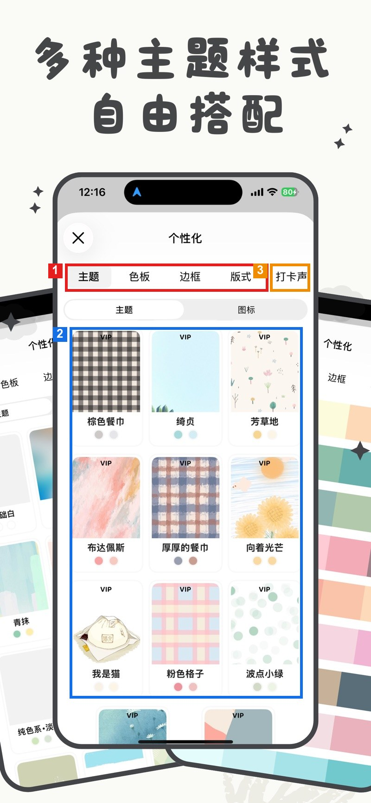
*ShineDay 小日常, China App Store listing, screenshot 8 ([listing](https://apps.apple.com/cn/app/id1263789061)).*
- **1:** tabs 主题 / 色板 / 边框 / 版式 (theme / palette / border / layout). This is one "personalise" screen holding everything.
- **2:** theme backgrounds. The ones with a VIP badge are paid; the rest are free.
- **3:** the 打卡声 check-in sound tab, which sits in the same place.

*This is the single best reference for how a Plus personalisation hub could be organised. In the ShineDay corpus, reviewers who pay mention themes and icons far more often than those who don't (R52-054). Purchases also happen "five minutes after downloading" because of the look (R52-144).*

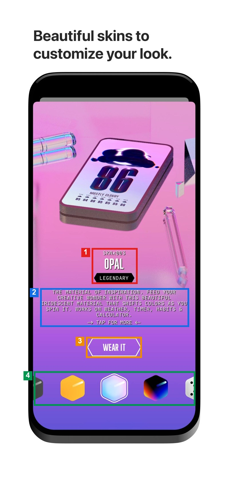
*(Not Boring) Habits, US listing, screenshot 8 ([listing](https://apps.apple.com/us/app/id1593891243)).*
- **1:** skin name (OPAL).
- **2:** rarity tier LEGENDARY and its description.
- **3:** the WEAR IT button.
- **4:** swatch row of other skins.

*Warning from the reviews: selling skins on top of a paid membership read as double charging: "$15 for permission to buy a $10 skin. Scam!" (R36-049). In Plus, themes should come included, not as a second shop.*

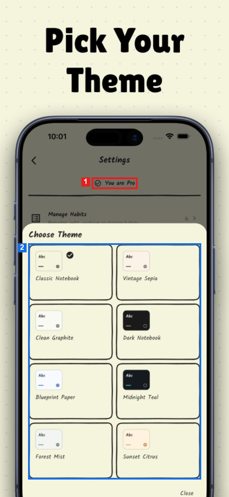
*Keizoku, US listing, screenshot 4 ([listing](https://apps.apple.com/us/app/id6751934729)).*
- **1:** "You are Pro", which shows this is a paid screen.
- **2:** Choose Theme: Classic Notebook, Vintage Sepia, Clean Graphite, Dark Notebook, Blueprint Paper, Midnight Teal, Forest Mist, Sunset Citrus.

*Keizoku has only 17 ratings, so treat it as a design reference only. Its listing states "Basic habit tracking is always free, with no ads", with themes in Pro. That is the exact model proposed for us.*

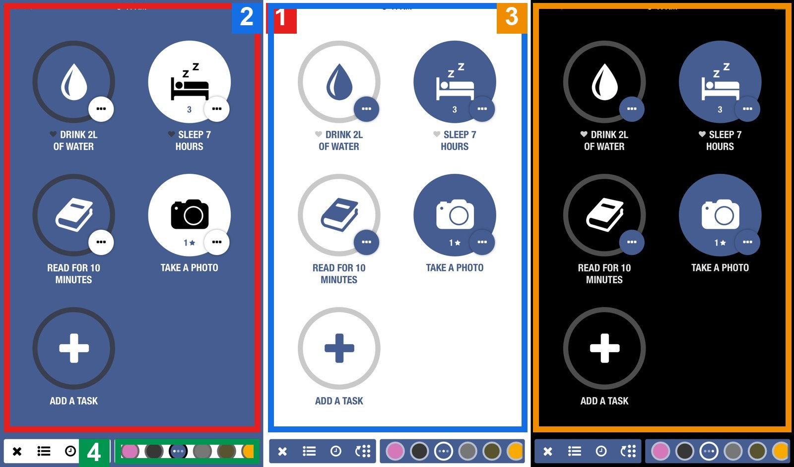
*Streaks 3, image from [MacStories' Streaks 3 review](https://www.macstories.net/reviews/streaks-3-review/) (2017; the app has been redesigned since). The article's own caption reads "Each theme includes a colorful, light, and dark mode."*
- **1:** colourful mode.
- **2:** light mode.
- **3:** dark mode.
- **4:** the theme colour row used to switch themes.

*One detail to copy: a theme is a set of modes, not one colour. Streaks today advertises 78 colour themes (current listing), all inside a one-time price.*

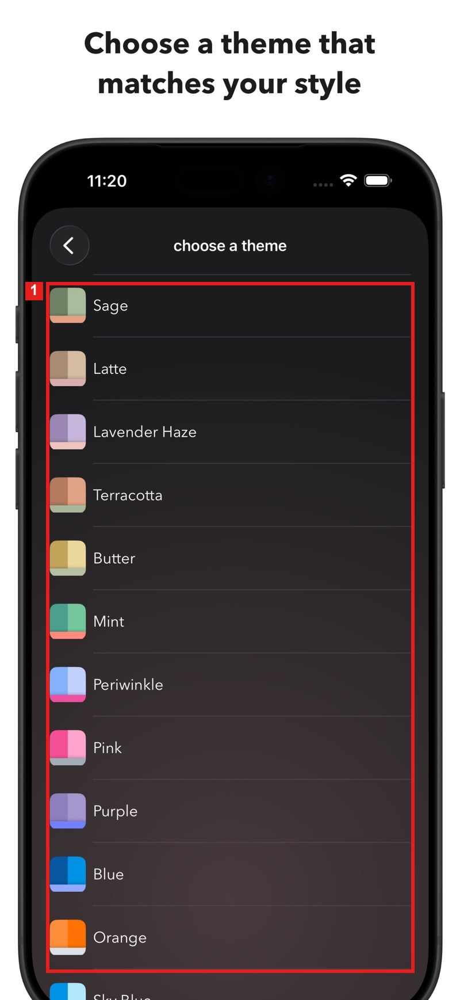
*Goal Streak, US listing, screenshot 8 ([listing](https://apps.apple.com/us/app/id1630626343)).*
- **1:** "choose a theme" list (Sage, Latte, Lavender Haze, Terracotta, Butter, Mint, Periwinkle…).

*Goal Streak's listing calls it "a free and simple habit tracker", with "Dark mode & themes – personalize your app experience, even the app icon." It is the reason a small set of good themes has to be free for us too (C080, C009). Plus sells **more and richer** themes.*

**What reviewers say.**

- Cosmetic gating is the gate people accept most: "mostly free aside from cosmetics (understandable)" (R36-050).
- Themes and skins convert in ShineDay (R52-054).
- But themes sold as premium drew zero mentions in StreakUp's 44 reviews (R06-034). Themes don't sell a weak product; they sell a loved one.
- Dark mode must never be paid. Gating it got "immediate deletion" in everyday and 3★ in Way of Life (R76-024, C080).

**How we should build it.**

1. **Free:** light, dark and about six good themes.
2. **Plus:** at least 30 themes in 5–6 named packs (Paper, Nature, Night, Pastel, Seasons, High contrast). Each theme covers light and dark and the same accent on widgets.
3. **Content runway:** one or two new packs each quarter go to all Plus owners at no extra cost. That keeps the reward loop from running dry (C237) without making it a subscription.
4. **Preview before purchase.** Try any theme live for the session.
5. **Never** sell individual themes on top of Plus (R36-049).

### 2.2 Extended palettes and a hex picker

**What it is.** Each habit has a colour. The free set is about 12–21 colours. Plus adds more sets (pastel, earthy, neon, colour-blind-safe) and a **custom colour picker** where you type a hex code or drag a colour wheel.

**How it works.** Habit editor → Colour. The default swatches show first; "More colours" opens packs; "Custom" opens a colour wheel with a hex field.

**Who has it:**

| App | What | Free or paid | Source |
|---|---|---|---|
| HabitKit | 21-colour palette per habit | Free in the editor | Listing screenshot 3 |
| DotHabit (Japan) | "Basic" set free; "Bright" set unlocked by watching a video | Rewarded ad | JP listing screenshot 9; R47-023 |
| Evoday | Colour per habit "down to the specific code" (hex) | Partly paid ("custom colours are paid") | R34-042, R34-050, reviews only |
| everyday | Colour gradient board; users ask for more colours and a hex picker | Requested: "I will pay for this!!" | R46-012, R46-149 |
| ShineDay | 色板 Palette tab | Mixed (VIP) | Listing screenshot 8 (above) |

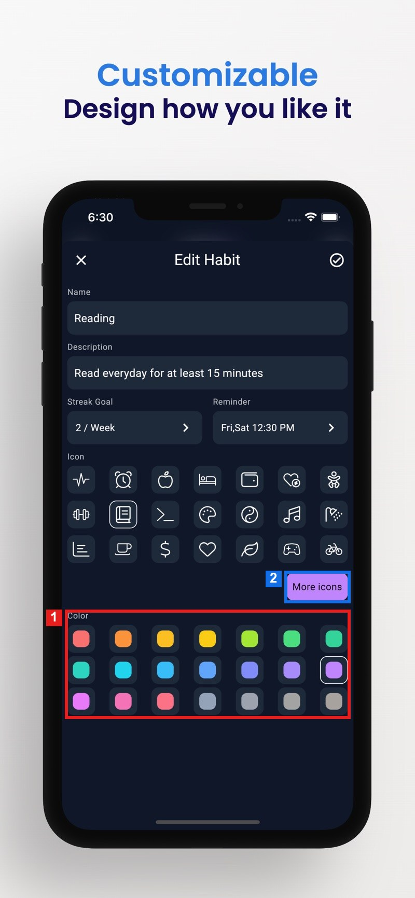
*HabitKit, US listing, screenshot 3 ([listing](https://apps.apple.com/us/app/id6443918070)).*
- **1:** the 21-colour palette in the habit editor.
- **2:** "More icons" button.

*In HabitKit the palette is free and icons expand. This is the baseline our free tier should match.*

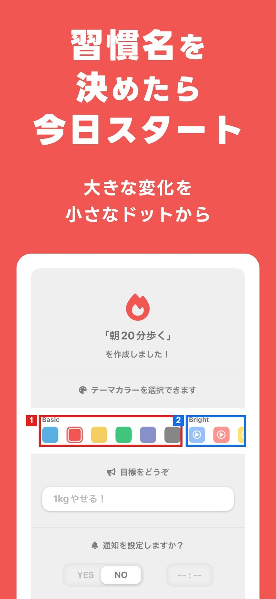
*DotHabit, Japan listing, screenshot 9 ([listing](https://apps.apple.com/jp/app/id1439938837)).*
- **1:** "Basic" colour set, free.
- **2:** "Bright" set. The ▶ badge on each swatch means a video ad unlocks it.

*This is the ledger's one example of rewarded ads being accepted: "more colours unlocked by watching a video" was reported neutrally, while a rewarded video to log yesterday drew 1★ (R47-023). The listing image doesn't show whether this is still how it works after DotHabit's 2025 move to a subscription.*

**Hex picker: no public screenshot found.** Evoday reviewers describe it ("pick your own colour down to the specific code", R34-042), but its listing doesn't show it. To see one in an app: Evoday → create or edit a habit → colour → custom. The reviews describe it as part of Premium (R34-050). I have not confirmed this on a device.

**How we should build it.**

- **Free:** 24 well-chosen colours, tested for contrast on light and dark.
- **Plus:**
  - four extra palettes: Pastel, Earth, Neon and Colour-blind-safe, each with 12 colours;
  - a custom picker: a hue/saturation wheel, a hex field (`#3FA7D6`), and "recent colours";
  - a warning if the chosen colour is unreadable against the current theme.

Everyday's evidence (C261) says colour is the *reward surface* in grid apps: the grid is what you look at, so its colour is what you're paying for. That is why this belongs in Plus rather than being trivial.

### 2.3 Photo covers per habit

**What it is.** Each habit gets a photo, either the user's own or one from a curated set. The photo shows full-screen behind the habit, or as its card.

**How it works.** Habit → Cover → choose from a curated gallery, take a photo, the camera roll, or your saved covers.

**Who has it:** Today Habit tracker (Neybox) built its product on this (R86-001/004). Daily Habits made "photos as icons" free (R02-050, C079).

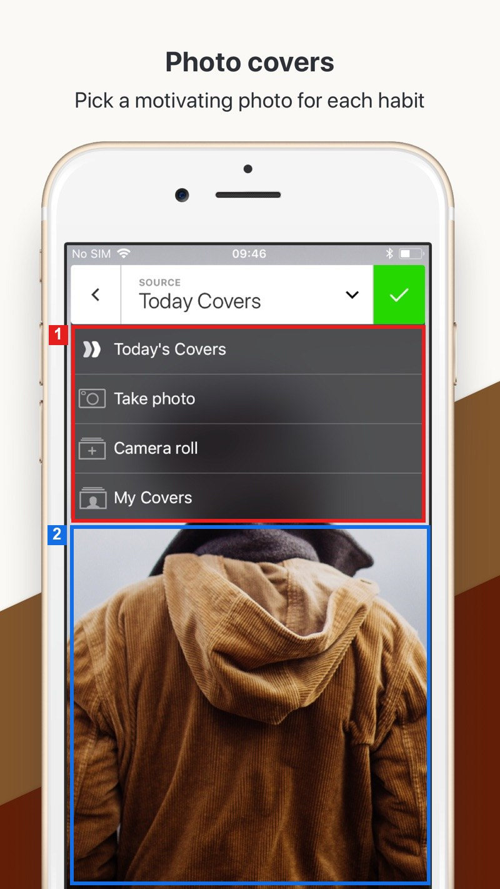
*Today Habit tracker, US listing, screenshot 2 ([listing](https://apps.apple.com/us/app/id1055295863)).*
- **1:** the cover source menu: Today's Covers, Take photo, Camera roll, My Covers.
- **2:** the full-screen cover behind the habit.

*Reviews: "It sets a craving, when I see the image I want to accomplish" (R86-004). "I purchased the full thing just because to put my own photo covers" is a named purchase trigger (R86-037). The warning: Today moved custom covers behind payment after they had been free, "taking existing covers with them" (R86-012). Never do that.*

**How we should build it.**

- **Free:** an icon or emoji per habit.
- **Plus:** your own photo, a curated gallery of about 200 covers, and a choice of photo shown as the card, the background, or the widget.
- **Rules:** photos stay on the device and in the user's own iCloud or Drive, never on our server. If Plus lapses (on Android, refunds), existing covers stay (C191).

### 2.4 Alternate app icons

**What it is.** The home-screen icon of our app changes to one the user picks: colour variants, seasonal, minimal, or retro. iOS supports this natively (`setAlternateIconName`, which shows a system confirmation). On Android, launcher activity-aliases can do it.

**How it works.** Settings → App Icon → a grid of icons → tap one → iOS confirms "You have changed the icon".

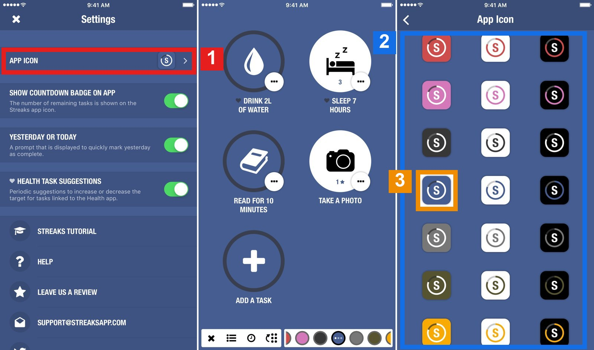
*Streaks 3, image from [MacStories' Streaks 3 review](https://www.macstories.net/reviews/streaks-3-review/), 2017, captioned "General settings, the settings bar, and 45 icon choices." The design is old, but the flow is still how iOS works.*
- **1:** the Settings → APP ICON row.
- **2:** the icon grid.
- **3:** the currently selected icon.

**Who sells it (from current listing text; I didn't see these screens myself):**

| App | Listing wording | Tier |
|---|---|---|
| Keizoku | "custom themes, dynamic app icons, all widget styles" | Pro |
| Zenith | "every premium app icon" | Pro |
| Haptic | "unique app icons (to your mood, weather…)" | Subscription |
| Habit Tracker – Daily Goal | "Themes, tints, and app icons" | Premium |
| DayCount (26,260 ratings) | "Alternate app icons" | Premium (annual or lifetime) |
| DrinkControl | "Select one of many alternate app icons" | Premium |
| SoberStreak | "alternate app icons" | Premium |
| Goal Streak | "personalize… even the app icon" | Free |
| Evoday | "alternate app icons" | Reviews, R34-042 |

**What reviewers say.** It is a small but warm request: app-icon options were requested 20 times at 4.85★ in Tappsk (R59-052) and twice in Rabit (R65-030). The failure mode is technical: in Evoday, the icon stopped changing after updates three times (R34-067). Test it on every release.

**How we should build it.** Free gets the default icon plus light and dark versions. Plus gets 20–30 icons, including seasonal ones and "the icon matches your theme". The Tappsk numbers above are the evidence: people like it and don't expect it for free. It is almost free for us to produce, which makes it a good Plus filler.

### 2.5 Widget designs

**What it is.** Widgets are the tracker's retention surface, and the free baseline keeps interactive widgets free. Plus sells additional **designs**: layouts (rings, year grid, dot grid, bar chart, big number), materials (glass, tinted, paper), per-widget themes, and sizes.

**How it works.** Long-press the home screen → add widget → pick a layout; then edit the widget → choose habit(s), theme, background, and whether to show numbers.

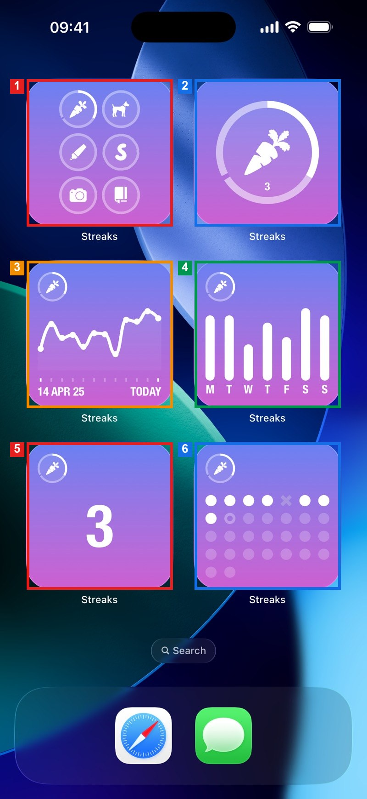
*Streaks, US listing, screenshot 9 ([listing](https://apps.apple.com/us/app/id963034692)).*
- **1–6:** six widget designs: a multi-task grid, a single ring, a line chart, a bar chart, a count, and a dot grid. Streaks includes all of them in its one-time price.

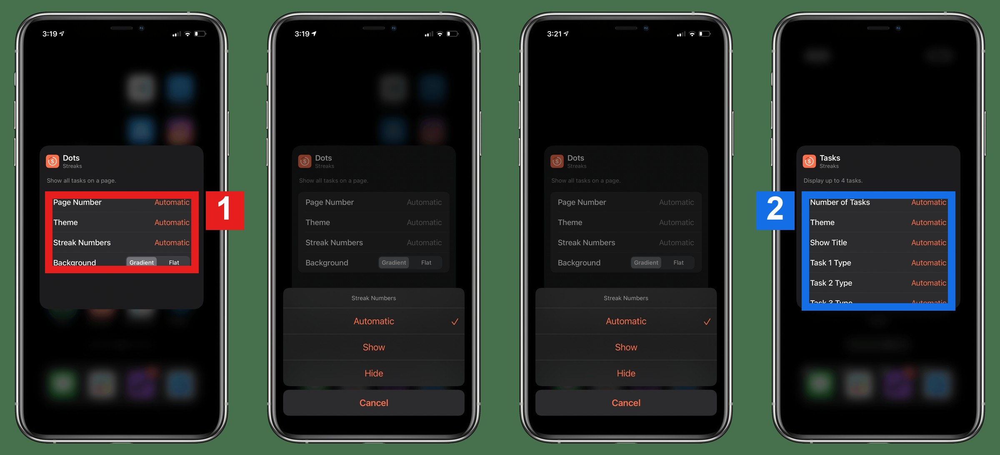
*Streaks 6, image from [MacStories](https://www.macstories.net/reviews/streaks-6-brings-habit-tracking-to-your-home-screen-with-extensively-customizable-widgets/) (2020).*
- **1:** Dots widget options: page number, theme, streak numbers, background (gradient or flat).
- **2:** Tasks widget options.

*This is what "widget customisation" means in practice: the options inside the widget's edit sheet.*

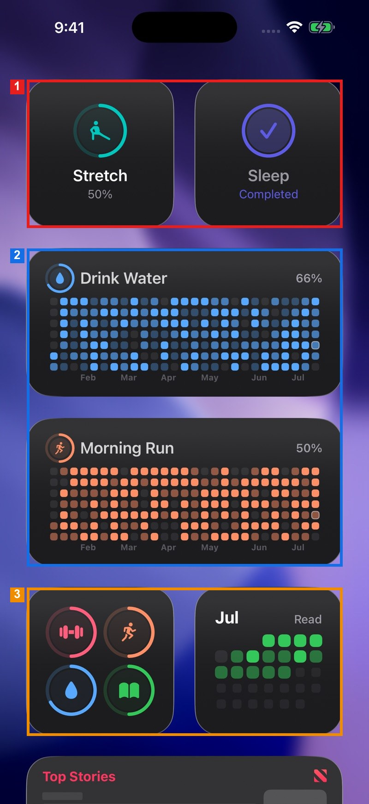
*Dots, US listing ([listing](https://apps.apple.com/us/app/id6758730376)).*
- **1:** small ring widgets.
- **2:** large year-grid widgets.
- **3:** a four-ring cluster and a month widget.

*Cross-check correction: the ledger report (R56) recorded Dots as fully free. Its current listing (version 2.5.4, 20 September 2026) now says "Dots lets you track 3 habits for free. Dots Pro lifts the limit — monthly, yearly… or a one-time lifetime purchase." The widgets still appear to be part of the free product, but I could not confirm which widget designs, if any, are Pro-only. The finding stands anyway: a young rival ships many widget designs to free users, so charging for widget access puts us behind.*

**What reviewers say.**

- Widget customisation is the #1 stated reason to pay in Days Since once the base widget is free (R03-025). Gating the widget itself was a disaster there, and in Ripples (R79-007).
- "Widget is the product's mechanism… so gate styling, not the number" (R90-040).
- C107 is the merged theme.

**How we should build it.**

- **Free:** every widget size in one clean style, and interactive check-off.
- **Plus:** 8–10 extra layouts (year grid, heat map, ring cluster, streak number, weekly bars, photo-cover widget, countdown), materials, per-widget theme, and a lock-screen style set.
- Widgets must never go blank or stale (C040).

### 2.6 Completion sounds, haptics and completion marks

**What it is.** It's what the moment of checking something off feels like: the sound, the vibration pattern, the animation, and the mark left in the grid (tick, cross, stamp, emoji, scribble).

**Who has it:**

- ShineDay has a 打卡声 check-in sound tab (above).
- Streaks 3 added "custom sound effects… when a task has been completed" (MacStories 2017).
- Not Boring's hold-to-check haptics and sound are "the hardest thing to copy" (R36-082).
- Keizoku sells completion mark and stroke styles in Pro.
- Check Calendar lets you check off with any emoji as a paid benefit (R74, R89).

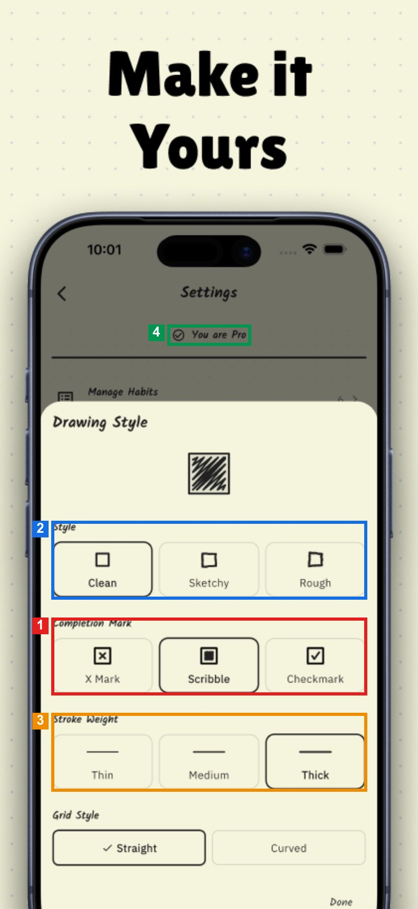
*Keizoku, US listing, screenshot 6.*
- **1:** completion mark: X, Scribble or Checkmark.
- **2:** style: Clean, Sketchy or Rough.
- **3:** stroke weight.
- **4:** "You are Pro".

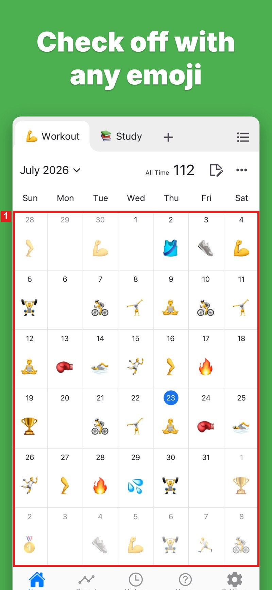
*Check Calendar, US listing, screenshot 5 ([listing](https://apps.apple.com/us/app/id1563837295)).*
- **1:** calendar days marked with emoji instead of ticks.

*A Habit Check Calendar buyer names emoji marks as part of why they bought on the same day (R74-008).*

**No app sells haptic styles as such.** There is no public image of a haptic picker. How we should build one:

- Settings → Feel → Completion feel. Choose from Soft tap, Double tick, Rising (a three-step ramp), Stamp (one heavy thud), or Off. There is a preview button for each.
- Pair each with a sound pack: Paper, Wood, Chime, Arcade, Silent.
- Only Plus gets the extra packs. Free gets one good sound and haptic, because "a little thrill in the sound when you check a habit" is part of the core (R57-059), and the hold-to-complete gesture is proposed as core too (C229).
- Respect Silent mode and Reduce Motion (C149, C171).

---
## 3. Plus — Depth

The free tier keeps the full record: history, the year grid, week/month/year views and completion % (C234). Plus adds ways to *understand* the record.

### 3.1 Compare habits and compare periods

**What it is.** There are two comparisons:

- **Across time:** this week vs last week, this month vs last month, this year vs last year.
- **Across habits:** a ranking of your habits by completion rate for a chosen period.

**How it works.** Stats → Compare. You pick a period and see paired rings or bars with the change marked (+15%). Or you pick Ranking and see habits sorted by %.

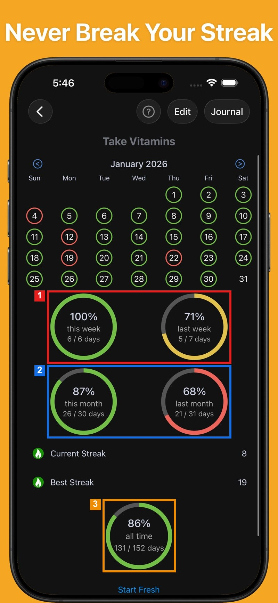
*Habit Hub, US listing, screenshot 2 ([listing](https://apps.apple.com/us/app/id1149192857)).*
- **1:** this week vs last week (100% vs 71%).
- **2:** this month vs last month.
- **3:** all time.

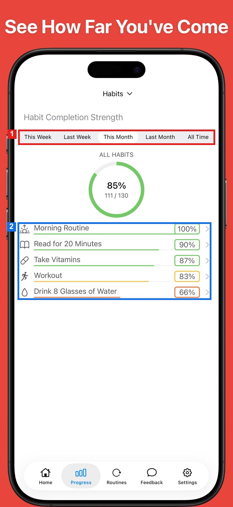
*Habit Hub, US listing, screenshot 10.*
- **1:** period tabs: This Week, Last Week, This Month, Last Month, All Time.
- **2:** habits ranked by completion strength.

*Habit Hub sells a one-time unlock, and its listing doesn't mark this screen as paid. I didn't verify its tier.*

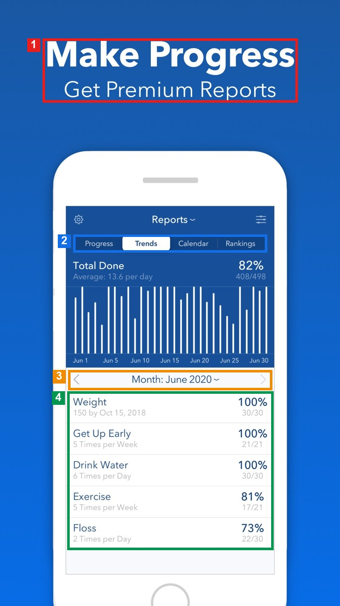
*Strides, US listing, screenshot 8 ([listing](https://apps.apple.com/us/app/id672401817)).*
- **1:** "Get Premium Reports", explicitly paid.
- **2:** report tabs: Progress, Trends, Calendar, Rankings.
- **3:** month selector.
- **4:** habits ranked by %.

*Strides users asked for better reports and trends: 76 requests, from satisfied users (R48-046). Reviewers there also propose a cheap one-time tier rather than a rental (R48-093).*

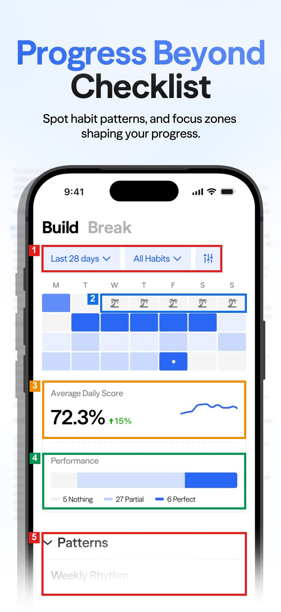
*Habitify, US listing, screenshot 4 ([listing](https://apps.apple.com/us/app/id1111447047)).*
- **1:** filters: last 28 days, all habits.
- **2:** vacation days (palm icon), excluded from scoring.
- **3:** average daily score 72.3%, +15% vs the previous period.
- **4:** the Nothing / Partial / Perfect split.
- **5:** Patterns → Weekly Rhythm.

*This is the richest "insight" screen in the set. It adds* patterns *(which weekday you fail on) on top of comparison.*

**What reviewers say.**

- Weekly, monthly and yearly reports are the #1 stated reason to pay in the category leader (R01-013).
- Statistics are three of the six named purchase triggers in R42 (R42-071).
- The caution: in Today, nobody reported buying *for* statistics, even though they were premium (R86-037). Avocation's "advanced statistics" turned out to be a calendar, and buyers turned into detractors (R54-012). Plus depth has to be visibly more than the free view.

**How we should build it.** Plus → Insights, with three tabs:

1. **Compare**: any two periods, side by side, per habit and overall.
2. **Ranking**: habits by %, with the change since the last period.
3. **Patterns**: best and worst weekday, time of day (if timestamps exist), streak-break days, and which habits tend to happen together.

Keep "together" descriptive. Zenith sells "habit correlations"; we should say "often done on the same day", not "causes". Skipped and vacation days are neutral (C256).

### 3.2 Multi-year timeline

**What it is.** It lets you look back across years: a year selector, year-vs-year comparison, and per-year best streak and completion rate for each habit.

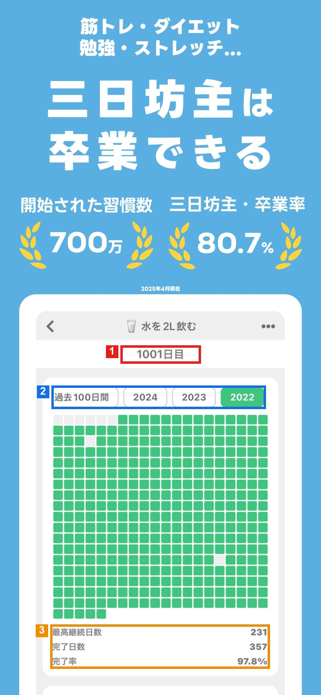
*DotHabit, Japan listing, screenshot 3.*
- **1:** 1001日目, "day 1001".
- **2:** tabs 過去100日間 / 2024 / 2023 / 2022 (last 100 days, then one tab per year).
- **3:** longest streak 231, days done 357, rate 97.8%.

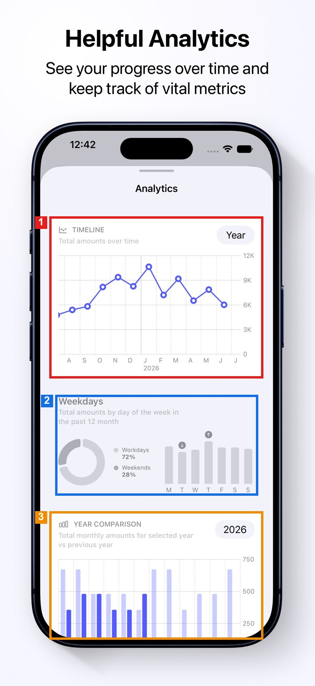
*Ripples, US listing, screenshot 9 ([listing](https://apps.apple.com/us/app/id6502667826)).*
- **1:** timeline (year).
- **2:** weekdays vs weekends split.
- **3:** YEAR COMPARISON: this year vs the previous year, month by month.

*Ripples moved "advanced analytics" from paid to free in v2.4 (April 2026, R79-021). So this screen is now free there.*

**What reviewers say.**

- A long-range timeline comparison is the single most up-voted request in ShineDay (63 votes, R52-094).
- Avocation users asking for proof of consistency over longer periods form the second-largest need (R54-044).
- Proof it matters: Evoday's year grid is the one feature reviewers say rivals lack (105 reviews, no 1★, R34-010).

**How we should build it.**

- **Free:** the current year's grid plus scrolling back through past years' grids.
- **Plus:** year tabs per habit, a year-vs-year overlay, per-year records, and "on this day" (what you did one or two years ago).
- Performance must not degrade with history (C303): test with 20 habits × 1,000 days.

### 3.3 Goal pacing

**What it is.** For a habit with a target by a date (read 20 books by 31 December; run 500 km this year), the app shows where you *should* be today and whether you're ahead or behind.

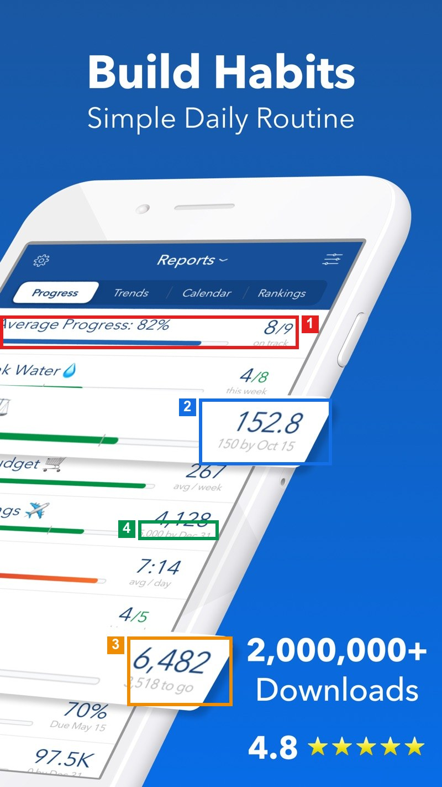
*Strides, US listing, screenshot 2.*
- **1:** average progress 82%, with 8 of 9 targets on track.
- **2:** 152.8 against "150 by Oct 15" (ahead of pace).
- **3:** 6,482, "3,518 to go".
- **4:** a target of "5,000 by Dec 31".

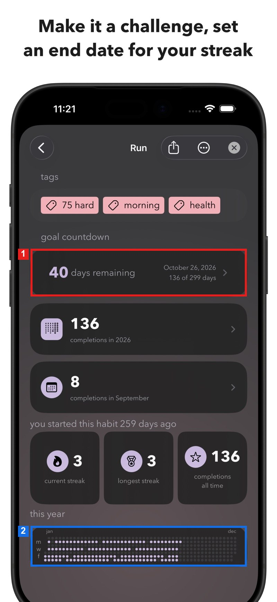
*Goal Streak, US listing, screenshot 9.*
- **1:** goal countdown, "40 days remaining".
- **2:** the this-year grid.

*This is the simpler, free form: an end date and a countdown, without pace.*

**What reviewers say.** Strides' four tracker types (habit, target by date, average, project) are its moat and the reason people switch to it: 485 reviews at 4.82★ (R48-009, R48-034, C265). Pacing is the piece that separates a *target* from a checklist.

**How we should build it.**

- **Free:** a target with an end date, plus a progress bar.
- **Plus:**
  - a pace line: where you should be today, with a linear or custom curve;
  - "on track / behind by N / ahead by N";
  - a projected finish date at the current rate;
  - a gentle catch-up suggestion ("2.3 a day for the next 10 days"). It is phrased as information, never as guilt (C095).

### 3.4 Detailed Year in Review

**What it is.** It's a year-end summary, a personal "Wrapped". The free version is a single page. The Plus version is a set of story-style cards covering:

- totals, best month, longest streak and top habit;
- your most consistent weekday;
- "you did X 312 times";
- a share card in square or 9:16 format.

**No exact public screenshot found.** What exists, verified from text:

- **HabitKit.** Its [changelog](https://habitkit.app/changelog) describes a Year in Review share card: choose the year and habits, accent colour and theme, then export as square, 9:16 story, or tweet format. To see it: open HabitKit and look for Year in Review. The changelog doesn't say which menu it lives in, and I have not confirmed the path on a device.
- **Dots.** Its listing: "Stats & Yearly Recap — Your whole year at a glance — a heatmap of every habit, monthly charts, your records, and a recap you can share."
- **Habify.** The year-end report is "the best emotional moment and the most reliable outage". It crashed in January 2020, December 2020, January 2021 and December 2024, and hung in January–March 2026 (R01-165, R01-095).
- **ShineDay.** Moving year statistics to VIP in December 2025 set off a burst of complaints. The same corpus proposes "free basic year summary, paid detailed report" (R52-051, R52-198).
- **HelloHabit.** A monthly report screenshot on Reddit ("so pretty") brought installs (R50-060). A shareable report is marketing.

The nearest images already in this document: Ripples' year comparison (3.2) and Strides' reports (3.1).

**How we should build it.**

1. **Free (from 1 December):** a one-page Year in Review with totals, longest streak, top three habits and a share card. This is growth, because every share is an ad.
2. **Plus:** 8–10 story cards:
   - month-by-month heat map;
   - best and worst month;
   - most consistent weekday;
   - "your comeback" (the longest gap followed by a restart);
   - per-habit pages;
   - year vs last year;
   - a printable A4 PDF;
   - a custom-themed share card.
3. **Offer moment:** the end of the free Year in Review is one of the three places Plus is offered (section 5).
4. **Reliability:** build it in October and load-test it before 1 December. The New Year peak is in C032. Reviews are concentrated in January: 17.6% of Strides' reviews were written in January (R48-015).

---

## 4. Plus — Power features

### 4.1 Shortcuts and automations

**What it is.** It covers Siri Shortcuts actions (log a habit, add an amount, get progress) and automation triggers, so a habit is checked without opening the app.

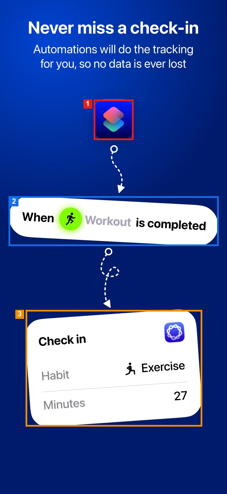
*Ripples, US listing, screenshot 3.*
- **1:** the Shortcuts app.
- **2:** automation trigger "When Workout is completed".
- **3:** action: check in the habit Exercise, 27 minutes.

**Who has it and what it's for.**

- HabitKit's changelog lists the actions Log Amount, Log Note, Get Progress and Open Habit.
- The segment is small and extremely loyal: people use hotel key cards as NFC triggers, and they also want a read-only API (R07-069).
- Integration mentions are rising in Habitify: "Pairs nicely with agentic workflows" (R33-128). Merged theme C046.

**How we should build it.** Split the actions:

- **Free:** basic Shortcuts actions: complete a habit, open a habit.
- **Plus:**
  - value actions (add an amount, log a note, set skip);
  - query actions (get today's progress, get a streak) that can feed other automations;
  - URL-scheme and deep links;
  - a read-only local export for power users.

### 4.2 Health auto-complete

**What it is.** A habit linked to an Apple Health or Health Connect metric completes itself when the threshold is met: 5,000 steps, 10 mindful minutes, 30 minutes of exercise, eight hours in bed.

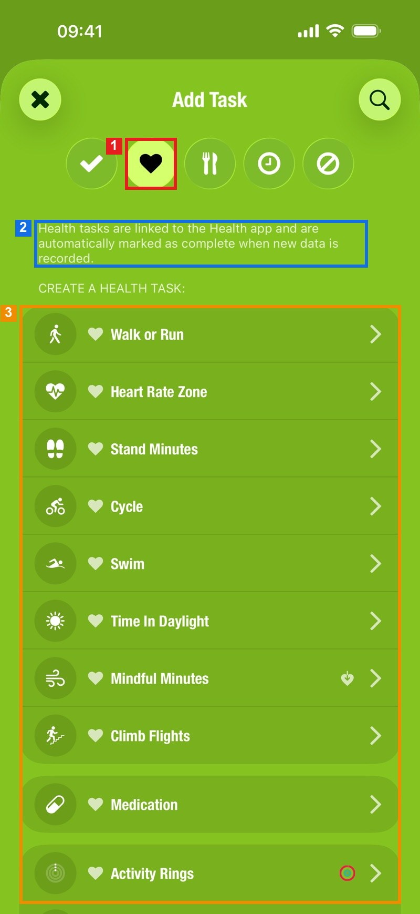
*Streaks, US listing, screenshot 4.*
- **1:** the Health tab when adding a task.
- **2:** text explaining that these tasks complete automatically from Health.
- **3:** the list of Health-driven tasks (walk/run, stand, mindful minutes, and more).

**What reviewers say.** "HealthKit auto-completion is the single highest-leverage integration in this category — it removes the friction that killed every other habit app" (R23-203, R23-028). Grit and Awesome Habits ship it too (their listing screenshots show it). Apple Health is also the largest ignored integration request in Finch (R10-072). And writes to Health must be exact (C072).

**Free or Plus?** Basic Health *reading* for one metric per habit could be free: it is core to "better than Reminders". Plus adds:

- compound rules ("10k steps OR a 30-minute workout");
- partial credit from Health;
- auto-skip on sick days (low step count plus a logged illness);
- writing mindful minutes back to Health.

This is a judgement call to test, not settled by evidence.

### 4.3 Watch complications and a watch-face library

**What it is.** Watch check-off is in the free baseline. Plus adds more complication styles (ring, count, next habit, streak) and a pre-built **watch face library** you can add in one tap.

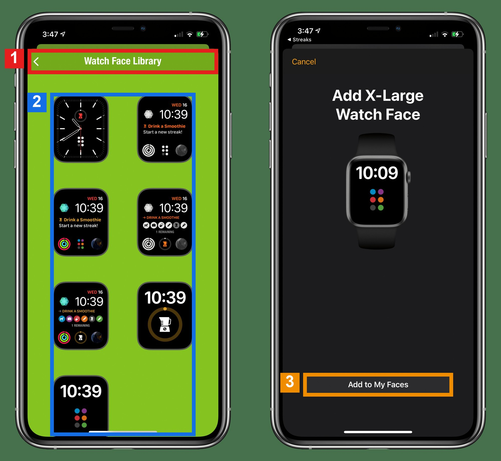
*Streaks 6, image from [MacStories](https://www.macstories.net/reviews/streaks-6-brings-habit-tracking-to-your-home-screen-with-extensively-customizable-widgets/).*
- **1:** the Watch Face Library title.
- **2:** pre-built faces with Streaks complications.
- **3:** "Add to My Faces".

**What reviewers say.**

- HabitMinder's complications are configurable "almost like watch faces themselves" and are part of its ecosystem praise (R53-019).
- Today's Infograph complications were requested for years and never shipped (R86-026).
- HabitKit users say they'd pay for a Watch complication (R07-103).

### 4.4 NFC check-in

**What it is.** You tap your phone on an NFC sticker, for example on the gym bag, the pill box or the bedside table, and the habit is checked.

**No public screenshot found.** Evidence from reviews:

- Awesome Habits shipped NFC tag check-off in November 2025 (R41-030).
- Roubit has NFC tag check-ins in Korea (R83-001).
- Habitify has NFC habits from 2024–26 (R33-021).
- HabitKit users trigger habits through Shortcuts with hotel key cards (R07-069).

To see it in an app: in Awesome Habits, open a habit's settings and look for an NFC option; I have not confirmed the exact path. The iOS workaround anyone can use today is Shortcuts → Automation → NFC → scan the tag → "Complete habit".

**How we should build it.**

- **Plus:** Habit → More → Link NFC tag → hold the phone to a blank NTAG213 sticker → the app writes a tag ID.
- Later taps complete the habit, with a haptic and a notification ("Vitamins ✓"), even with the app closed. iOS 13+ background tag reading supports this with a universal link.
- One tag can complete several habits. Suggest cheap stickers but don't sell them.

---

## 5. Plus — Patronage and when to offer Plus

### 5.1 Patronage features

**What it is.** It's a way for people to pay because they want the app to exist, and to help others who can't pay.

- **Finch Guardians.** Donors pay to sponsor Finch Plus for people who can't afford it. A monthly raffle gives winners a month of Plus. Afterwards they can stay sponsored, return to free, or take a reduced price.
  - It has 708 mentions at 4.76★, and 92 of those carry purchase evidence (R10-113). Paying users over-index on it by 6.6× (R10-108).
  - The one complaint: "there is no way to apply" (R10-113, R10-170).
  - **No public screenshot.** Path, from Finch's help pages as summarised in search results: top-left menu → "Become a Guardian" (donor) or "Enter the raffle" (receiver).
- **Habit Hearts.** 11 users received free premium after asking, and all 11 left 5★ reviews. The report calls making this route visible "the cheapest experiment" (R72-008).
- **継続する技術.** The only paid item is an honestly named "useless feature" message pack. Buyers pay to support the developer (25.9%) or as a reward for finishing a 30-day run (40.7%) (R70-014, R70-015).

**How we should build it (inside Plus):**

- **Supporter badge:** a small mark on the profile and in the Year in Review, plus a thank-you note from the team.
- **Gift Plus:** buy Plus for a friend, or "gift a Plus to a student". Pooled gifts go to people who apply through a visible form (C025). This answers Finch's "no way to apply" complaint.

### 5.2 When to offer Plus: milestone moments

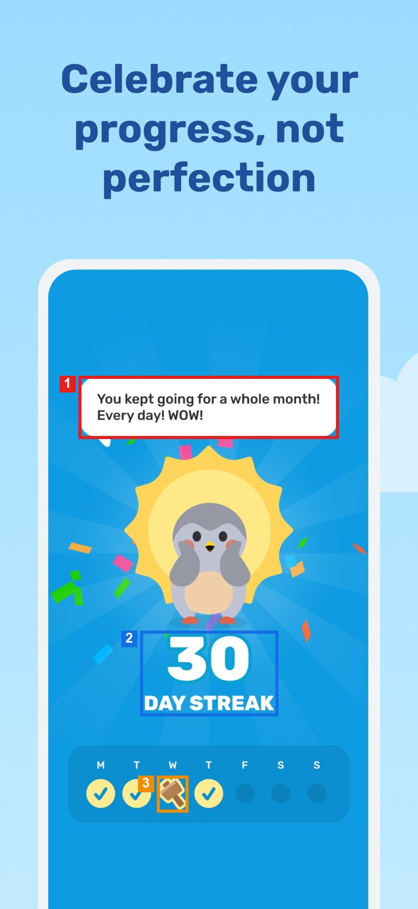
*Finch, US listing, screenshot 7 ([listing](https://apps.apple.com/us/app/id1528595748)).*
- **1:** the message "You kept going for a whole month!".
- **2:** 30 DAY STREAK.
- **3:** the streak-repair hammer, a paid-currency mechanic.

*Copy the celebration, not the hammer: repairing a streak costs 1,000 gems and reintroduced the guilt the app was praised for removing (R10-065).*

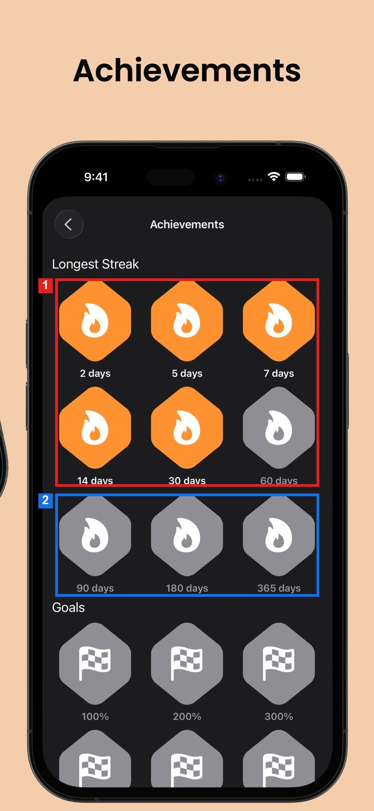
*Grit, US listing, screenshot 3 ([listing](https://apps.apple.com/us/app/id6446997766)).*
- **1:** earned streak badges from 2 to 30 days.
- **2:** locked badges from 60 to 365 days.

**The rule.** Offer Plus when the person has **already got value**, never at the first launch, the check-in, or a cap:

- **after a 30- or 100-day run.** 40.7% of buyers in 継続する技術 bought as a milestone reward (R70-014);
- **at a 14-day streak**, the experiment proposed in the Habit Hub report (R43-135);
- **at the end of the free Year in Review.**

Each offer is one card that can be dismissed, with a "don't show again" option (C093). It is never a modal on the check-in (C240, R47-127). It says "one-time, not a subscription" (C305) and "everything you have today stays free".

---
## 6. Companion — the optional subscription

A subscription is only defensible where value keeps arriving and costs us money each month. A static tracker fails that test. Reviewers say so directly:

- "It's not like a yoga or meditation app, which is constantly adding new videos/content, so why a yearly fee?" (R55-029).
- Merged theme C196: a subscription is a promise of continued delivery.

Companion has two parts that pass the test.

### 6.1 AI reflection partner

**What it is.** It's an assistant that reads what *you* logged (check-ins, misses, notes, mood) and writes back: a short reply to a check-in, or a weekly letter that notices patterns. It is not a coach that invents a plan. It reflects on your own record.

**Who has it:**

| App | What it does | Tier | Evidence |
|---|---|---|---|
| Roubit (Korea) | A handwritten-style "cheering letter" (응원 편지) that replies to your diary entry | 2 letters a week free; unlimited on the yearly plan | R83-004, R83-013, R83-016, R83-029 |
| DotHabit (Japan) | "DotBuddy" comments on each check-in | Premium (2025–) | R47-012, R47-075, C263 |
| SoberStreak | Companion chat with a choice of personality, plus weekly and monthly insights | 3 messages a month free; Premium $9.99/month or $39.99/year (US) | Listing text and screenshots |
| Awesome Habits | Apple Intelligence habit suggestions on the device | Free, one mild mention | R41-028, listing screenshot 6 |
| Critique AI | AI "analysis" of photos and speech | Hard paywall; the counter-example | R64-012 |

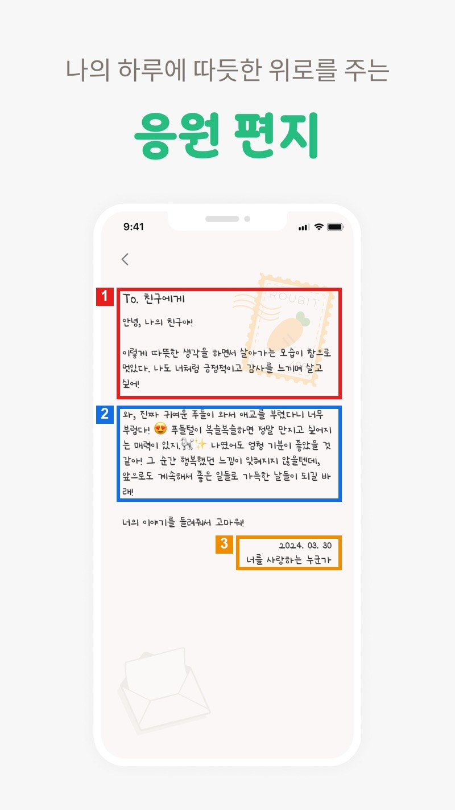
*Roubit, Korea listing, screenshot 6 ([listing](https://apps.apple.com/kr/app/id1527382961)).*
- **1:** the greeting.
- **2:** a paragraph that refers to the poodle the user wrote about in the diary.
- **3:** the date, and a sign-off meaning "someone who loves you".

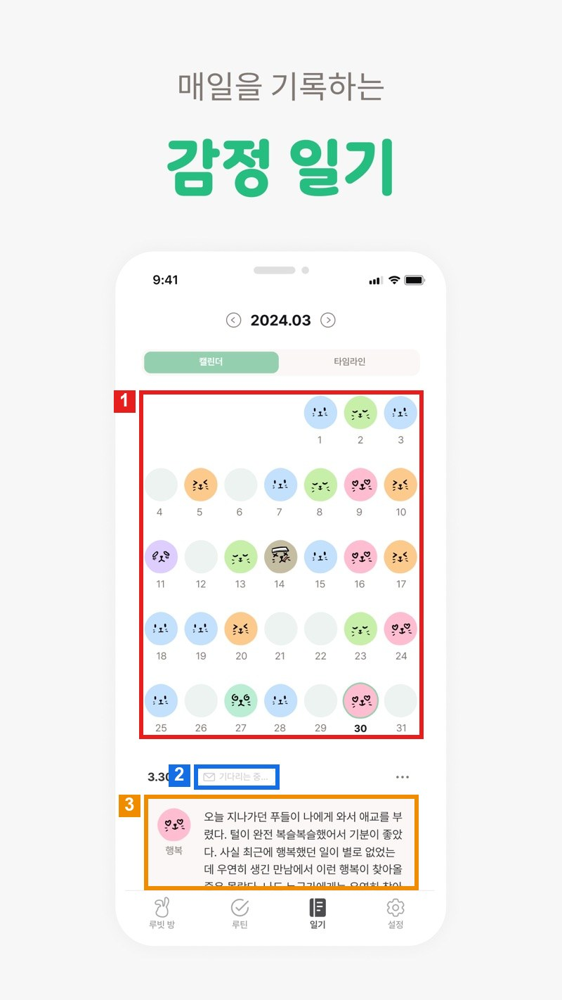
*Roubit, Korea listing, screenshot 5.*
- **1:** mood calendar.
- **2:** the chip 기다리는 중… ("waiting…"), meaning the letter is still being written.
- **3:** the diary entry about a poodle.

*The pair proves the letter reads the input: the diary (image 2, box 3) mentions the poodle and the letter (image 1, box 2) answers it. That is the standard every AI reply must meet (C279).*

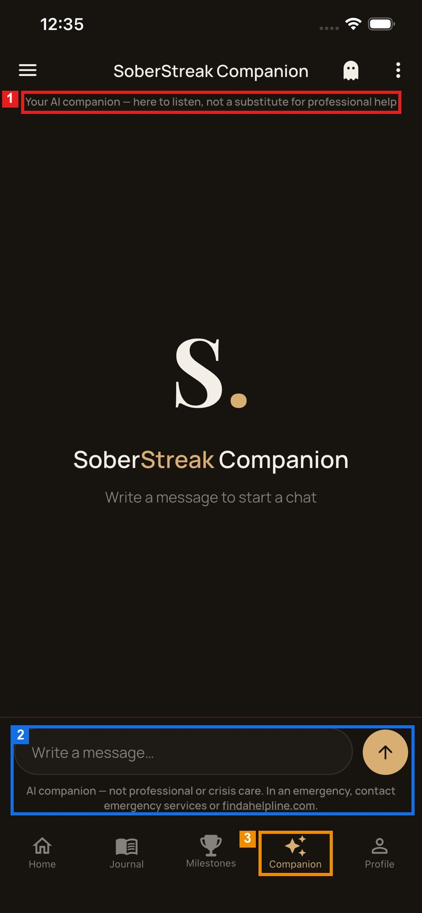
*SoberStreak, US listing, screenshot 2 ([listing](https://apps.apple.com/us/app/id6779854029)).*
- **1:** "Your AI companion — here to listen, not a substitute for professional help".
- **2:** the input field, with a crisis footer pointing to findahelpline.com.
- **3:** the Companion tab.

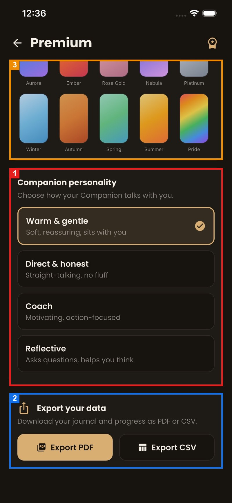
*SoberStreak, US listing, screenshot 7.*
- **1:** companion personality: Warm & gentle, Direct & honest, Coach, or Reflective.
- **2:** export as PDF or CSV.
- **3:** a grid of named tiles (Aurora, Ember, Rose Gold… Pride). The screenshot cuts off the heading, so I can't tell whether these are animated themes or app icons. I don't count them as proof of either.

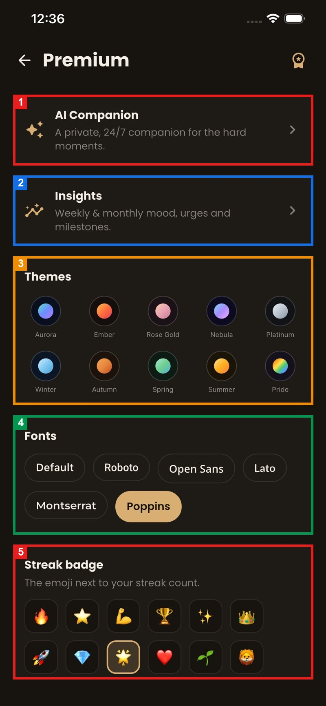
*SoberStreak, US listing, screenshot 8.*
- **1:** AI Companion.
- **2:** insights.
- **3:** themes.
- **4:** fonts.
- **5:** streak badge.

*SoberStreak was released on 25 June 2026 and had 0 ratings when fetched. It is a design reference for how to present an AI companion safely, not evidence that anyone pays for it.*

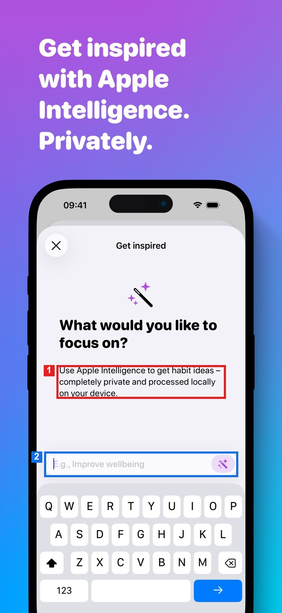
*Awesome Habits, US listing, screenshot 6 ([listing](https://apps.apple.com/us/app/id1514915737)).*
- **1:** text saying suggestions are processed locally on the device.
- **2:** the input field ("What would you like to focus on?").

*This is the privacy-preserving option: on-device models, no server cost, no data leaving the phone. It is too weak for letters today, but worth watching.*

**DotHabit's DotBuddy: no public screenshot.** Its Play description says "Every time you log, DotBuddy responds to your effort. Celebrations when you're winning, encouragement when it's tough." To see it: in DotHabit, log a habit (add a memo if you like); the reply appears under the entry. The reviews report it as premium from 2025 (R47-012). I have not confirmed the current tier on a device.

**What reviewers say.**

- **For.**
  - DotHabit's AI coach is "the first premium feature reviewers praise unprompted". One reviewer said, roughly: "you'd think 'it's just AI', but it's surprisingly nice" (R47-012).
  - Roubit's letters are its most singled-out feature. Buyers subscribed for them and "the money isn't wasted at all" (R83-029).
  - A Critique AI insider called a working AI trainer "a steal" against a human one (R64-039).
- **Against.**
  - Letters that silently stop read as a bug. The state must be visible (R47-124, R83-047).
  - An AI that scores silence at 79 destroyed trust (R64-012).
  - AI-generated art and copy in a paid product is rejected (R49-011, C267).
  - Rabit had zero AI mentions in 498 reviews (R65-050). Don't build AI because "AI is expected" (C056).
- **Safety.** 13.6% of Roubit reviewers use it for mental health, including crisis disclosures (R83-006). The letter needs a crisis protocol and an "AI" label (R83-044, C162, C103).

**How we should build it.**

1. **Opt-in, in its own tab.** It never appears inside the check-in flow.
2. **Weekly letter** (Sunday evening). It reads the week's check-ins, misses, notes and mood, and writes 150–250 words:
   - one thing that went well, with a specific reference;
   - one pattern ("Tuesdays are hard");
   - one small suggestion you can accept or ignore.
3. **Reply on note.** When you add a note to a check-in, a short reply appears under it. You can switch it off per habit.
4. **It must use the input.** If the week has too little data, it says so ("Not much to go on this week — here's what I can see") instead of inventing (C279).
5. **Visible state.** Letters left this week, when the next one is due, and "paused" if billing fails. It never stops silently.
6. **Safety.**
   - It is labelled AI.
   - Self-harm and crisis language gets fixed, reviewed resources, never a generated reply.
   - A relapse in a quit habit gets non-judgemental copy (C095).
   - Minors get no letters without an age check.
7. **Privacy.** Text is sent to the model provider under a zero-retention agreement, never used for training, and deletable. The first screen says this.
8. **Free allowance.** One letter a month and three note replies a week, free forever and stated before writing. This follows Roubit's free letters (R83-047) and the finding that a no-card trial converts better per review (R49-090).
9. **Cost check** (assumption, not ledger data). A weekly letter plus about 12 replies a month is roughly 20–30 short generations per subscriber-month. At current small-model prices that's about $0.10–0.30. Measure it in a pilot.

### 6.2 Programme library

**What it is.** It's a library of structured programmes, 7 to 30 days long: "21 days of better sleep", "30-day walk habit", "Morning routine in 14 days". Each day has one small action and a short "why", with a source. Starting one adds its habits to your tracker; finishing one gives a badge.

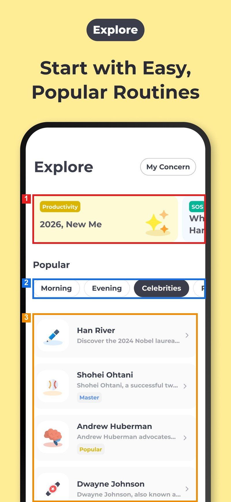
*Routinery, US listing, screenshot 7 ([listing](https://apps.apple.com/us/app/id1450486923)).*
- **1:** featured programme "2026, New Me".
- **2:** tabs: Morning, Evening, Celebrities.
- **3:** celebrity routines (Han River, Shohei Ohtani, Andrew Huberman, Dwayne Johnson).

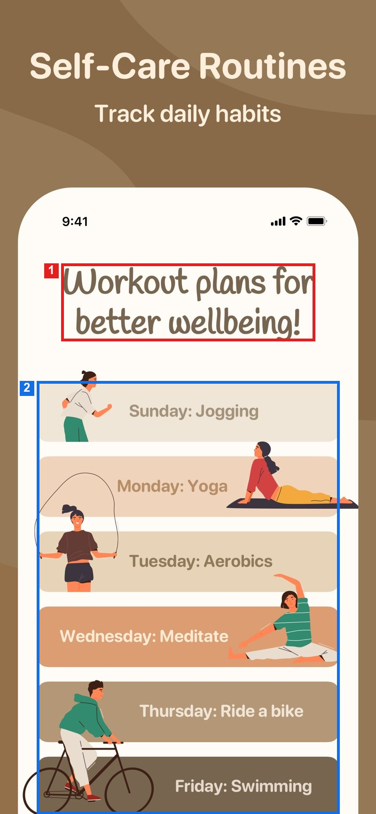
*Me+, US listing, screenshot 2 ([listing](https://apps.apple.com/us/app/id1596403446)).*
- **1:** "Workout plans for better wellbeing".
- **2:** weekday plan cards.

*Me+ sells this library inside a $39.99/year subscription. Its reviews say the library is what separates it from "a fancy Reminders app" (R04-051, R04-105), and it is a named purchase trigger (R04-028).*

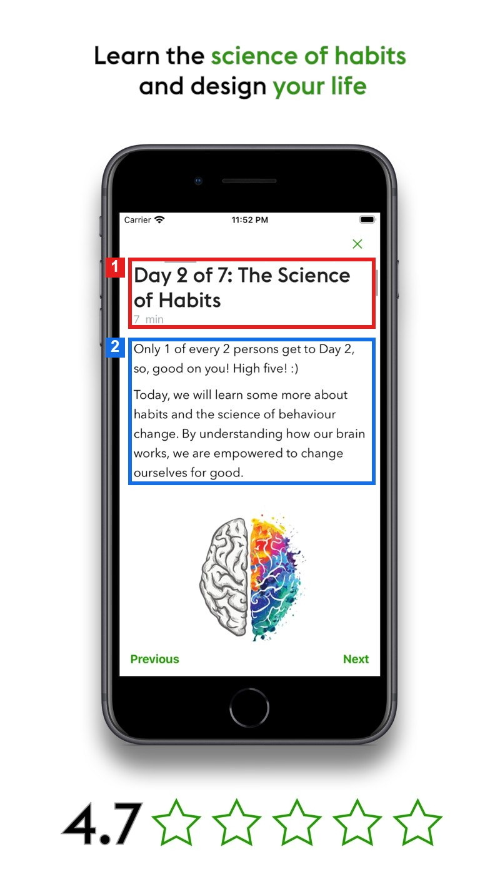
*everyday, US listing, screenshot 8 ([listing](https://apps.apple.com/us/app/id1394150432)).*
- **1:** "Day 2 of 7: The Science of Habits".
- **2:** the lesson text.

*Early users valued everyday's Learn tab and 7-day course. Later users barely used it, and it was English-only (R46-020).*

21 Days Challenge's library is shown in section 7.

**What reviewers say.**

- **For.**
  - Content is the paid layer in routine apps (C116, C118).
  - Fabulous's coaching content is liked; its problems are billing (R24).
  - Ultiself's library with sources ("why") is what works there (R68-010).
  - A guided setup that shrinks the goal to five minutes is 継続する技術's strongest mechanic (R70-004).
- **Against.**
  - Productive added Challenges and Explore tabs, and users asked to hide them (R13-069).
  - TheFor's paid routine packs and routine AI got zero mentions in 80 reviews (R69-011).
  - Fabulous's long-term payers can't save or replay content, "the main reason… I consider not renewing". So paid content must be a saved library (C233).

**How we should build it.**

- **A separate tab, hidden until enabled.** It must never be in the way of someone who just wants to tick boxes (R13-069).
- **Free: a starter shelf of about 5 programmes**, so the library is visible and useful without paying. That is the lesson from 21 Days (section 7).
- **Companion: the full library.** Two to four new programmes a month, localised, each with its sources. This is the visible cadence the subscription promises (C196).
- **Programme mechanics:**
  - each day is one small action and a "why";
  - a missed day doesn't reset (C157);
  - you can restart;
  - your notes are saved and replayable (C233);
  - finishing unlocks a badge and offers to keep the habit in the tracker.

---

## 7. Ads vs subscription — what 21 Days Challenge teaches

### 7.1 The app

| Fact | Value | Source |
|---|---|---|
| Developer | Kati & Lima (Lima Tech) | Play listing |
| Android installs | 10,766,616 (shown as 10M+) | Play listing, fetched September 2026 |
| Play rating | 4.7★, 90,000+ ratings | Play listing |
| Released | 4 September 2019 | Play listing |
| Monetisation (Play) | "Contains ads"; in-app purchases $0.99–$11.99 per item | Play listing |
| Monetisation (iOS) | Only "Remove ads month $1.99" and "Remove Ads Year $17.99" | [iOS listing](https://apps.apple.com/us/app/id1485458184), 562 ratings at 4.70 |
| Earlier Play price | $0.99 a month or $11.99 a year | 21D#11365, 21D#10827 (2021) |
| What premium adds, per reviews | No ads, plus wallpapers (21D#12635), themes (21D#6769) and widget customisation (21D#4791) | Reviews |
| Review corpus used | 27,095 Play reviews, mean 4.73★, 51 languages (68% English), 2019–2026 | `Play Store Reviews/125. 21 Days Challenge/` |

**Features:**

- a library of 21-day challenges (self-love, walking, morning routine, study, declutter…);
- a daily "scratch card" that reveals today's challenge;
- a 21-day grid per challenge;
- points that buy avatar items;
- wallpapers, daily affirmation notifications, a mood tracker and journal;
- a blog;
- community-made challenges and a gratitude feed.

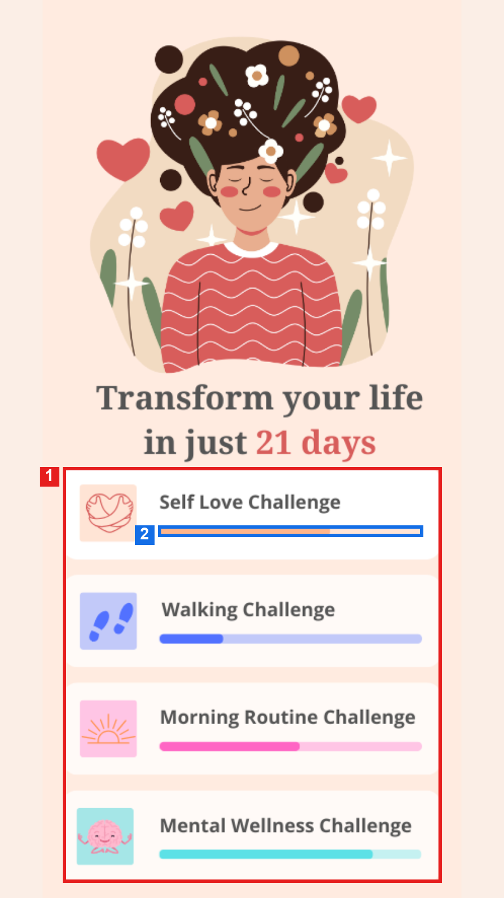
*21 Days Challenge, Play listing screenshot 1 ([listing](https://play.google.com/store/apps/details?id=com.limatech.dayschallenge.dayschallenge)).*
- **1:** the challenge library.
- **2:** progress bar per challenge.

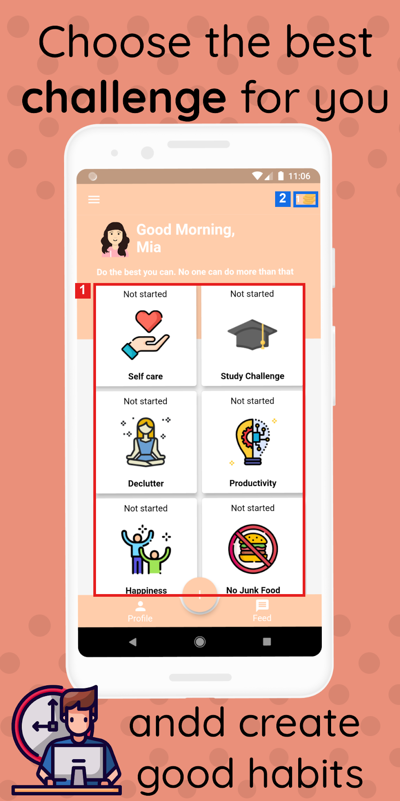
*21 Days Challenge, Play listing screenshot 4.*
- **1:** challenge grid, "Not started".
- **2:** points.

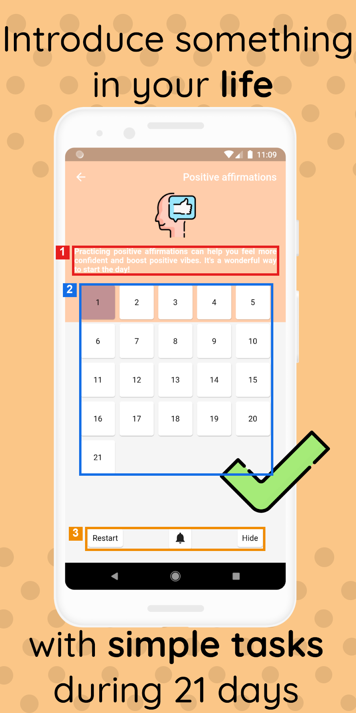
*21 Days Challenge, Play listing screenshot 5.*
- **1:** why this challenge matters.
- **2:** the 21-day grid.
- **3:** Restart, reminder and Hide.

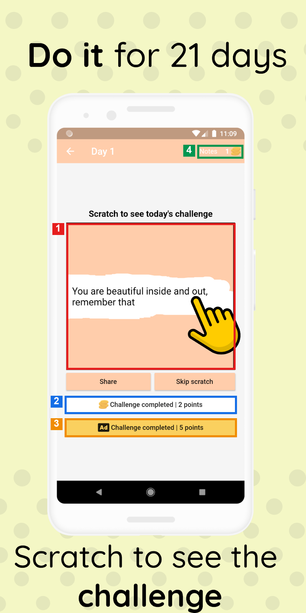
*21 Days Challenge, Play listing screenshot 6.*
- **1:** the scratch card with today's challenge.
- **2:** "Challenge completed | 2 points".
- **3:** "[Ad] Challenge completed | 5 points", an optional rewarded ad that triples the points.
- **4:** notes and points counter.

*The app puts its rewarded ad on the completion button, the one place the ledger says never to put an ad (C240). What makes it bearable is that it's **optional** and only changes points, not the record. Reviews show that isn't enough on its own (7.3).*

### 7.2 Why it works despite ads

**Method.** I searched all 27,095 reviews with a multilingual keyword net for ads and money. That covered ads, Werbung, anuncios, pub, реклама, إعلان, iklan, reklam and others, plus premium, pay, subscription and free. This found 588 reviews. I read every one in its original language and hand-coded 15 themes. 74 were off-topic keyword noise ("adds value", "pay attention"). The map is in `Temp/play125-21days-ads-classification.py`. This is a targeted read, not a full-corpus classification: reviews about ads that use none of the keywords are missed.

| Theme | Reviews | Share of all 27,095 | Mean ★ | 1★ | Helpful votes |
|---|---|---|---|---|---|
| Ads are light, short or absent | 164 | 0.61% | 4.88 | 0 | 4,291 |
| Too many or annoying ads | 265 | 0.98% | 3.31 | 51 | 2,909 |
| Ad on navigation or completion ("every click") | 44 | 0.16% | 2.59 | 13 | 550 |
| Loud, long or unskippable video | 22 | 0.08% | 2.82 | 7 | 1,380 |
| Hijacking (X opens the store, can't close, crash) | 12 | 0.04% | 2.75 | 4 | 142 |
| Harmful or contradictory ad content | 13 | 0.05% | 2.46 | 6 | 470 |
| "It got worse" (ads ramped up) | 12 | 0.04% | 1.92 | 5 | 257 |
| Rewarded ad valued because optional | 6 | 0.02% | 4.50 | 0 | 31 |
| Rewarded ad criticised or broken | 10 | 0.04% | 2.80 | 2 | 445 |
| Paid and happy | 18 | 0.07% | 4.89 | 0 | 1,228 |
| Paid and it failed | 9 | 0.03% | 2.67 | 4 | 454 |
| Price or premium scope objection | 12 | 0.04% | 3.25 | 2 | 53 |
| Grateful it's free / not pushed to pay | 41 | 0.15% | 4.90 | 0 | 869 |
| Wants to pay, can't find how | 3 | 0.01% | 4.67 | 0 | 7 |
| Uninstalled because of ads | 19 | 0.07% | 1.79 | 10 | 86 |

Across the negative ad themes (too many, placement, loud, hijack, harmful, ramp), 59 of the 497 one-star reviews (11.9%) complain about ads. In Habit Rabbit, an interstitial on check-off was 52% of one-star reviews (R28-003). In ShineDay, the 2025 ad rollout was "the largest negative event in nine years" (R52-012).

**Why it holds up:**

1. **It's a content app, not a record.** The unit of value is today's card. People open it to *receive* something, so an ad between cards feels like the price of the content. In a tracker, the unit is *your* record, so an ad there punishes your own action (R65-014, R28-004).
2. **It started light and was generous.** Early reviews praise that ads are rare and short. The most helpful review in the whole corpus (1,147 votes, 21D#15934) says the ads "aren't annoying… like many other apps". The same text was posted again in 2024 (21D#4482, 173 votes), so I count it once as evidence.
3. **Almost everything is free.** Free-gratitude reviews average 4.90★: "sick of apps with 90% content behind a ridiculously priced paywall" (21D#8294).
4. **Ad removal is cheap and feels like support.**
   - "$1 a month… You are supporting the developers" (21D#10827, 244 votes).
   - "The first free app I voluntarily support with premium" (21D#1158).
   - "I paid for a yearly membership to help support you guys" (21D#2137).
5. **The rewarded ad is optional:** "no ads unless you want more points" (21D#14155); "I like that I can choose" (21D#12187).

### 7.3 Where it breaks

- **Ramp.** Complaints as a share of reviews were 0.70% in 2020 and 0.96% in 2021, then 1.77% in 2023 and 2.71% in 2024. They eased to 1.11% in 2025 and 1.07% in 2026. "Ads are light" stayed flat at about 0.4–0.8%. From 2023, complaints outnumber praise about 3:1 (2023: 36 vs 17; 2024: 24 vs 5; 2025: 15 vs 5; 2026: 20 vs 9).
  - "It was great earlier when you could opt in to donate… now it feels exploitative… no longer a safe space" (21D#8547, 89 votes).
  - "Great at first… then after 10 days… literally every click would give me an ad" (21D#4346).
  - The ledger's other ad apps show the same drift: DayStamp's ad grew from 5 to 30 seconds (R57-037), and Quit Bad Habits went from "ad-light" to criticised (R90-009).
- **Loud video in a calm app.** "The ads pop out of nowhere on full volume… very anxiety inducing" in an app "supposed to help with mental wellness" (21D#11560, 409 votes). "Volume control/mute doesn't exist" (21D#14353, 224 votes).
- **Content that contradicts the purpose:**
  - gambling ads to someone for whom gambling is "one of my struggles/addictions" (21D#19448);
  - a Burger King ad during a no-junk-food challenge (21D#26246);
  - violent games and cheating dramas during affirmations (21D#9882);
  - ads meant to "get him back" inside a self-esteem blog post, seen by a paying user (21D#12802, 151 votes);
  - game ads that "generate fear" (21D#26059, 183 votes).

  The ledger's rules C307 and C114 exist for exactly this.
- **Hijacking.** The X opens the Play Store (21D#6987, 21D#9267), or the close button doesn't work (21D#21063). This is the same pattern as C269.
- **Rewarded ads that betray the deal:**
  - "if you select less points, you still get an advert" (21D#4304), the exact failure in R28-131;
  - watched the ad, got no points or wallpaper (21D#15856, 21D#25994);
  - "how is watching ads making me more productive or less stressed…?" (21D#15753, 174 votes).
- **Paid and still shown ads.** "I paid for a subscription… the app keeps showing me ads and asks me to subscribe again" (21D#20279, 280 votes, Spanish). "Subscribed and still get a thousand ads" (21D#25798). A payment that failed (21D#4304). Cancelling was hard (21D#6028). Merged theme C127.

### 7.4 The models compared

| | **A. Free + Plus + Companion, no ads** (current proposal) | **B. Free + ads + remove-ads subscription** (21 Days) | **C. Library only on subscription, no ads** | **D. Hybrid: ad-free tracker, free library with *optional* rewarded bonuses** |
|---|---|---|---|---|
| **What's free** | Unlimited tracker; starter programmes | Everything, with ads | Unlimited tracker; library locked | Unlimited tracker, ad-free; starter library; opt-in rewarded ads for cosmetic bonuses only |
| **What's paid** | Plus (one-time); Companion (subscription) | Ad removal, about $1.99/month or $17.99/year, plus perks | Companion (library + AI) | Plus (removes the rewarded offers too); Companion |
| **Experience** | Best: nothing interrupts | Worst in the tracker; bearable in content | Clean, but the library is invisible to most | Clean core; the ad only appears if you tap "watch for bonus" |
| **Brand fit ("free, unlimited, no ads")** | Full | Breaks the hook (C246: 37 reports) | Full | Mostly: "no ads unless you ask for one" needs careful wording |
| **Revenue shape** | Lifetime sales plus a small recurring stock | Recurring from day 1 with every user; low per user | Recurring from a small share | Small ad income plus A |
| **Serves people who can't pay** (teens, blocked card payments: C238, C026) | Only via gifted Plus | Yes | No | Yes, through rewarded bonuses |
| **Main risk** | Low conversion in fully free apps (R56-021, R58-011) | Ramp, harmful ads, payers still seeing ads | "Content tab nobody wanted" (R13-069, R69-011) | Complexity; rewarded ads creeping onto the record (R47-023, R83-045) |

**Illustrative break-even** (assumptions, not market data):

- A 3% Plus conversion at $10 net is **$0.30 per install**.
- An ad model earning 60 impressions per install over its life (one a day for two active months) needs an effective eCPM of **$5** to match: 60 × $5 / 1,000 = $0.30.
- eCPM varies many-fold by country and format, and this ledger has no ad-revenue data. Measure it before relying on it.
- Ads also cost something no formula shows: "free and no ads" is the main *acquisition* reason in the free-app corpora. It accounts for 45% of HabitGrid's reviews (R84-006), and competitor paywalls send people to Dots (R56-006).

**Recommendation: keep A, with one optional hybrid test.**

1. **The tracker stays ad-free forever.** Every piece of evidence agrees: the record is personal, and an ad on it is a punishment (C240, C246, R47-006/007, R57-008, R65-014).
2. **Borrow 21 Days' generosity, not its ads.** A free starter library is what makes a content app feel like a gift. The paid library goes in Companion.
3. **Only if** we need a path for people who can't pay (teens, markets where card payment fails), test D: **rewarded, opt-in, cosmetic-only**. Examples: watch one ad to try a Plus theme for 24 hours, or unlock a bonus wallpaper. Never for records, backfill, habits or the check-in (R47-023, R83-045, C238).

### 7.5 If any ad ever ships — experience rules

Each rule comes from the ledger or the 21 Days reviews above.

1. **Never** on launch, check-in, habit creation, backfill or restore (C240, C275, C306, R47-127).
2. **Opt-in only**: a button the user presses. Declining never shows an ad (R28-131, 21D#4304).
3. **Muted, short and skippable**: no autoplay sound, 15 seconds at most, and a close button that closes (C269; 21D#11560, #14353).
4. **A frequency cap that never grows with tenure.** Announce any change in the changelog (21D#8547, R57-037).
5. **Category blocks everywhere, and checked per storefront:** gambling, alcohol, tobacco and vaping, dating and "get your ex back", violent games, and food during food challenges (C307, R90-039; 21D#19448, #26246, #9882, #12802).
6. **No ads in recovery, mood or journal flows,** or for users who declared a quit habit (R90-044, C103).
7. **The reward is always granted,** and granted before the ad closes (21D#15856, #25994).
8. **Anyone holding Plus or Companion never sees one,** including on our blog and website (C127; 21D#12802, #20279).
9. **A findable "no ads ever" option,** one-time rather than monthly (R52-016, R90-043; 21D#19492).
10. **No personalised ads for minors;** non-personalised by default everywhere.

---

## 8. Strategy — how free-core apps turn users into payers

### 8.1 The model to copy: Habit Hub

Habit Hub (R43) has been running for 10 years. It uses one one-time unlock ($2.99, now $4.99), no subscription ever, and no ads.

- **It removed the cap.** When it lifted the 3-habit cap around 2021–22, cap complaints fell from 14.1% to 0%, and all money-related friction fell from 23.1% to 0% by 2024–26. Reviewers now say it is "so hard to find an app that'll let you track unlimited habits for free but this one does" (R43-007).
- **It still sells.** "The dominant purchase trigger is the one-time model itself" (R43-084). A cheap one-time purchase produces almost no billing conflict: 2 refund mentions in 638 reviews (R43-091).
- **It has a moat.** A "nag me until it's done" reminder is credited to nobody else (R43-011). ADHD users are its fastest-growing group without being targeted (R43-018, R43-100).
- **Its only losses are to free defaults** (Reminders, calendar, paper), never to a named paid rival (R43-059).

To be "Habit Hub-like":

- unlimited free;
- one clear one-time purchase that adds things rather than removing limits;
- one or two mechanics people can't get elsewhere (for us: forgiving scoring and nag-until-done);
- and then reliability, year after year.

### 8.2 The revenue benchmark: HabitKit

According to its founder's post ([2025 — The Year That Changed Everything](https://sebastianroehl.substack.com/p/2025-the-year-that-changed-everything)), read from search-result summaries rather than the full post:

- $602,000 revenue in 2025, $112,000 of it in January;
- $28,000 monthly recurring revenue and 25,100 active subscribers;
- about 272,000 iOS and 290,000 Android downloads;
- 4.8★ on iOS and 4.6★ on Play.

Growth came from New Year, a YouTube video ("Apps You'll ACTUALLY Use"), and a top-5 ranking for "habit tracker" in the US, with no paid ads. Its model is 4 free habits plus Pro (monthly, yearly or lifetime).

The ledger's view of it: "The product is winning. The packaging is losing." 51% of its one-star reviews are about the paywall, price or cap (R07-005). **Our proposal is HabitKit's product with Habit Hub's packaging.**

### 8.3 What actually makes a free user pay

In buyers' own words across the ledger:

| Trigger | Evidence |
|---|---|
| Used it free for a long time, then paid | "Used the free version for about a month and I'm going to be upgrading" (R50-054); Strides' long-free-use buyers (R48-056); Routinery users who bought after the free tier had worked for them (R05-022) |
| A milestone reward | 40.7% of 継続する技術's buyers bought after finishing a run (R70-014) |
| Support the developer | 25.9% of buyers in 継続する技術, a 15.2× lift (R70-014/015); a 37× lift in Habitica (R85-028) |
| One-time or lifetime exists | The most-cited commercial feature in Awesome Habits (R41-013); the top trigger in Habit Hub (R43-084) |
| Lifetime on sale | 36.3% of Tappsk's 1,090 buyers; "waited for discount and bought forever" (R59-066) |
| The look | "Downloaded, five minutes later bought premium" (R52-144) |
| A specific capability they want | Photo covers (R86-037), widget customisation (R03-025), reports (R01-013) |

And what kills conversion:

- a paywall before value (R43-135, R75-020);
- an upsell after each check-in (R48-083; R47-014);
- confusing plans (C177);
- entitlements that fail (C065).

The literature agrees. Users active after week one are 5–8× more likely to convert, and caps make people leave rather than pay (RFG-014, RFG-016).

### 8.4 Distribution — how to become the default

1. **Own January.** 17.6% of Strides' reviews are written in January (R48-015). HabitKit's best month is January. Ship the free Year in Review in December and a "New Year" programme shelf on 26 December. Load-test it (C032).
2. **Rank for the keyword.** A top-5 US spot for "habit tracker" is HabitKit's engine. The listing should lead with what people love: unlimited, free, no ads, one-time (C134). Quit-habit keywords can be won from inside the same listing (RQH-016).
3. **Be the app people switch to.** Displacement is real: people land on free apps because competitors paywalled them (R56-006, R29, R27, R84-006). Offer import from HabitKit, Habitify, Streaks and Loop, and say so.
4. **Creators and community.** YouTube and Reddit were Ripples' launch cohort (R79-059). Reddit launched HabitBull (R55-005). TikTok is Blossom's only named channel (R58-005). Therapists and coaches recommend free, no-ad apps (C058, R55-030). Press and podcasts drove Way of Life (R76-062).
5. **Shareable outputs.** A monthly report screenshot on Reddit brought installs (R50-060). Make the Year in Review and milestone cards beautiful, and brand them quietly.
6. **Localise early.** It's the ledger's clearest cause and effect (C027): Me+ localised and the language complaint disappeared within a year (R04-079).
7. **Be found by AI assistants.** "I found it by asking GPT to recommend an app with the features I wanted" (R57-062). "GPT suggested this app; I downloaded it and immediately closed Xcode" (R84-006, R84-021). See section 9.
8. **Winning comparisons isn't enough.** Awesome Habits wins every comparison and still has "a discovery problem, not a persuasion problem" (R41-009). Budget time for distribution as seriously as for features.

---

## 9. AI-era channels

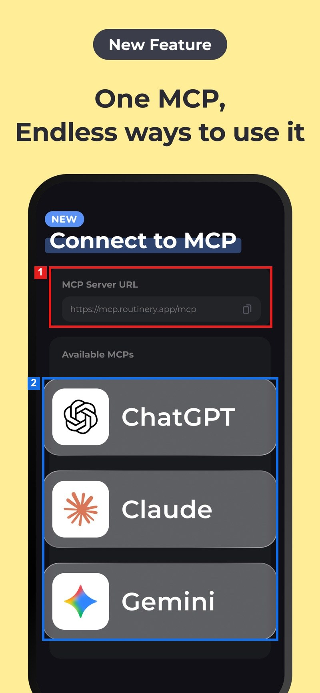
*Routinery, US listing, screenshot 4.*
- **1:** its MCP server URL.
- **2:** "Connect to" ChatGPT, Claude and Gemini.

*The user's routine data becomes usable by their own AI assistant.*

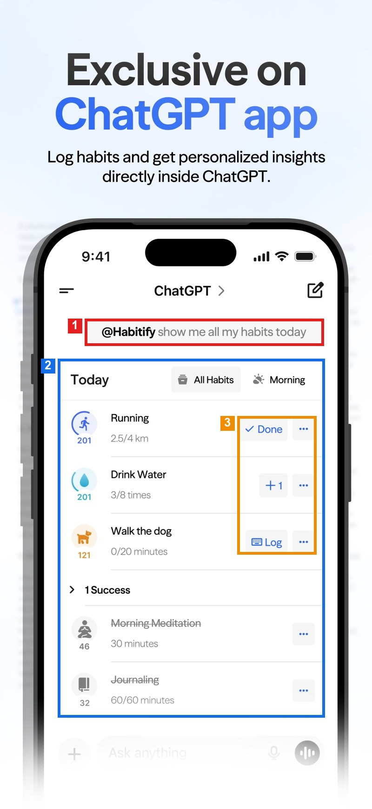
*Habitify, US listing, screenshot 6.*
- **1:** the prompt "@Habitify show me all my habits today".
- **2:** the habits card inside ChatGPT.
- **3:** Done, +1 and Log actions.

*The listing marks it "Exclusive on ChatGPT app".*

**Why it matters.**

- AI is now both a substitute and a channel. One Check Calendar reviewer "uninstalled this and created my own in 10 mins with Claude" (R89-015). Life Reset reviewers say a plan can be generated for free, and that what can't be copied is "the level-up loop, art direction, community, removing the daily decision" (R49-056).
- Integration mentions are rising, and one reviewer said it "pairs nicely with agentic workflows" (R33-128, R33-093).

**Options:**

| Option | What | Tier |
|---|---|---|
| A. Free connector | An official MCP server and ChatGPT or Claude app: read today's habits, log a check-in, get a summary | Free. It's distribution: every assistant user who asks "log my run" sees our name |
| B. Power connector | Plus adds write-heavy actions (bulk edit, create programmes, export) | Plus |
| C. None | Keep data on the device only | — |

My view is A plus B, with a caveat. The connector reads the user's data only with their permission, never ours, and nothing is sent to our servers unless they turn sync on. This also answers the "just build it with Claude" substitute: our app is what their assistant talks to.

---

## 10. What I could not verify, and how to check in the app

| Item | Status | How to check |
|---|---|---|
| Hex colour picker | No public image | Evoday → edit habit → colour → custom (Premium per R34-050) |
| Year in Review (HabitKit) | Text only, from the changelog | HabitKit (Pro) → look for "Year in Review" around year end; the path isn't documented |
| Dots Yearly Recap | Listing text only | Dots → Stats → recap |
| DotBuddy AI replies | Play description only | DotHabit → log a habit (with a memo) → the reply appears under the entry |
| Finch Guardians | Help-page summaries only | Finch → top-left menu → "Become a Guardian" or "Enter the raffle" |
| NFC check-in | Reviews only | Awesome Habits → habit settings → NFC; or iOS Shortcuts → Automation → NFC |
| Haptic styles as a product | No app found | Our design (2.6) |
| SoberStreak tile grid | Heading cut off | SoberStreak → Premium → the section above "Companion personality" |
| Paid or free status of Habit Hub's comparison screen | Not marked on the listing | Habit Hub → Stats, without the unlock |
| Dots' current tiers | Listing now shows a 3-habit free cap and Dots Pro, unlike R56 | Dots → Settings → Pro |
| 21 Days: what Play's $0.99–$11.99 items are | Not itemised on Play | 21 Days → Premium screen on Android |
| HabitKit revenue figures | From search-result summaries of the founder's post, not the full text | Read the substack post in full |

---

## 11. Sources

- **Ledger.** [Feature Ledger](../../Feature%20Ledger.md); cards in `Tools/prd_ledger/<N>/cards.jsonl`; merged themes in `Tools/prd_ledger/canonical.json`.
- **21 Days Challenge reviews.** `Play Store Reviews/125. 21 Days Challenge/reviews.jsonl` (27,095). Theme map in `Temp/play125-21days-ads-classification.py`; reviews read in `Temp/play125-21days-ad-money-reviews.txt`.
- **App Store listings** (metadata and screenshots via the iTunes Lookup API, September 2026). The apps are those linked in each caption. Working files are in `Temp/deepdive/listings/`, and the annotation script is `Temp/deepdive/annotate.py`.
- **Google Play.** [21 Days Challenge](https://play.google.com/store/apps/details?id=com.limatech.dayschallenge.dayschallenge).
- **MacStories.**
  - [Streaks 3 review](https://www.macstories.net/reviews/streaks-3-review/) (2017): app-icon picker and theme modes.
  - [Streaks 6 review](https://www.macstories.net/reviews/streaks-6-brings-habit-tracking-to-your-home-screen-with-extensively-customizable-widgets/) (2020): widget options and watch face library.
- **HabitKit.** [Changelog](https://habitkit.app/changelog); [founder's 2025 post](https://sebastianroehl.substack.com/p/2025-the-year-that-changed-everything).
