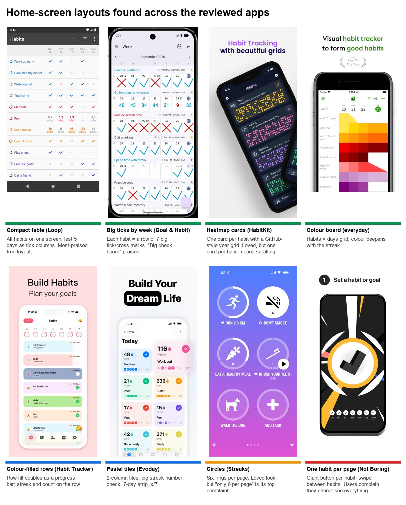
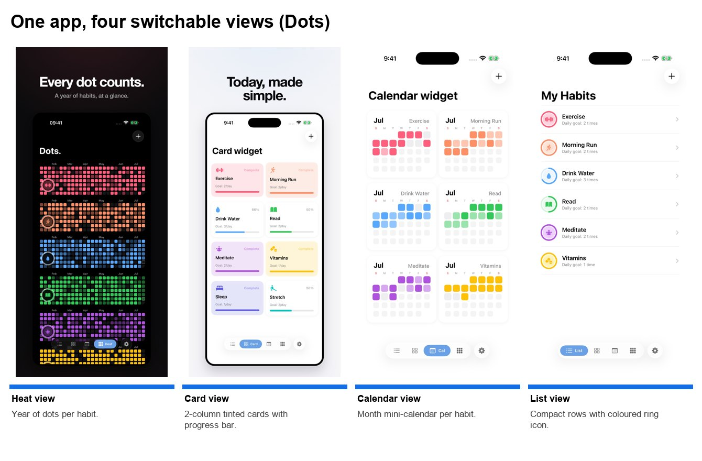
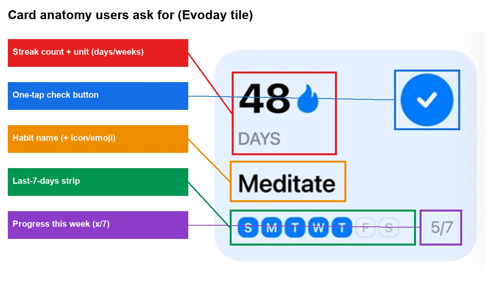
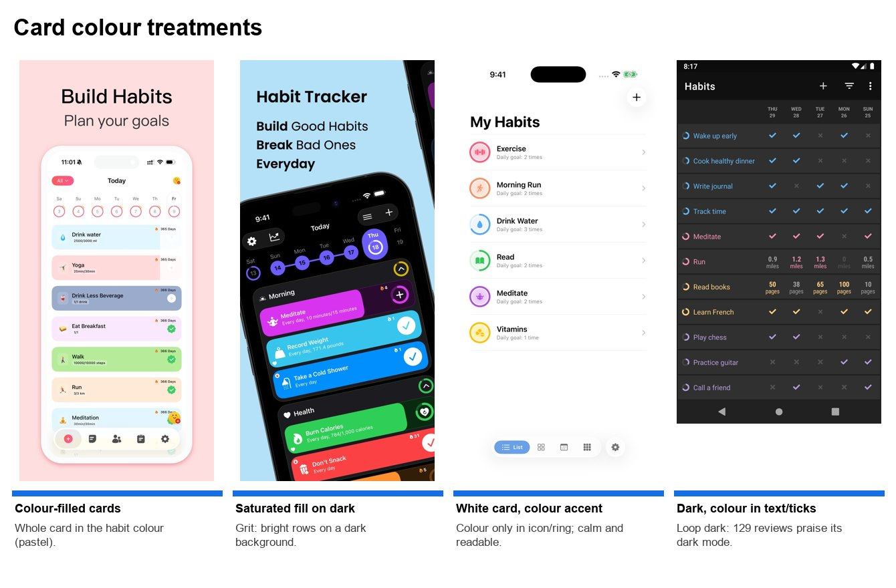
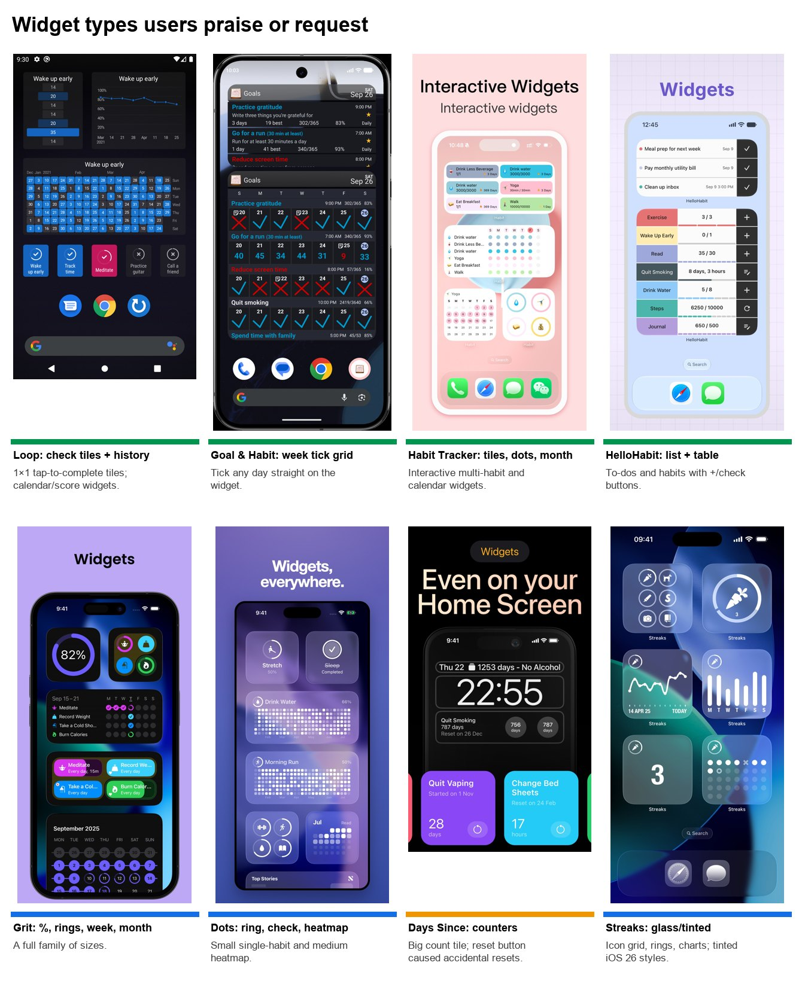

# Home Screen Cards and Widgets

> **Written by Claude (Claude Code)**, 23 September 2026. Authorship of every report is listed in the [Research Reports index](<../../README.md>).

**Status: exploratory research, not a decision.** This report covers:

- which home-screen layouts habit-tracker users love or dislike;
- what they want on each habit card;
- how they feel about card colour;
- the same questions for home-screen and lock-screen widgets.

It is built from what reviewers wrote, not from taste. Decisions live in Notion. Nothing here is decided.

*Prepared 23 September 2026. The reviews run from November 2011 to September 2026. The screenshots are App Store and Google Play listing images fetched 22–23 September 2026.*

---

## How to read this

- **Numbers come from hand-read reviews.** I pulled 39,930 candidate reviews (182 apps, both stores, all languages) that mention layout, cards, colour, icons or widgets. I then read and coded two sets by hand, one review at a time:
  - **Design set:** 8,254 reviews read; 5,416 carry at least one home-screen or card design code (145 apps).
  - **Widget set:** 7,844 reviews read; 7,818 carry at least one widget code (151 apps).
  - Percentages below use those denominators unless stated.
- **The generic remainder is estimated, not hand-coded.** About 13,000 more reviews say only "nice layout", "love the colours" or "please add a widget". For those, I hand-labelled a random 200 from each half and report the estimate with a 95% margin (section 8).
- **Evidence IDs.** `P3#11840` means line 11,840 (counting from 0) of `Play Store Reviews/3. Loop Habit Tracker/reviews.jsonl`. `A34#48` is the same for `App Store Reviews/34. …`. Every ID in this report was checked against the source files.
- **Ledger links.** `C023` and similar codes are merged themes in the [Feature Ledger](../../Feature%20Ledger.md).
- **Stars (★)** are the mean star rating of the reviews in a group. A low mean means the topic comes up in unhappy reviews.
- **Screenshots** are developers' own listing images. They show a layout exists and how it looks, not how well it works.

---

## 1. The short version

**Home screen**

1. **Show every habit at once. This matters more than which card shape you pick.**
   - 248 reviews (4.6%, 49 apps, ★4.82) praise seeing all habits on one screen.
   - 381 (7.0%, 60 apps, ★3.79) complain that they can't, or that they have to scroll. This group includes big cards, "only 6 circles per page" and one-habit-per-screen designs.
   - The most-praised free layout is Loop's compact table: one row per habit, the last few days as tick columns.
2. **Show history on the home screen, not only in stats.**
   - Week strips, month calendars, year heatmaps and colour boards are praised in 397 reviews (7.3%, ★4.80) and requested in 314 (5.8%).
   - HabitKit's GitHub-style heatmap alone draws 64 praise mentions.
3. **Offer more than one view.**
   - 143 reviews (2.6%, 41 apps) praise or ask for switching between views such as week, month and year.
   - No review asked for fewer views.
   - The pattern that works: a compact default plus a view toggle, as Dots and Goal & Habit Tracker do (section 3).
4. **What users want on a card:**
   - a one-tap check (big, satisfying ticks: 222 praise);
   - a percentage or progress figure (339 want it);
   - a streak number (192);
   - an icon or emoji (127 hand-coded, plus about 760 in the remainder);
   - a short recent-days strip.
   - The percentage must be explained: 111 reviews (★3.68) say it's confusing.
5. **Colour is loved, but it has to be the user's colour.**
   - Colour is praised in 854 hand-coded reviews (15.8%, ★4.64), plus about 1,480 more in the remainder.
   - The complaints are specific: too bright or garish (132), poor contrast (59), too pink or childish (42).
   - Dark mode is the single most requested visual feature: 567 requests (10.5%, 70 apps).
   - Cards should carry the habit's colour on a background that works in light and dark.
6. **Clutter is the biggest home-screen complaint.**
   - 707 reviews (13.1%, ★2.60) complain about a cluttered home screen.
   - 495 of those are about Fabulous alone.
   - Clean or minimal design is praised in 645 reviews (11.9%, 87 apps).

**Widgets**

1. **The widget's job is visibility.**
   - 788 reviews (10.1% of widget reviews, ★4.78) say the widget works because they see it every time they unlock the phone.
   - "Please add a widget" is the most common widget review: 1,030 hand-coded, plus about 2,270 in the remainder.
2. **Checking off from the widget is the most important widget feature.**
   - It appears in 1,100 reviews (14.1%, 101 apps).
   - When an update took it away, reviewers revolted: 302 redesign-backlash reviews, led by ShineDay (126) and Loop (70).
3. **Reliability matters as much as design.**
   - Broken, blank or stale widgets appear in 1,226 reviews (15.7%, ★3.27).
   - Paywalling the widget appears in 342 (4.4%, ★2.48, the lowest-rated widget topic).
4. **The most-requested widget type is one list of all today's habits, checkable in place.**
   - 426 reviews (56 apps) ask for it.
   - Loop users ask most (192), because Loop offers only one-habit widgets.
5. **After that, users ask for:**
   - calendar, week or heatmap widgets (243 requests, 181 praise);
   - the streak (175), percentage or progress (148) and counters (159);
   - lock-screen widgets (173);
   - control over size, transparency, dark or light background and font (about 700 across these).

The layouts and widgets these patterns point to are summarised as a candidate set in section 7.

---

## 2. Which home-screen layouts users love

*Listing screenshots.*
- *Top row:* Loop (Play), Goal & Habit Tracker Calendar (Play), HabitKit (App Store 7), everyday (App Store 46).
- *Bottom row:* Habit Tracker (App Store 1), Evoday (App Store 34), Streaks (App Store 23), (Not Boring) Habits (App Store 36).
- *The coloured bar under each image:* green means mostly praised, blue means praised with caveats, amber means polarising, red means mostly criticised.

| Layout | Example apps | What reviewers say | Evidence |
|---|---|---|---|
| **Compact list / table** (row per habit, recent days as tick or value columns) | Loop, Way of Life, HabitBull | Most-praised for "all habits at a glance". Being able to see everything drives 248 praise reviews (4.6%, ★4.82). | "Very nice to see a weeks view of all habits at a glance" `P3#11840`; `P24#7009`; `P65#8884` |
| **Big ticks by week** (each habit a row of 7 large ✓/✗) | Goal & Habit Tracker | Check-mark praise is 222 reviews (★4.72), 64 of them for this app alone. Reviewers say the marks are "very rewarding". | `P65#6954`, `P65#3633`, `A76#2527` |
| **Heatmap / GitHub grid** | HabitKit, Evoday, Habit Pixel, Rise | 161 praise (★4.85). Users call it "satisfying" and "GitHub-esque". HabitKit shows one large card per habit, which works for 3–6 habits. | `P9#756`, `P123#72`, `A34#48`, `A84#17` |
| **Colour board** (habits × days, colour deepens with the streak) | everyday | Praised for density: "can show many habits at once" (everyday: 12 of 21 table-view praise mentions). | `A46#183`, `A76#2530` |
| **Month calendar per habit** | Days Since, Goal & Habit, Check Calendar | 157 praise; the month calendar is the single most-requested view (185). | `P110#3420`, `P65#5148`, `A3#9041` |
| **Colour-filled list rows** (fill = progress) | Habit Tracker, Grit, Do Habits | Praised as colourful. The row doubles as a progress bar. | see section 5 |
| **Tiles / 2-column cards** | Evoday, Days Since, Dots card view | Liked. Small counts (grid praise 21); tiles of 4–6 per screen are fine. | `A3#2623` |
| **Circles / rings** | Streaks | **Polarising.** 92 praise the look (45 of them Streaks), and 47 complain (37 Streaks). The complaint is density: only 6 fit on a page, which forces swiping. | ✓ `A23#5913`; ✗ `A23#2427`, `A1#55032` |
| **Big card / one habit per screen** | (Not Boring) Habits, Today, Atoms, Habitica boxes | **Mostly criticised.** Big blocks mean scrolling: 25 big-card complaints, 14 one-habit complaints, and part of 124 scrolling complaints. | `A36#53`, `A86#1689`, `P125#9551`, `P44#225` |

**What the ranking means:**

- The winning layouts share one property: **density with visible history.** They show every habit, plus several days of state, on one screen. Shape (list, tile, circle) matters less than that.
- Users ask for density when they can't get it, in 381 reviews:
  - "more tasks per screen" (`A23#2427`);
  - "only 6 per page" in Streaks;
  - "too big" (`P10#11319`, `P65#3281`);
  - Atoms added a *Compact View* toggle.
- Tall cards and one-per-screen layouts collect these complaints, even when the individual card is beautiful.

---

## 3. One view or several?

*Listing screenshots, Dots (App Store 56). A bottom bar switches between Heat, Card, Calendar and List views of the same habits.*

The evidence favours **several views over one fixed layout:**

- **Praise and requests.** 95 reviews praise having several views (★4.71, 25 apps) and 48 more ask for them. Examples: "week and month views are most useful" `A76#2527`; "easily see in week or month view" `P65#5441`; "year/month/week calendar on the home page instead of just daily" `P2#8492`; "another option of viewing monthly tick marks on the home page" `P3#5858`.
- **No review argues against it.**
- **Density preferences split.** Most reviewers want compact, but a minority like big, calm cards: 15 big-card praise vs 25 complaints. A toggle serves both groups. Atoms and Evoday both expose a "compact/list vs tiles" switch in settings.
- **History shape preferences also split.** Heatmap (161 praise), calendar (157), week strip (61) and colour board (21) all have fans. No single history view dominates.

**A pattern that fits the evidence** (the Dots and Goal & Habit Tracker approach):

- a compact **Today list** as the default, where every habit is visible and one tap checks it off;
- plus **Week**, **Month** and **Year/heatmap** views of all habits, one tap away;
- with a density option (compact vs cards).

This is a research observation, not a decided design.

---

## 4. What goes on a card

*Listing screenshot, Evoday (App Store 34), cropped and annotated. The numbered boxes mark the five elements reviewers ask for.*

| Element | Want it | Against it / problems | Notes |
|---|---|---|---|
| **One-tap check / tick** | 222 praise big, satisfying check marks (★4.72); 78 ask for them | 68 complaints, 23 of them Loop: an unclear tick state, or no undo | Make "done" unmistakable. The ledger says logging must never gain a tap (`C264`), and a deliberate press-and-hold with haptic feedback is valued (`C229`, `C069`). |
| **Percentage / progress** | 201 praise and 138 requests (together 339, 6.3%); 89 praise rings or bars | **111 find the percentage confusing (★3.68)**: Loop's "habit strength" and Habit—Daily Tracker's percentages (`A20#576`, `P3#4203`, `P24#13795`) | Show a plain figure: "5/7 this week" or "82% this month". If the score is smoothed, explain it. |
| **Streak number** | 114 praise and 78 requests (192, 3.5%): "streak count is a must add feature" `P3#3098`; `A20#1431`; `P130#123` | 33 dislike streaks, mostly when a streak resets harshly | Streaks are wanted, but Loop users also praise not being "streak freak". Show the streak next to the weekly progress figure, not on its own. |
| **Icon / emoji** | 88 praise and 39 requests hand-coded; about 760 (11.5% ±4.4) in the generic remainder | Reviewers ask for more choice, words instead of icons-only, and the ability to use their own emoji | The icon plus the habit's colour is how users recognise a habit at a glance (`P105#647`, `A13#18314`, `P10#11314`). |
| **Recent days strip** (last 5–7 days) | Week-view praise is 61; the compact-table praise (section 2) is largely about this strip | — | This is what lets a list view show history without opening the habit. |
| **Count / value** (8 glasses, 30 min) | Counter habits are praised in stepper apps | Some users want counters that step by more than 1 | Show "3/8" on the card, with a +1 tap. |
| **Grouping and order** | 188 want sections (morning/evening, categories) or a manual order | — | Grouping also reduces clutter on long lists (`P2#11949`, `P3#8075`). |

**On "plain" cards (identifier only):**

- Minimal cards are praised: 94 reviews for minimal design, plus 569 for clean design generally.
- But the ask is almost always **"clean, and still show me a number"**.
- Pure-identifier cards with no progress rarely appear in praise. Users added the streak, percentage or strip back through requests.

---

## 5. Card colour: colourful, white, or dark?

*Listing screenshots.*
- *Pastel colour-filled rows:* Habit Tracker (App Store 1).
- *Saturated fill on dark:* Grit (App Store 25).
- *White card with a colour accent:* Dots (App Store 56).
- *Dark with coloured text and ticks:* Loop (Play).

**Colour is a net positive.**
- Colour is praised in 854 hand-coded design reviews (15.8%, 71 apps, ★4.64). The generic remainder adds about 1,480 more (22.5% ±5.8 of 6,582).
- Users like colour most as **colour coding**, meaning one colour per habit or category. One reviewer loves making each chore any colour they want (`A1#54551`); another calls colour coding their favourite visual representation (`P2#7181`). See also `A13#2237`, `P4#21172`, `P33#407`.
- Loop, whose only colour is in the habit name and ticks, still gets 14 of the 54 colour-coding praise mentions.

**The complaints are narrow, and fixable.**
- **Too bright or garish:** 132 reviews. Most are in apps without a dark mode (Finch 42, Fabulous 35, Me+ 11): "too vibrant, can't clearly read" `P4#25737`.
- **Poor contrast:** 59 reviews, often dark mode done badly. Examples: the add button is invisible in the dark theme (`P3#9121`); descriptions don't show in dark mode (`A1#792`).
- **Too pink, feminine or childish:** 42 reviews (★2.79). "Could do with a little less pink" `P12#50555`; "childish graphics" `P4#14780`. See ledger `C057` (offer a non-pastel option).
- **Too dull or plain:** 83 reviews.
- Pastel is liked (36 praise vs 9 complaints) as long as it isn't the only option.

**Users want the colour to be theirs.**
- 178 hand-coded reviews ask to choose colours or themes, plus about 460 in the remainder.
- Colour choice is also the most tolerated thing to charge for (ledger `C167`, and the [Plus and Subscription Deep Dive](../../Business%20Model%20and%20Monetization/Plus%20and%20Subscription%20Deep%20Dive/Plus%20and%20Subscription%20Deep%20Dive.md)).

**Dark mode is expected, and wanted done properly.**
- 503 dark-mode requests plus 65 light-mode requests (567 together, 10.5%, 70 apps, ★3.66).
- 266 reviews praise it (Loop alone gets 129: "dark mode which is always a must" `P3#15222`).
- 66 complain it's done badly: low contrast, or an app that is dark only. Productive was dark-only and drew 38 light-mode requests.
- Ledger `C080`.

**What this means for cards:**

| Option | Evidence says |
|---|---|
| Fully colour-filled cards | Loved when the palette is soft or user-chosen. A bright fill across a long list reads as "garish". Works best when the fill doubles as progress. |
| White/neutral card with a colour accent (icon, ring, check) | The safest default. It is never criticised as garish, and the colour still identifies the habit. |
| Dark card, colour in the accents | Needed as a full theme, not an afterthought. Contrast must be checked. |

**The pattern the reviews point to:**
- one colour per habit, chosen by the user;
- applied to the icon, check and history cells;
- a fill option for people who want colourful cards;
- light and dark themes that both pass contrast checks.

---

## 6. Widgets

*Listing screenshots.*
- *Top row:* Loop (Play), Goal & Habit Tracker (Play), Habit Tracker (App Store 1), HelloHabit (App Store 50).
- *Bottom row:* Grit (App Store 25), Dots (App Store 56), Days Since (App Store 3), Streaks (App Store 23).

### 6.1 Why widgets matter

- **Visibility is the main reason.** 788 widget reviews (10.1%, 71 apps, ★4.78) say the widget works because it is on screen every time they pick up the phone: "keeps me motivated" `P3#12523`; "helpful for me to glance what I need todo today" `P24#12838`.
- **Missing widgets cost ratings.** 1,030 hand-coded reviews (13.2%, 102 apps) ask for a widget. About 2,270 more of the 6,587 generic widget mentions are the same request (34.5% ±6.6). Reviewers repeatedly say they will lower their rating or uninstall until one exists (`P10#5199`, `P33#1432`).
- **Overall tone is warm.** General widget praise is the largest single widget code: 2,517 reviews (32.2%, ★4.81).

### 6.2 Check off from the widget

- **This is the most important widget behaviour.** Interactivity comes up in 1,100 reviews (14.1%, 101 apps):
  - 496 ask for it;
  - 324 praise it (★4.79): "the widget check box tiles are amazing" `P3#11092`; "Finally added interactivity" `A7#833`;
  - 283 complain it is missing or broken, for example "can't check off from the list directly from widget. regret subscribing" `P11#4988`.
- **Removing it causes the worst backlash in the corpus.** 302 reviews (3.9%) are about a widget redesign that made things worse:
  - **ShineDay (126):** its iOS 14 redesign replaced the tap-to-check round-icon widget with a progress-only card that opens the app.
  - **Loop (70):** version 2.1.2 removed stacked multi-habit widgets and the numeric increment.
  - **Streaks (20):** the medium widget lost its 12 tasks (`A23#4768`).
- Ledger `C023` (interactive check-off) and `C264` (never add a tap to logging).
- **Two details:**
  - **Accidental taps.** 36 reviews report them, mostly Days Since's reset button on the small widget (`A3#1937`). Destructive actions should not sit on a widget.
  - **Counters need a +1.** Counter habits need a +1 tap, not a number-entry sheet. Loop's change to "open the app to enter a value" is part of its backlash (`P3#3999`, `P2#3461`).

### 6.3 Reliability and access

**Broken or stale widgets.**
- 957 reviews report broken widgets and 315 report stale ones (1,226 together, 15.7%, 80 apps, ★3.27).
- The generic remainder adds about 1,350 more (20.5% ±5.6).
- Typical failures:
  - blank or "can't load";
  - the day does not roll over at midnight;
  - checks not syncing with the app;
  - blank under iOS 26 tinted or clear modes;
  - widgets that die until the app is opened (MyRoutine, HabitBull, Loop on some Android launchers).
- Ledger `C040` (widgets must not go blank, stale or disagree with the app).

**Paywalled widgets.**
- 342 reviews (4.4%, 41 apps) at **★2.48**, the lowest-rated widget topic; about 630 more in the remainder.
- Taking back a free widget is worse still: Days Since 74, Habit—Daily Tracker 46, HabitNow 44, Streak Tracker.
- The ledger says basic widgets stay free (`C009`) and widget *variants* are the paid layer (`C107`).

### 6.4 Which widget types

| Widget | Praise | Requests / complaints | Notes |
|---|---|---|---|
| **Today list, all habits, checkable** | 45 praise list widgets (Me+, HabitNow, HelloHabit, Habit Tracker) | **426 ask for it** (56 apps). Loop is 192 of them; one asks for a widget that checks several habits, not just one (`P3#9578`). 22 complain lists are cut off. | The most-requested type. It should scroll or resize, and offer to hide completed habits (63 ask) or keep them struck through (20 ask). It should also show only habits due today (80 ask). |
| **Single-habit check tile** (1×1) | 82 praise the check tile (74 Loop); 44 single-habit praise | 65 say one-per-habit fills the screen; 28 want the name shown, not just an icon (`A1#55119`) | Loved as a small add-on, not as the only option. |
| **Week grid** (habits × 7 days, tickable) | 61 praise (Habit Tracker 23, Goal & Habit 16); "big check or cross board" `P65#4619` | 54 requests; 35 complaints (showing Monday-start and empty on Mondays, or not tickable) | The best-rated multi-habit history widget. Show the last 7 days, not the calendar week (`P24#15751`). |
| **Month calendar / heatmap** | 76 calendar and 24 heatmap praise: "best heatmap habit tracking widget" `P9#515` | 107 calendar and 16 heatmap requests; several Goal & Habit users want a whole month, not a week (`P65#1793`, `P65#4560`) | Offered at several sizes. |
| **Streak / count tile** (Duolingo-style) | 55 streak praise; 61 counter praise (Days Since 48) | 121 streak requests, often asking for a Duolingo-style streak widget (`P3#3038`, `P2#4775`) | Big number plus flame. Keep the reset action off it. |
| **Progress % / ring** | 34 progress and 19 % praise (Me+'s "tasks completed %" `A4#7692`) | 67 progress and 31 % requests | Works as a small summary tile. |
| **Lock screen** | 73 praise (Days Since 40) | 100 requests | For Watch, see 89 praise and requests. |
| **Pet / companion** | 152 praise (Finch 146) | 12 ask for it | Motivating, but a separate idea from tracking. Finch users also want their goals on the widget. |
| **To-dos / quote / timer** | — | 87 to-do, 16 quote and 33 timer requests | These are niche requests. |

### 6.5 What to show and how it should look

**Content**
- **Streak:** 175 want or praise it.
- **Percentage or progress:** 148.
- **Counts:** 159.
- **Only what's due today:** 80, with 21 complaining that weekly habits reappear daily.
- **Readable names:** 28 ask for text labels.

**Appearance**
- **Customisation:** 214 generic requests.
- **Transparency:** 69 requests.
- **Dark or light background, or follow the system:** 78. HabitNow's list stays glaring white after the phone switches to dark (`P2#8373`).
- **Font size:** 64 requests.
- **Size options:** 312 in all, split between "too big / wasted space" (177) and "want other sizes" (118).
- **Contrast:** 33 complaints (Loop's translucent tiles are hard to read, `P3#11777`).
- **Opposite preferences exist.** Some want colour when *not* done (`P3#2515`). Others want the habit colour everywhere.

**Order and grouping**
- 38 want the widget to follow the app's order and 27 complain it doesn't.
- 80 want grouped or stacked widgets (Loop's removed "stack").

---

## 7. What the evidence points to (candidate set, not a decision)

**Home screen**

- **Default "Today" view:** a compact list where every habit is visible without scrolling on a normal phone. Each row has:
  - icon/emoji and name, in the habit's colour;
  - a one-tap check (a counter shows "3/8" with +1);
  - a short last-7-days strip;
  - a streak number and a plain progress figure ("5/7").
- **One-tap views:**
  - **Week:** all habits × 7 days, with big ticks.
  - **Month:** a calendar per habit.
  - **Year:** a heatmap per habit.
- **Options:**
  - Density: compact rows (default) or cards/tiles.
  - Grouping: sections by time of day or category, plus a manual order.
- **Colour:**
  - The user picks each habit's colour.
  - Card style: neutral card with colour accents (default) or colour-filled card.
  - Light and dark themes, both contrast-checked.
  - No forced pastel or pink.

**Widgets** (free at a basic level, with variants as the paid layer per `C009`/`C107`)

1. **Today list:** checkable in place, scrollable or resizable, with due-today-only and hide-done options.
2. **Single-habit check tile:** labelled, with a streak or +1 counter.
3. **Week grid:** habits × last 7 days, checkable.
4. **Month calendar and year heatmap.**
5. **Streak / progress summary tile.**
6. **Lock-screen versions** of 1, 2 and 5.

**Engineering rules the reviews make explicit:**
- The widget must never lose check-off in an update.
- It must roll over at midnight (or at the user's chosen day end) without opening the app.
- It must stay in sync with the app.
- It must render in iOS 26 tinted and clear modes.
- It must follow the app's habit order.
- No destructive button (reset or delete) belongs on a widget.

---

## 8. Method and limitations

**1. Candidate pool.**
- 39,930 reviews across 182 apps (21,244 App Store, 18,686 Google Play, all languages).
- Each matched keyword families for views, shapes, density, colour, card content or widgets.
- Built by `Temp/homescreen/pull.py`. Eleven non-habit Play apps were excluded.

**2. Hand coding.**
- Every review with a specific term was read in its original language and coded against a fixed codebook. Suffixes: `+` praise, `-` complaint, `_R` request.
  - Design: 8,254 read, 5,416 coded.
  - Widgets: 7,844 read, 7,818 coded.
- Coded maps are in `Temp/homescreen/codes/`, with inputs in `codes_in/` and definitions in `code-meanings.md`.
- Aggregation is `aggregate.py` and `evidence.py`, with output in `agg_design.json` and `agg_widget.json`.
- One alignment error in widget batch 25 was caught during coding and corrected before aggregation.

**3. Generic remainder.**
- 6,582 design reviews (generic words only, such as "layout", "colours", "icons") and 6,587 widget reviews ("widget" plus no specific attribute) were rule-bucketed (`bucket.py`).
- The rules were too imprecise to use directly (widget-request precision 0.77, recall 0.43).
- So I hand-labelled 200 random reviews from each set (`audit_r1b_labels.txt`, `audit_r2b_labels.txt`) and report the sample shares:

| Widget remainder (6,587) | Share | Approx. |
|---|---|---|
| "Add a widget" | 34.5% ±6.6 | ~2,270 |
| Praise | 28.0% ±6.2 | ~1,840 |
| Broken | 20.5% ±5.6 | ~1,350 |
| Paywall | 9.5% ±4.1 | ~630 |
| Other | 7.5% | ~490 |

| Design remainder (6,582) | Share | Approx. |
|---|---|---|
| Not about home-screen visuals | 33.0% | ~2,170 |
| Colour praise | 22.5% ±5.8 | ~1,480 |
| Generic layout praise | 19.5% | ~1,280 |
| Icon/emoji | 11.5% ±4.4 | ~760 |
| Colour-choice requests | 7.0% | ~460 |
| Clutter | 4.5% | ~300 |

**4. Layout census.** I catalogued the home-screen layout of about 70 apps from their listing screenshots (`Temp/homescreen/census-notes.md`).

**Limitations**
- **Keyword recall.** Reviews describing a layout without any matched word are missed. This is likely a small undercount of density complaints.
- **Concentration.** Counts are concentrated in big apps. Most clutter complaints (495 of 707) are about Fabulous. ShineDay and Loop dominate the redesign counts. Each claim above names the lead apps so this is visible.
- **Stars are not causal.** A low mean rating means the topic comes up in unhappy reviews, not that it caused them.
- **Screenshots are marketing images.** They show a layout exists, not that users like it. Reviews supply the verdicts.
- **Single coder.** The coding was done by one coder. Code definitions are fixed in `code-meanings.md` so the work can be re-audited.

---

## 9. Evidence index

**Design (home screen and cards)**

| Claim | Count (denominator 5,416) | Representative IDs |
|---|---|---|
| All habits at a glance praised | 248 (4.6%, 49 apps, ★4.82) | `P3#11840`, `P24#7009`, `P65#8884`, `A3#2623` |
| Want more on one screen / scrolling / oversized cards | 381 (7.0%, 60 apps, ★3.79) | `A23#2427`, `A1#55032`, `P125#9551`, `P10#11319`, `A36#53` |
| History grids praised / requested | 397 / 314 | `P9#756`, `A46#183`, `P110#3420`, `P65#3633` / `P2#8492`, `P3#5858` |
| Several views praised / requested | 95 / 48 | `A76#2527`, `P65#5441`, `P24#10803` |
| Check marks praised | 222 (★4.72) | `P65#6954`, `P49#911`, `P3#4267` |
| Percentage wanted / confusing | 339 / 111 (★3.68) | `P32#324`, `A48#2992` / `A20#576`, `P3#4203`, `P24#13795` |
| Streak wanted | 192 | `P3#3098`, `A20#1431`, `P130#123`, `P2#10817` |
| Icons praised / requested | 127 (+~760 remainder) | `P105#647`, `A13#18314`, `P10#11314` |
| Grouping / order wanted | 188 | `P2#11949`, `P3#8075`, `P3#11189` |
| Colour praised | 854 (15.8%, ★4.64) (+~1,480) | `A13#2237`, `P4#21172`, `P33#407`, `P2#7181` |
| Too bright / low contrast / too pink | 132 / 59 / 42 | `P4#25737`, `A16#710` / `P3#9121`, `A1#792` / `P12#50555`, `P4#14780` |
| Dark/light mode requested / praised | 567 / 266 | `A20#1656`, `P12#21239`, `P33#677` / `P3#15222`, `P2#6026` |
| Clean / minimal praised | 645 (11.9%) | `A3#1529`, `P24#15310`, `P3#9036` |
| Clutter | 707 (13.1%, ★2.60; Fabulous 495) | `A24#21966`, `P12#59374`, `P24#15295`, `A18#1978` |

**Widgets**

| Claim | Count (denominator 7,818) | Representative IDs |
|---|---|---|
| Visibility is the value | 788 (10.1%, ★4.78) | `P3#12523`, `P24#12838`, `A3#10015` |
| Add a widget | 1,030 (+~2,270) | `P7#333`, `A86#1048`, `A34#14` |
| Check-off from widget (ask / praise / missing) | 496 / 324 / 283 | `P18#588`, `P3#16323` / `P3#11092`, `A7#833`, `P31#235` / `P11#4988`, `P37#566` |
| Redesign backlash | 302 (ShineDay 126, Loop 70) | `P3#4943`, `A23#4768`, `P9#885`, `P4#3474` |
| Broken / stale | 1,226 (15.7%, ★3.27) | `A3#9924`, `P3#13159`, `A23#3669`, `P123#253` |
| Paywalled | 342 (★2.48) | `P2#10978`, `P92#20`, `P9#956` |
| All-habits list widget wanted | 426 (Loop 192) | `P3#9578`, `P9#1116`, `P8#4507`, `P54#64` |
| Week / calendar / heatmap widgets praised | 181 | `P65#4619`, `P24#15545`, `P65#4338`, `P9#515` |
| Streak on widget | 175 | `P3#3038`, `P2#4775`, `P19#272` |
| Counter on widget | 159 | `A3#5428`, `P3#3999`, `P2#3461` |
| Appearance: transparency / dark / font / colour | 69 / 78 / 64 / 214 | `P14#146`, `P9#636` / `P65#5707`, `A10#3798` / `P65#8223`, `P3#7376` / `A3#10509`, `P37#439` |
| Lock screen | 173 | `A3#2439`, `A1#47724` / `A3#1218`, `P11#5469` |
| Hide done / due today / keep done visible | 63 / 80 / 20 | `P2#12909`, `A1#45378` / `P3#2935`, `P12#62538` / `A33#1143` |
| Accidental taps | 36 | `A3#1937`, `P2#7613` |
| Labels, not icons only | 28 | `A1#55119`, `A36#190` |

**Ledger themes this report supports:**
- `C009` basic widgets, icons and colours are free;
- `C012` week, month and year grid views;
- `C023` interactive widget check-off;
- `C040` widgets must not go blank or stale;
- `C057` non-pastel design option;
- `C069` and `C229` check-off feedback;
- `C080` themes and dark mode;
- `C107` widget variants as the paid layer;
- `C119` redesigns must not regress density;
- `C167` colour variety as the paid layer;
- `C264` never add a tap to logging.
