# Theme Pack Design References

*Researched 23 September 2026. 10 actual Dribbble design references + 1 official WhatsApp example. Images saved locally; these are source designs, not generated mockups.*

**First prototypes ki Midnight Pastel, Soft Pastel, Playful Doodles ni recommend chesthunnaanu.** Ee three directions ki visible popularity undi, distinct personality undi, mana cards/rows/calendar meeda adapt cheyyadaniki clear path undi. Paper/Field Notes attractive ga unna, current engagement low—experiment ga treat cheyyali.

[Plus and Subscription Deep Dive](../Plus%20and%20Subscription%20Deep%20Dive/Plus%20and%20Subscription%20Deep%20Dive.md) lo section 2.1 chadivaanu. Report cosmetics ni strongest monetisation evidence group ga rank chesthundi. Adi theme packs category-wide #1 purchase cause ani prove cheyyadu; report itself exploratory. Free light/dark, richer Plus packs, live preview, Plus meeda second theme charge avoid cheyyadam ane recommendations tho ee shortlist align avutundi.

**Ee names mana proposed pack names.** Source pages mostly UI concepts; purchasable theme packs ani claim cheyyatledu. Commercial product lo original artwork/design adaptations build cheyyali. Exact source assets use cheyyalante creator permission/licence scope verify cheyyali; public visibility resale rights ivvadu.

## Popularity evidence

Counts Dribbble **Shot details** panel nunchi direct ga verify chesaanu. Saves, likes, views separate ga record chesaanu; comments count ni likes ga mix cheyyaledu. Counts change avuthayi. Pinterest search results dorikayi, kaani reliable comparable saves/likes verify cheyyalekapoyaanu; popularity ranking lo avi include cheyyaledu.

Likes = visual interest signal. Saves = reference ga keep chesukunna signal. Rendu mostly designer audience behaviour; mana habit-tracker users pay chestharu ani evidence kaadu. Older posts, creator reach and promotion valla totals affect avuthayi. Anduke publication date, views kooda ichaanu; raw likes ni conversion probability ga convert cheyyaledu.

| Proposed direction / source | Likes | Saves | Views | Posted | Layout fit | Priority |
|---|---:|---:|---:|---|---|---|
| [Midnight Pastel](https://dribbble.com/shots/19061261-CosyPOS-restaurant-POS-system) | 2,114 | 1,570 | 465,707 | 2022-08-12 | High | First prototype |
| [Soft Pastel](https://dribbble.com/shots/15770373-Beauty-Face-Care-App) | 1,492 | 793 | 288,610 | 2021-06-02 | High | First prototype |
| [Playful Doodles](https://dribbble.com/shots/21367995-Habit-Tracker-Mobile-IOS-App) | 1,336 | 959 | 224,868 | 2023-05-04 | Medium–high | First prototype |
| [Gradient Cards](https://dribbble.com/shots/25578455-UI-UX-Mobile-App-Design-for-a-Notes-AI-App-Voice-Journal-App) | 696 | 69 | 59,184 | 2025-02-04 | High | Second prototype |
| [Honey & Sunshine](https://dribbble.com/shots/24147135-Habit-Tracker-Mobile-App) | 627 | 364 | 185,795 | 2024-05-13 | Medium after adaptation | Explore |
| [Sage & Latte](https://dribbble.com/shots/25514838-freud-v2-AI-Mental-Health-Companion-Journal-Diary-Overview) | 210 | 120 | 24,264 | 2025-08-17 | High | Second prototype |
| [Illustrated Covers](https://dribbble.com/shots/23854233--Exploration-Journal-App) | 273 | 113 | 79,207 | 2024-03-19 | Medium | Explore |
| [Porcelain & Teal](https://dribbble.com/shots/27467876-walden-by-oktavsoftware-Private-Mood-Tracking-Journal-App-UI) | 186 | 74 | 8,961 | 2026-06-23 | High | Explore |
| [Dreamy Glass](https://dribbble.com/shots/27035792-Luma-Emotional-Journal-App-Concept) | 103 | 38 | 11,902 | 2026-01-30 | Medium | Explore |
| [Paper / Field Notes](https://dribbble.com/shots/27157920--Nautilus-Naturalist-Journal-App) | 29 | 20 | 4,879 | 2026-03-07 | High after simplification | Low-evidence experiment |

## 1. Midnight Pastel

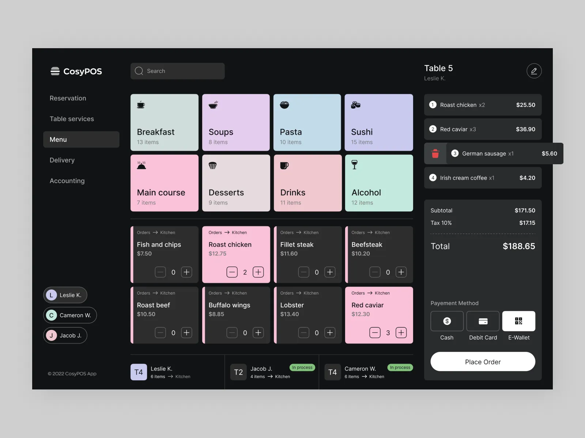

[CosyPOS – restaurant POS system](https://dribbble.com/shots/19061261-CosyPOS-restaurant-POS-system) — Dmitry Lauretsky / Ronas IT. **2,114 likes · 1,570 saves · 465,707 views.**

**Image lo em undi:** Charcoal app background, lavender/mint/rose cards, dark text on coloured cards. Same design lo filled cards, dark cards with accent strips, compact rows anni kanipisthayi.

**Mana app ki adaptation:** Habit cards ki pastel fill; compact list lo colour strip; calendar lo ade accent; stats ki charcoal panels. Oka fixed card shape meeda depend avvadu.

**Pack potential — judgement:** Mana card-based app ki strongest starting point. Night Lavender, Night Mint, Night Rose variants tho oka coherent pack cheyyachu. Basic dark mode free ga unchi, ee richer styling ni Plus lo pettali.

**Limit:** Dense grid lo every card full colour ayithe hierarchy pothundi. Active/completed states ki fill + check mark rendu use cheyyali.

## 2. Soft Pastel

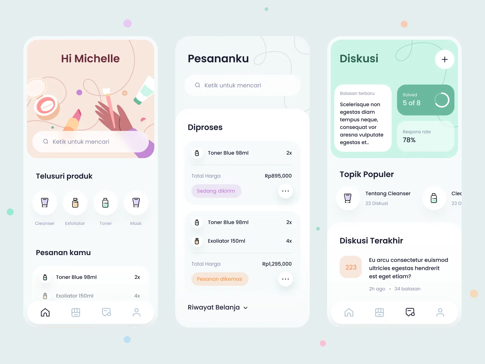

[Beauty & Face Care App](https://dribbble.com/shots/15770373-Beauty-Face-Care-App) — Ghani Pradita / Paperpillar. **1,492 likes · 793 saves · 288,610 views.**

**Image lo em undi:** Pale blue-white surface, peach and mint header panels, soft rounded cards, subtle line-art decoration.

**Mana app ki adaptation:** Whole app ki low-saturation base; habit cards ki tinted panels; header/card corners lo sparse doodles; charts and buttons ki matching accents.

**Pack potential — judgement:** Peach, Mint, Lavender, Butter laanti variants ki useful reference. Calm/self-care positioning tho fit avutundi; popularity kooda strong.

**Limit:** Shot lo text konchem faint ga undi. Mana version lo readable dark text, visible boundaries maintain cheyyali; source contrast ni blindly copy cheyyakudadhu.

## 3. Playful Doodles

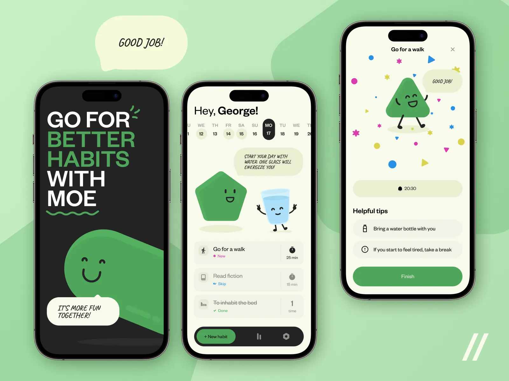

[Habit Tracker Mobile IOS App](https://dribbble.com/shots/21367995-Habit-Tracker-Mobile-IOS-App) — Purrweb; interface Olga Vorontsova, motion Alexey Luchin. **1,336 likes · 959 saves · 224,868 views.**

**Image lo em undi:** Cream canvas, green character, simple habit rows, doodle marks and a celebratory completion screen.

**Mana app ki adaptation:** Normal rectangular cards/rows ni preserve chesi, corner sticker, custom completion mark and small celebration add cheyyali. Mascot ni every card lo pettalsina avasaram ledu.

**Pack potential — judgement:** Flat palette kanna clear personality untundi. Garden Doodles, Little Stars, Tiny Creatures laanti original packs test cheyyachu.

**Limit:** Existing character Mo ni mana asset ga use cheyyakudadhu. Illustration cost ekkuva; dense layouts lo decorative elements reduce cheyyali.

## 4. Gradient Cards

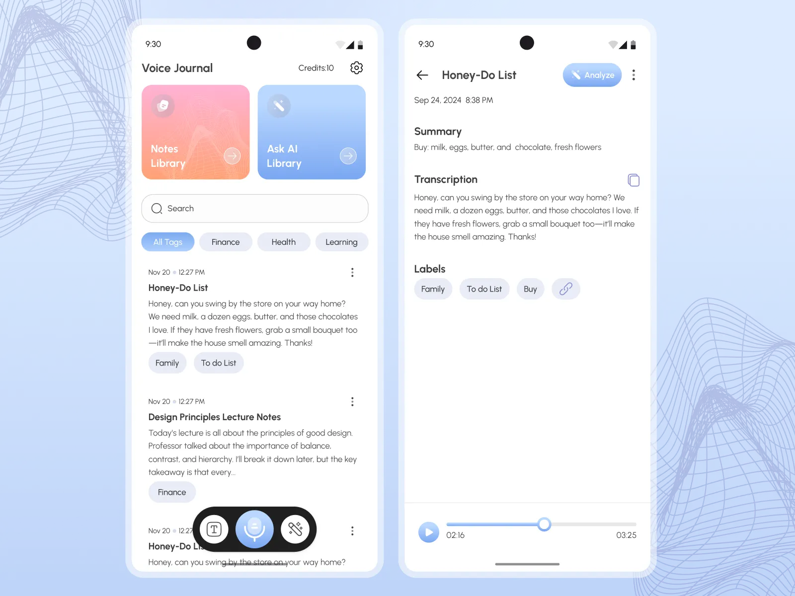

[UI/UX Mobile App Design for a Notes AI App | Voice Journal App](https://dribbble.com/shots/25578455-UI-UX-Mobile-App-Design-for-a-Notes-AI-App-Voice-Journal-App) — Anna (asol_design). **696 likes · 69 saves · 59,184 views.**

**Image lo em undi:** White workspace, pink-to-orange and blue gradient cards, matching pill controls, fine decorative line texture.

**Mana app ki adaptation:** Habit cards ki gradient fill; long rows ki narrow gradient stripe; progress bars ki solid coordinated accent. Background neutral ga undachu.

**Pack potential — judgement:** Sunrise, Ocean, Lilac variants easy ga recognise cheyyagalige pack. Card skins ni whole-app redesign lekunda start cheyyadaniki useful.

**Limit:** White text over light gradient readability test cheyyali. Likes strong, kaani saves 69 matrame; likes alone batti winner ani cheppalem.

## 5. Honey & Sunshine

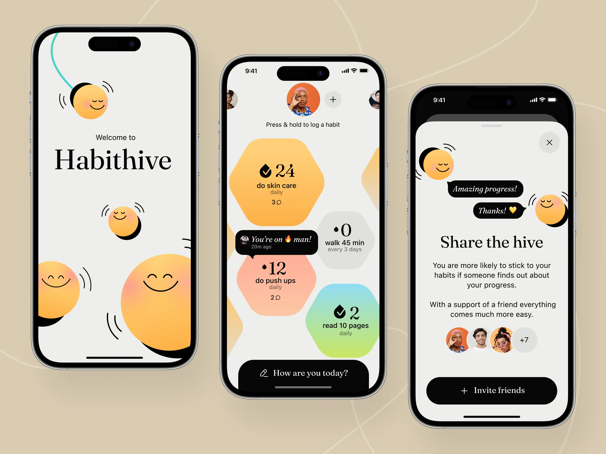

[Habit Tracker Mobile App / Habithive](https://dribbble.com/shots/24147135-Habit-Tracker-Mobile-App) — Ronas IT | UI/UX Team. **627 likes · 364 saves · 185,795 views.**

**Image lo em undi:** Honey-yellow gradients, cream/grey base, black labels, expressive bees and honeycomb habit tiles.

**Mana app ki adaptation:** Yellow palette, small bee/doodle, completion stamp teesukovali. Honeycomb ni fixed layout requirement ga teesukokunda normal cards meeda faint pattern ga adapt cheyyali.

**Pack potential — judgement:** Named identity undi kabatti seasonal summer pack ga plausible. Plain yellow recolour kanna theme value clearer.

**Limit:** Exact honeycomb layout user requirement ki suit kaadu. Our adaptation is a proposal; source itself is not layout-independent.

## 6. Sage & Latte

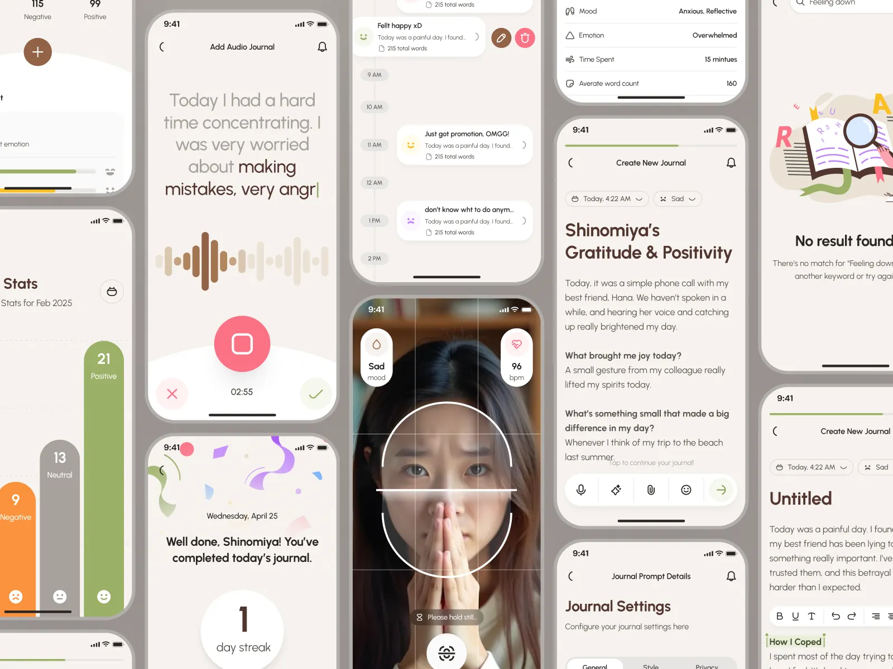

[freud v2: AI Mental Health Companion – Journal & Diary Overview](https://dribbble.com/shots/25514838-freud-v2-AI-Mental-Health-Companion-Journal-Diary-Overview) — strangehelix. **210 likes · 120 saves · 24,264 views.**

**Image lo em undi:** Warm off-white surfaces, brown typography, olive/sage accents, pill-shaped cards and soft shadows.

**Mana app ki adaptation:** Habit rows, calendar cells, charts and settings panels ki same cream/sage/brown system apply cheyyachu. Illustration optional.

**Pack potential — judgement:** Calm, adult, less playful choice. Matcha, Oat, Terracotta laanti variants ki starting reference.

**Limit:** Reference lo unna AI/health features ni recommend cheyyatledu; visual treatment matrame. Paper texture ee image lo strong ga ledu—texture add chesthe adi mana proposal.

## 7. Illustrated Covers

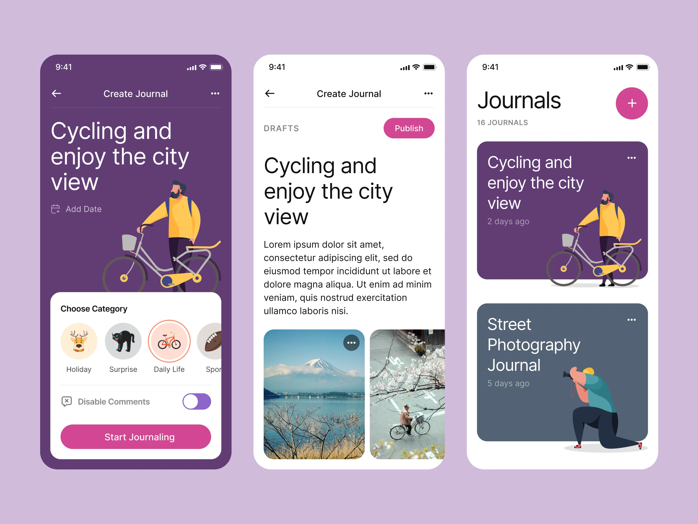

[#Exploration – Journal App](https://dribbble.com/shots/23854233--Exploration-Journal-App) — Paperpillar. **273 likes · 113 saves · 79,207 views.**

**Image lo em undi:** Plum/slate cards with large activity illustrations; card design detail screen header ki extend avutundi.

**Mana app ki adaptation:** Reading, walking, water laanti common habits ki original covers; user-created habits ki abstract fallback. Compact row lo same artwork thumbnail ga collapse avvali.

**Pack potential — judgement:** Theme + habit cover bundle ga value visible ga untundi. Report lo photo-cover purchase evidence ki adjacent direction.

**Limit:** Arbitrary habit names, long text, small widgets lo large artwork fit kaadu. Default minimal mode and hide-art option avasaram.

## 8. Porcelain & Teal

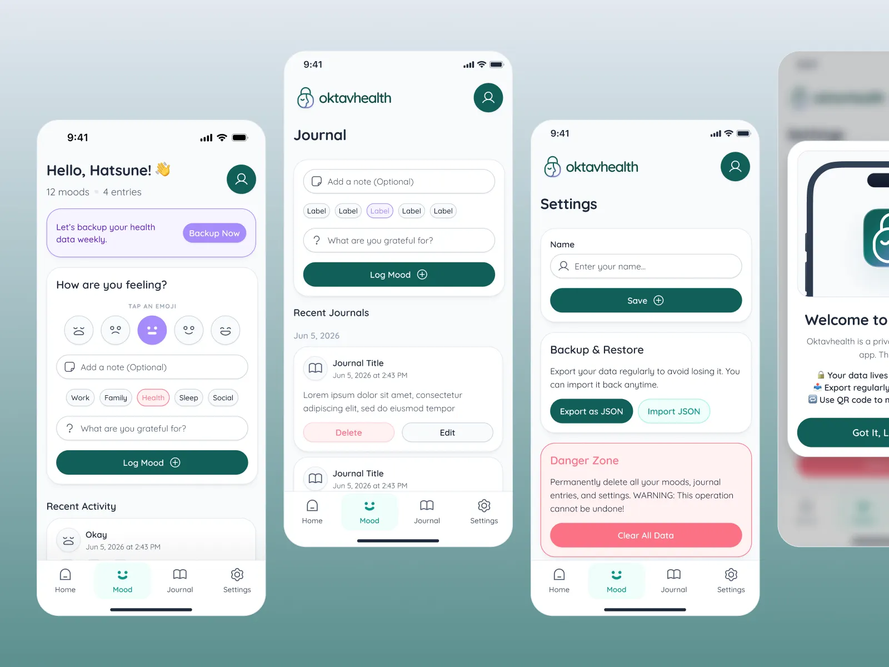

[walden by oktavsoftware: Private Mood Tracking & Journal App UI](https://dribbble.com/shots/27467876-walden-by-oktavsoftware-Private-Mood-Tracking-Journal-App-UI) — Samuel Oktavianus. **186 likes · 74 saves · 8,961 views.**

**Image lo em undi:** Inspected image lo white rounded panels, fine grey borders, teal buttons and lavender highlights unnayi.

**Mana app ki adaptation:** Same surface/border/accent treatment lists, forms, cards, stats ki transfer avutundi. Selected states lavender, primary action teal.

**Pack potential — judgement:** Clean premium option ga test cheyyachu; visual difference from a good free default takkuva undachu, so bundle lo supporting variant ga better.

**Limit:** Source tags lo dark teal/gradient unnappatiki saved image light UI. Daanini dark-theme proof ga present cheyyatledu. Lower total reach; 186 likes cannot be equated to established demand.

## 9. Dreamy Glass

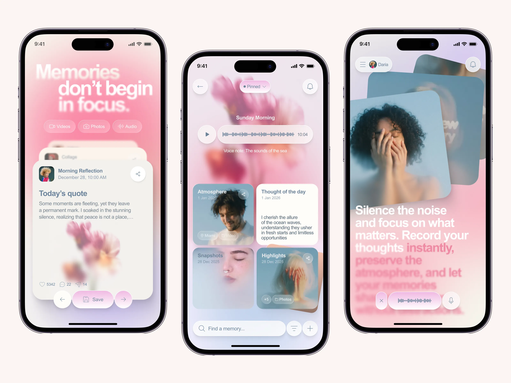

[Luma — Emotional Journal App Concept](https://dribbble.com/shots/27035792-Luma-Emotional-Journal-App-Concept) — Humbleteam. **103 likes · 38 saves · 11,902 views.**

**Image lo em undi:** Blurry pink/lilac photo backgrounds, milky cards, translucent floating controls.

**Mana app ki adaptation:** Background atmosphere + mostly opaque habit cards. List/grid/calendar same safe text surface use cheyyali. Optional blur/photo layer.

**Pack potential — judgement:** Screenshot lo distinctive ga untundi. Dreamy Rose, Cloud Blue, Lavender Mist variants possible.

**Limit:** Blurred headings and low-contrast body text ni copy cheyyakudadhu. Busy backgrounds and transparency valla dense stats readability taggochu; first release priority kaadu.

## 10. Paper / Field Notes

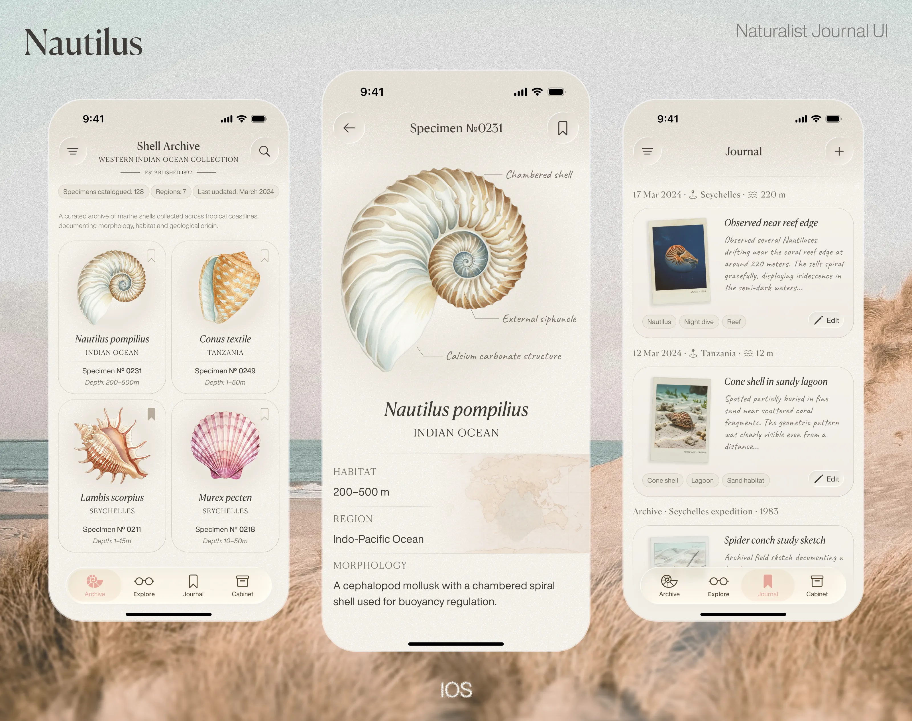

[Nautilus — Naturalist Journal App](https://dribbble.com/shots/27157920--Nautilus-Naturalist-Journal-App) — Yana. **29 likes · 20 saves · 4,879 views.**

**Image lo em undi:** Warm textured paper, fine ink outlines, serif headings, specimen cards and Polaroid-like photos.

**Mana app ki adaptation:** Paper material ni full canvas + cards ki use chesi, lists lo fine rules, calendar lo stamped completion marks pettachu. Cards size maarina material panichestundi.

**Pack potential — judgement:** Paper pack ki actual visual reference. Classic Notebook, Field Notes, Sepia variants original ga design cheyyachu.

**Limit:** Only 29 likes / 20 saves. Visually promising, kaani popularity-backed launch winner kaadu. Handwritten body text ni avoid chesi regular readable font retain cheyyali.

## 11. WhatsApp: background + foreground kalipi theme cheyyadam

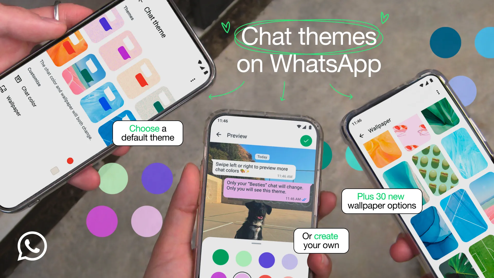

[Official WhatsApp announcement, 13 February 2025](https://blog.whatsapp.com/chat-themes-to-reflect-your-style). Presets background tho paatu chat bubble colours kooda change chesthayi; mix-and-match and custom photos kooda describe chesaaru. Public likes/saves ee source lo levu; idi interaction reference, popularity proof kaadu.

Mana equivalent: **app background + habit card surface + accent + completion mark** kalisi change avvali. Wallpaper loud ga unna, text unna card surface opaque/readable ga undali. Theme chooser thumbnail lo bare wallpaper badulu oka actual habit card, mini-calendar, selected button chupinchali. App-wide default first; per-habit override later, if useful.

## Layout maarina theme work avvali ante

“Any layout” guarantee ee reference shots ivvavu. Layout-independent theme system ni build chesi actual app layouts meeda verify cheyyali. Geometry/nav/data structure separate; theme visual roles ni replace chesthundi.

| Surface | Midnight Pastel | Soft Pastel | Playful Doodles | Paper experiment |
|---|---|---|---|---|
| App background | Charcoal | Pale blue/cream | Warm cream | Low-intensity paper grain |
| Big card | Pastel fill, dark text | Tinted fill, small doodle | Neutral fill, corner sticker | Ink border, paper fill |
| Compact row | Accent strip + check | Tinted icon tile | Small sticker/check | Thin rule + stamp |
| Calendar / heatmap | Same accent ramp | Same accent ramp | Plain cells + playful check | Plain cells + ink check |
| Stats panel | Flat dark surface | Flat light surface | Decoration outside chart | Grain removed behind chart |
| Completion | Filled indicator + check | Darker accent + check | Small doodle celebration | Stamp + check |

Decoration must scale down with available space. A 320px-wide card and 44px-high row cannot carry the same large illustration. Keep borders, fills and patterns flexible; illustrations need corner/thumbnail/hidden variants. Dense heatmaps need plain cells. Long habit names, numbers, empty/skipped/completed states, enlarged text and both appearance modes need checking before a pack is accepted.

## What I would build and test first

**Three packs × three variants = nine prototypes**, not an immediate commitment to 30 production themes. Proposed variants: Midnight Lavender/Mint/Rose; Soft Peach/Mint/Lilac; original Garden Doodles/Stars/Tiny Creatures. Variants are our proposed work, not found downloadable products. Sage & Latte and Gradient Cards can follow; Paper deserves a small preference test despite its low likes.

Make previews using the **same habits and same layout**, so people choose appearance rather than a different feature set. Let target users apply a theme to their own list/grid/calendar, keep it for several days, and show the real Plus price. Compare preview → apply → still using → purchase by pack. Apply/keep signals are more informative than asking “looks good?”; actual purchase is stronger evidence than likes or stated willingness to pay. No reliable external sales/conversion data for these specific designs was found, so “easy to sell” remains a hypothesis.

The proposed Plus bundle can include these packs. This research does not establish a separate per-pack price or justify charging again on top of Plus. A polished free baseline is necessary; richer paid packs need a visibly different material/illustration identity, not just a different hex colour.

**Not shortlisted:** [Neubrutalism Mobile App Design Exploration](https://dribbble.com/shots/25960693-Neubrutalism-Mobile-App-Design-Exploration) had **0 likes, 1 save, 2,335 views** when checked (posted 29 April 2025). That particular reference fails the popularity criterion; it does not prove the entire style is unpopular.

All adaptation and launch recommendations above are design judgement, separate from the observed counts. Source images remain credited to their creators. Machine-readable metadata: [sources.json](sources.json).
