# Day Details — 21 Wireframes and Interaction Notes

Written by Codex (OpenAI), 4 October 2026. [Handoff index](README.md) · [research and rationale](<The Habit Day Sheet — Wording, Hierarchy and Actions.md>) · [revision history](<Decision History — Why the Layout Changed.md>) · [editable Figma board](https://www.figma.com/design/Ncccsm1l2O62GJ5xLSInqk/Design?node-id=370-2031).

**These PNGs render the proposed pop-ups in Markdown. They are wireframes of the overall layout and interactions, not final visual designs.** Figma's `⋯`, `×`, chevrons, checkbox marks, card styles and button heights are stand-ins. Build the actual sheet from native SwiftUI, SF Symbols, system typography, menus and buttons, with Dynamic Type, VoiceOver and light/dark appearance (U1/U9/U18). The note surface previews or invites a **note for this selected day** and opens the existing separate note editor; it is not another logging button or an inline text editor. The selected-day status, controls and saved logs form one activity group; note and Skip are separate groups (U15–U17). All screenshots here are exports of our own editable Figma layers.

## Shared behavior across the variants

- **Entry and purpose:** tap a habit row's body for the day shown to inspect and correct that day. The row's round CTA still logs directly (U14). The sheet title is the selected day, not `Today · Habit name`. The habit identity row, including its chevron, opens the habit page; a task has no habit-page destination.
- **Toolbar:** the leading ⋯ opens a native menu of habit-level commands such as Edit, Pause/Resume, Archive and Delete; destructive actions are last and Delete is confirmed. The trailing `×` is the native `xmark` Close button with spoken name **Close**. Each has a usable 44 pt hit region; the mock glyph is not the implementation (U1/U14/U18).
- **Activity:** show a clear day state instead of a generic “Result.” A quick and manual logging pair has equal native regular-size hit areas; style expresses goal-aware priority. No empty “Today's logs” placeholder appears. When logs exist, each row names its unit/session, time and source and opens correction of that one record (U16/U19).
- **Note and Skip:** an empty note says **Add a note…**; an existing one shows its text. Tapping either opens the separate note editor. Skip is a true bordered action button, not a chevron row. After activation the **same** button becomes **Undo skip**, without moving. New-log actions remain visible but disabled, while saved logs and the note remain visible and the note editable (U15).
- **Date navigation:** the bottom day pager from the old sheet is removed. The selected-day title is context only. Another day remains accessible from Today or the habit calendar; do not add a top chevron without a real date-selection action (U5).
- **Spacing:** in the Figma specimen, status/control gap ≈10 pt, quick/manual gap ≈8 pt, controls/logs gap ≈18 pt and log heading/records gap ≈8 pt. Give the *whole* activity group ≈28 pt outside space, and note/Skip ≈24 pt. These are relationships between elements, not card padding or fixed implementation constants (U17).

## Checks and checklist

### 01. Daily check, not done

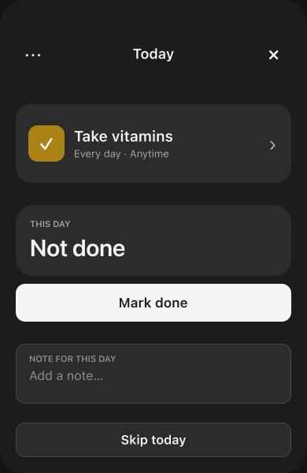

The single visible **Mark done** action changes this day directly. There is no duplicate Done switch, Add Entry, or empty log card. Keep note and Skip below the day activity. [Figma state](https://www.figma.com/design/Ncccsm1l2O62GJ5xLSInqk/Design?node-id=371-2034).

### 02. Daily check, done

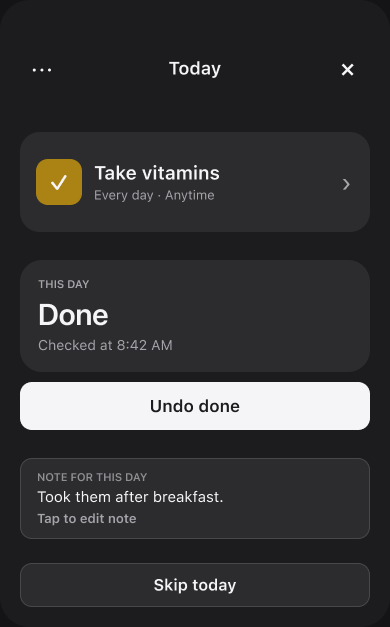

**Done** and its optional checked time explain the current state. **Undo done** names the correction; the saved day note is visible and tappable. A separate one-item “entry” editor would duplicate this state. [Figma state](https://www.figma.com/design/Ncccsm1l2O62GJ5xLSInqk/Design?node-id=371-2062).

### 03. Weekly check

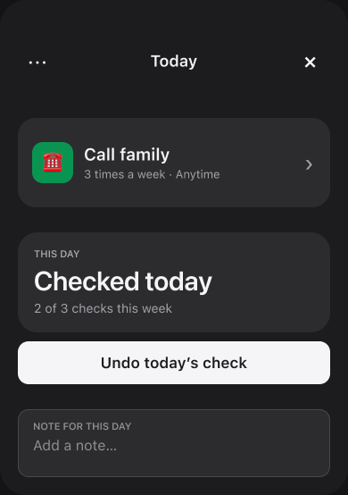

Show **Checked today** as the selected-day fact and **2 of 3 checks this week** as smaller period context. Undo changes this day's check, not the whole weekly goal. This same distinction applies to an incomplete day. [Figma state](https://www.figma.com/design/Ncccsm1l2O62GJ5xLSInqk/Design?node-id=371-2092).

### 04. Repeated daily checks

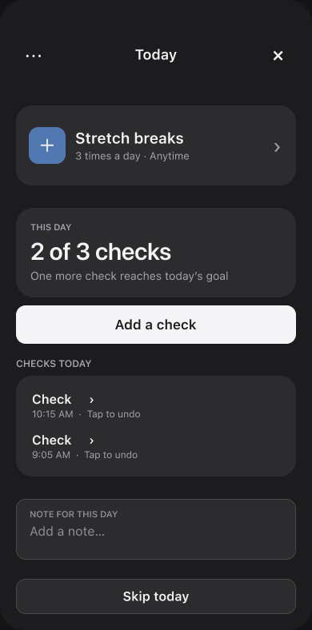

**Add a check** increments; it must never silently undo a previous check. Existing checks appear only when present, with time and a named correction for the selected check. A multi-value record may need the separate editor; an individual single check can be undone here. [Figma state](https://www.figma.com/design/Ncccsm1l2O62GJ5xLSInqk/Design?node-id=371-2120).

### 05. Checklist

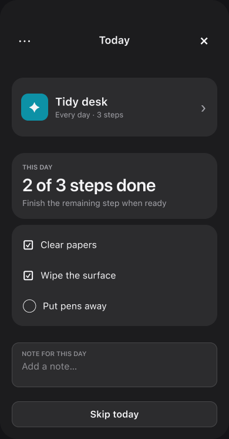

The named steps are both the work and the correction controls. Status summarizes the count, while each step remains individually togglable. Do not add a generic entry list or an Add Entry action for a step. [Figma state](https://www.figma.com/design/Ncccsm1l2O62GJ5xLSInqk/Design?node-id=371-2157).

### 13. Monthly check

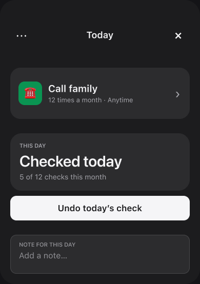

Like the weekly variant, separate the selected day's check from the month's count; the period goal is context, not a demand to check multiple times on this day. Keep this composition for less common recurrence intervals too. [Figma state](https://www.figma.com/design/Ncccsm1l2O62GJ5xLSInqk/Design?node-id=374-2045).

## Amounts, time and quit records

### 06. Positive amount goal

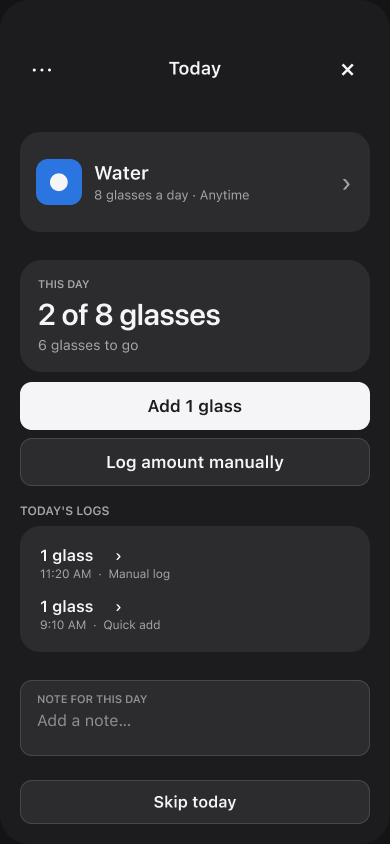

The status states **2 of 8 glasses**. **Add 1 glass** is the goal-aligned quick CTA; **Log amount manually** has the same native-size footprint but a quieter style. Existing logs sit immediately below and tap through to correction of one glass record. The note and Skip sit outside that activity group. [Figma state](https://www.figma.com/design/Ncccsm1l2O62GJ5xLSInqk/Design?node-id=371-2193).

### 07. At-most amount goal

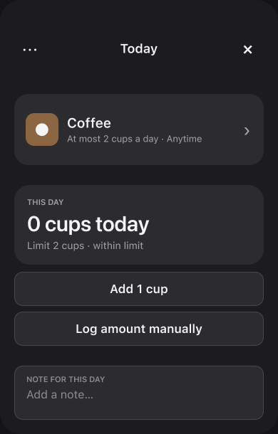

**0 cups today · limit 2** is factual; the limit is not a progress target to fill. **Add 1 cup** and **Log amount manually** remain equally reachable but bordered, so the design does not encourage consumption. No empty logs card. [Figma state](https://www.figma.com/design/Ncccsm1l2O62GJ5xLSInqk/Design?node-id=371-2231).

### 08. Time goal

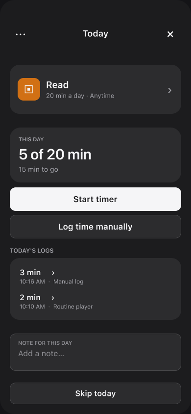

**Start timer** is the prominent action for a positive time goal; **Log time manually** is equally sized. Saved sessions include duration and source and tap to the one-record editor. A running timer is a separate state below. [Figma state](https://www.figma.com/design/Ncccsm1l2O62GJ5xLSInqk/Design?node-id=371-2259).

### 09. Quit habit, no slip

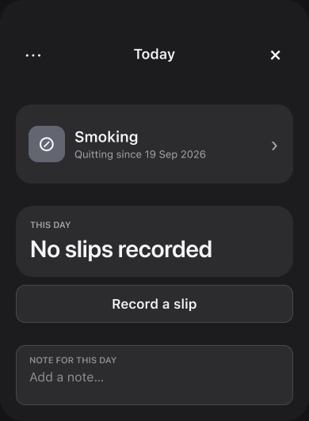

**No slips recorded** is a neutral fact. **Record a slip** stays available but visually quiet. Do not add a blank entries card, celebrate a slip action, or use shame language. [Figma state](https://www.figma.com/design/Ncccsm1l2O62GJ5xLSInqk/Design?node-id=371-2298).

### 17. Quit habit, recorded slip

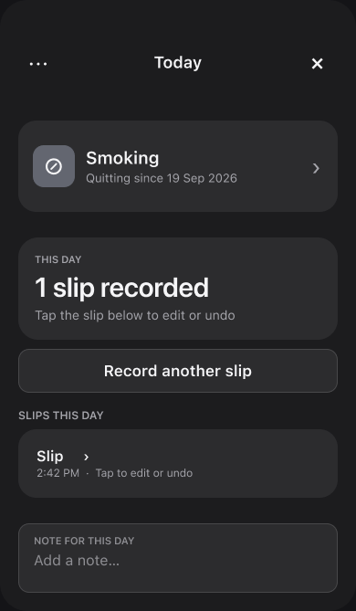

Once a slip exists, show its occurrence under **Slips this day** and let the row open **Edit slip** for date/time correction or one-slip deletion. **Record another slip** remains bordered. The Day sheet must recalculate its status after a change; it should not treat a slip as positive progress. [Figma state](https://www.figma.com/design/Ncccsm1l2O62GJ5xLSInqk/Design?node-id=376-2049).

### 18. Limit exceeded

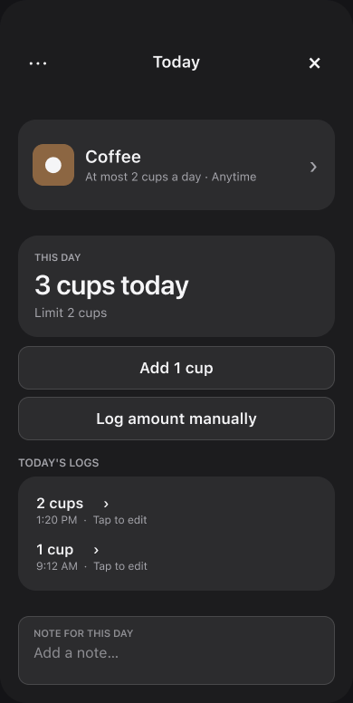

The exceeded amount is stated plainly and remains editable by record. Avoid red, “failed,” or a completion bar toward the limit (U3/U16). This is a state for factual correction, not punishment. [Figma state](https://www.figma.com/design/Ncccsm1l2O62GJ5xLSInqk/Design?node-id=376-2083).

### 19. Timer running

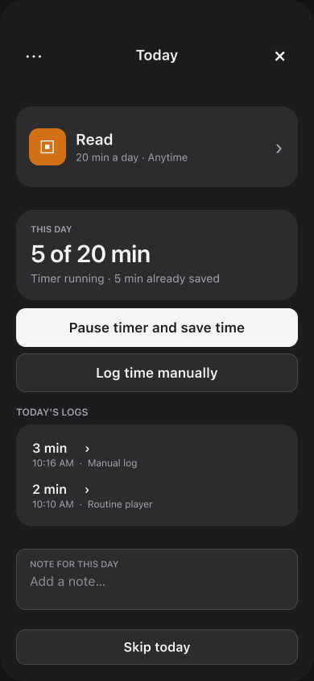

Keep the live timer's start/pause state legible without letting every part of the sheet tick or redraw. Existing saved sessions remain separate from the currently running session and can still be inspected. The native implementation must follow S3/S4/S6, then measure S2/T4. [Figma state](https://www.figma.com/design/Ncccsm1l2O62GJ5xLSInqk/Design?node-id=376-2119).

## Tasks, dates and management

### 10. One-time task, not done

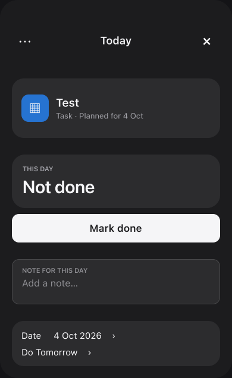

The task has one Mark done/Undo done state, its planned date and its note. It has no habit-page link or per-task entry list; Edit Task belongs to the task's native management action. [Figma state](https://www.figma.com/design/Ncccsm1l2O62GJ5xLSInqk/Design?node-id=371-2324).

### 11. Selected past day

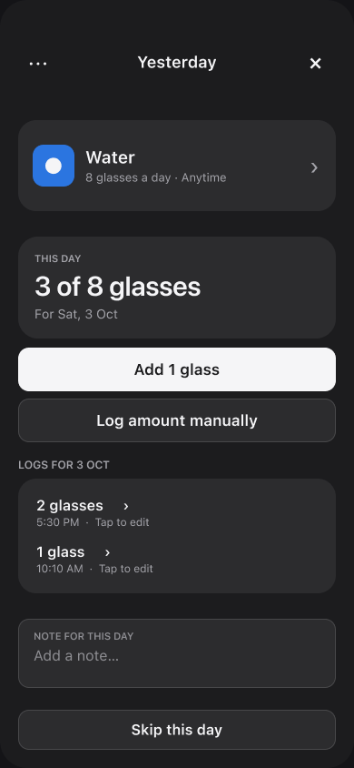

The toolbar identifies the actual selected date; labels and log heading refer to **that day**. Corrections apply to that day, not silently to Today. Past-day access comes from Today or the habit calendar, with no bottom pager. [Figma state](https://www.figma.com/design/Ncccsm1l2O62GJ5xLSInqk/Design?node-id=371-2348).

### 12. Native menu study, light appearance

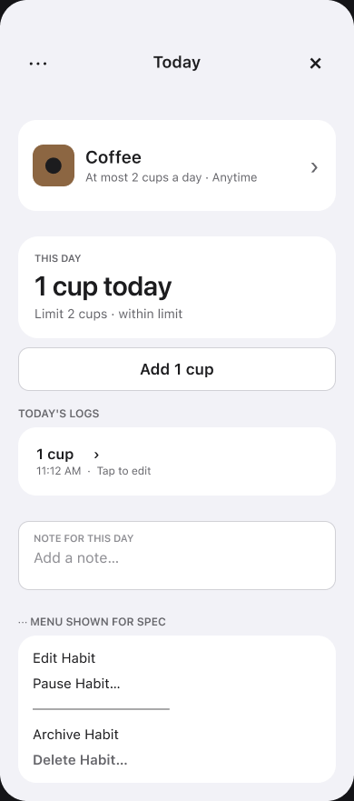

The image illustrates the grouping and order of **View Habit / Edit / Pause / Archive / Delete**, with destructive actions last. Implement a native SwiftUI `Menu`, native actions and system iconography; the mock menu geometry is not a custom menu specification. Preserve the identity row's direct path to the habit page and confirm Delete with Archive Instead (U14). [Figma state](https://www.figma.com/design/Ncccsm1l2O62GJ5xLSInqk/Design?node-id=371-2386).

### 16. Centered identity exploration

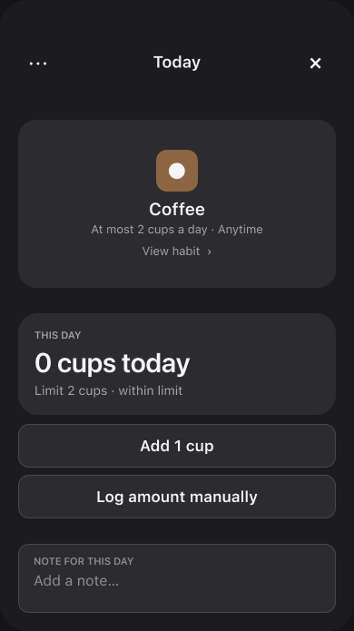

This is an **exploration**, not a separate required final layout. It tests the user's centered icon/name idea against the compact leading-aligned identity used in the other variants. The latter is the handoff baseline because long names, two-line plans and the page chevron gain a stable scan edge; confirm on a small iPhone and at accessibility text sizes before finalizing. [Figma state](https://www.figma.com/design/Ncccsm1l2O62GJ5xLSInqk/Design?node-id=374-2129).

### 20. One-time task, done

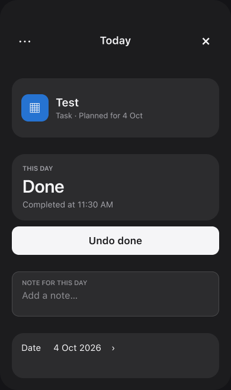

The task's state changes to Done and its direct control becomes Undo done. The note remains accessible; the screen does not invent a task log editor. [Figma state](https://www.figma.com/design/Ncccsm1l2O62GJ5xLSInqk/Design?node-id=376-2157).

## Skipped and paused states

### 14. Skipped daily check

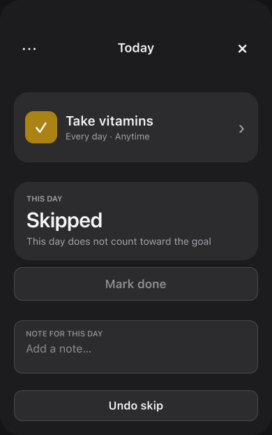

**Undo skip** occupies the exact position of Skip. The normal **Mark done** control remains visible but disabled. Note remains reachable; skip does not erase the day or replace the main CTA with recovery. [Figma state](https://www.figma.com/design/Ncccsm1l2O62GJ5xLSInqk/Design?node-id=374-2073).

### 15. Paused day

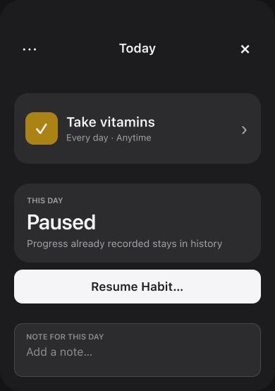

Explain pause neutrally, keep the habit identity/management path and note context. Do not style the paused day as a missed target or offer unavailable logging as if it works. The precise pause eligibility rules remain those of the habit model, not the pixel mockup. [Figma state](https://www.figma.com/design/Ncccsm1l2O62GJ5xLSInqk/Design?node-id=374-2101).

### 21. Skipped amount day with saved logs and note

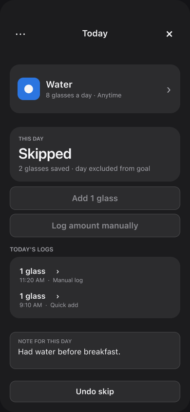

This is the explicit recovery state missing from the early design. **2 glasses saved** and both log rows stay visible and correctable; the saved note stays visible. New **Add 1 glass** and **Log amount manually** controls are disabled but keep their positions. **Undo skip** stays below the note, where Skip was. Skipping changes the day's treatment, not its record history (U15/D7). [Figma state](https://www.figma.com/design/Ncccsm1l2O62GJ5xLSInqk/Design?node-id=388-2072).

## Build and validation handoff

Use the [native implementation contract](<Native Implementation Contract.md>) for the SwiftUI mapping and the [record-editor wireframes](<Entry Editor Wireframes.md>) for what happens when an editable saved log is tapped. Validate every variant on an iPhone, especially large text, VoiceOver, light/dark, long names, keyboard transitions, skipped records and the difference between a positive goal and an at-most limit (U1/U9/S2/T3/T4). The chosen labels and exact visual rhythm remain hypotheses until that work is done.
