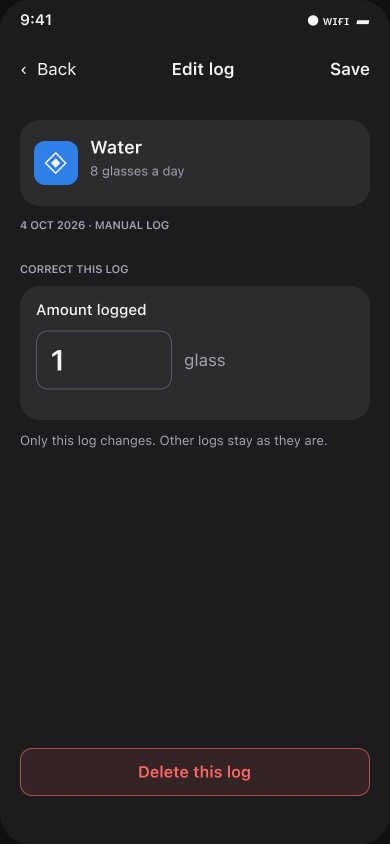
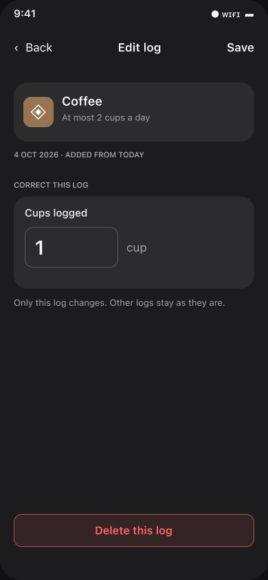
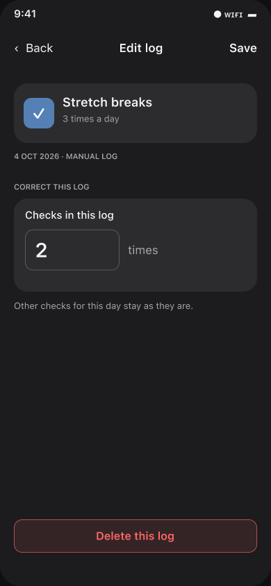
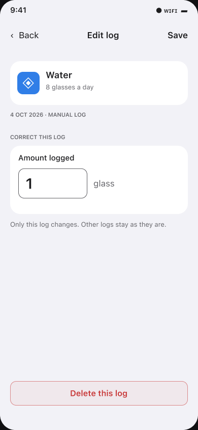
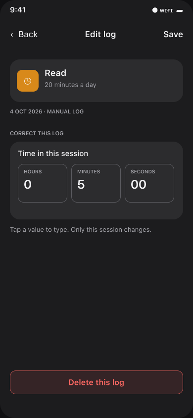
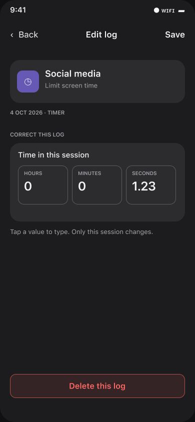
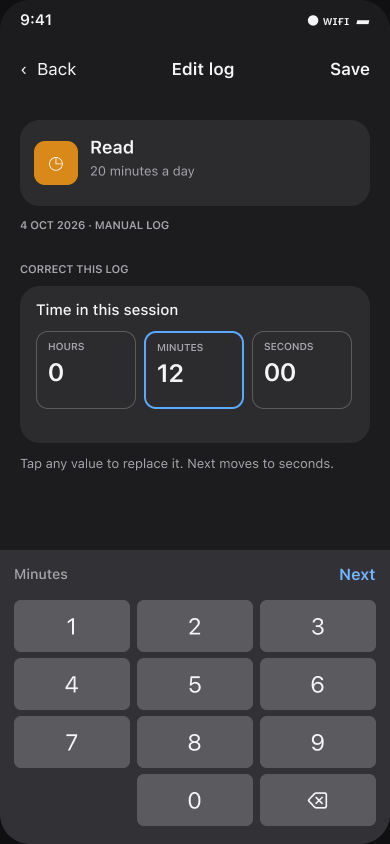
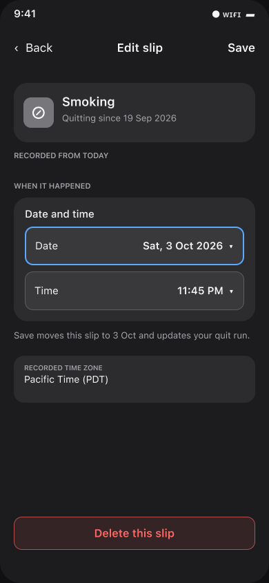
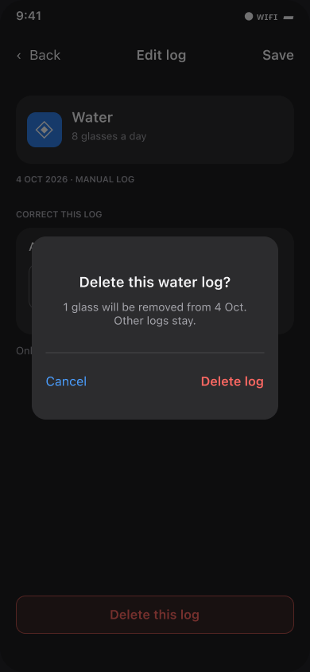

# Entry Editor — 10 Wireframes and Interaction Notes

Written by Codex (OpenAI), 4 October 2026. [Handoff index](README.md) · [editor research](<Editing One Habit Log — Scope, Fields and Recovery.md>) · [decision history](<Decision History — Why the Layout Changed.md>) · [editable Figma board](https://www.figma.com/design/Ncccsm1l2O62GJ5xLSInqk/Design?node-id=408-2071).

**These are pop-up wireframes showing the correction layout, fields and interaction states—not final iOS designs.** Implement real SwiftUI navigation, text fields, native keyboard, compact `DatePicker`, controls and alerts. The drawn status bar, keyboard, focus ring, chevrons, buttons and exact heights are only visual representations. Follow Rulebook U1/U6/U9/U19 and the [native implementation contract](<Native Implementation Contract.md>).

## Scope and common structure

Tapping an **editable saved record** from Day details opens **Edit log** for an amount, duration or multi-check count, or **Edit slip** for a quit occurrence. The first editable item is the fact that this *one* record owns. Habit name/icon, tracked day, source and time zone provide context without replacing the field. Save changes only this record, preserves its ID and other records, and returns to the relevant Day details state. Back discards the draft; if the user changed it, provide an appropriate discard decision before losing work. A full-width, native bordered **Delete this log / Delete this slip** button sits near the bottom safe area, separated by open space from the editable field and Save. There is **no divider above it**. Tapping Delete opens a native confirmation alert; no record is removed until the person chooses its destructive action (U19). In the keyboard-focused state, the keyboard covers the bottom area; dismiss it to reach Delete rather than floating a destructive control beside the keyboard.

No generic editor opens for a one-time task, checklist step, once-daily binary check, single check toward a weekly/monthly goal, or individual one-check record. Those correct with their named controls in Day details. A multi-check *record whose integer value can change* does need the count editor. Do not leave a chevron pointing to a removed screen.

## Amount and count fields

### 01. Water — positive amount log

Show this saved record's amount and **glass** unit together; the whole-day 8-glass target is context, not an editable field here. Use a native numeric field with locale-aware decimal handling and validation; Save affects only this one log. The distinct bottom Delete button opens the confirmation shown in state 07. [Figma state](https://www.figma.com/design/Ncccsm1l2O62GJ5xLSInqk/Design?node-id=408-2077).

### 02. Coffee — at-most amount log

The editor is equally reachable for a limit habit, but its copy and style stay factual. Correcting cups is not a celebration of approaching the limit. Keep the value and cup unit explicit; changing it recalculates the selected day's factual total. [Figma state](https://www.figma.com/design/Ncccsm1l2O62GJ5xLSInqk/Design?node-id=408-2112).

### 05. Repeated check — multi-value record

Only a record that stores **more than one check in one saved log** needs this count correction. Accept a positive whole number; show the check unit and source. An individual one-check record should have a named one-record Undo in Day details instead of a redundant “Times 1” screen. [Figma state](https://www.figma.com/design/Ncccsm1l2O62GJ5xLSInqk/Design?node-id=408-2229).

### 08. Water — light appearance

This checks the same hierarchy in light mode. SwiftUI should use semantic/system colors and Dynamic Type, not sample the exact pixels or hard-code a dark card palette. Compare focus, unit text, Save and destructive-action contrast in both appearances. [Figma state](https://www.figma.com/design/Ncccsm1l2O62GJ5xLSInqk/Design?node-id=408-2346).

## Saved durations

### 03. Read — manually logged duration

Hours, Minutes and Seconds remain adjacent so the saved session is understood before editing. Unlike the current large hour/minute wheel plus detached Seconds row, each displayed value can be tapped to replace it. Keep the keyboard closed on initial presentation. The tracked day and **Manual log** source are compact, read-only context. [Figma state](https://www.figma.com/design/Ncccsm1l2O62GJ5xLSInqk/Design?node-id=408-2147).

### 04. Social media — fractional timer duration

The same three-field pattern works for a timer/routine-player record with decimal seconds. A 1.23-second session must display and survive a Save as **1.23 sec**, without rounding to a minute, dropping precision or changing its provenance. Hours/Minutes use a number pad; Seconds uses a locale-appropriate decimal pad. [Figma state](https://www.figma.com/design/Ncccsm1l2O62GJ5xLSInqk/Design?node-id=408-2188).

### 09. Minutes focused — what tapping a time value does

This is the interaction missing from the initial static form. Tapping **Minutes** selects its current content, focuses that small field and brings up the system number pad. A keyboard accessory gives **Next** to Seconds and **Done** after the last field; tapping Seconds directly need not force the other fields. Save stays in the native toolbar. Validate 0–59 for Minutes/Seconds, a positive total and the app's maximum; show errors near the field rather than silently clamping. Keep the focused field visible above the keyboard at accessibility text sizes (U6/S11). The drawn keypad is **not** a custom keyboard specification. [Figma state](https://www.figma.com/design/Ncccsm1l2O62GJ5xLSInqk/Design?node-id=415-2072).

## Quit occurrence and deletion

### 06. Smoking — slip's recorded date and time

A slip's editable fact is **when it happened**. Show separate Date and Time rows backed by native compact pickers, plus the saved recording time zone; changing one leaves the other intact. The occurrence can affect the quit run. **The date control is a proposed interaction, not current app behavior:** `HabitStore.editEntry` currently rejects another tracked day, so implement the atomic same-ID day move before shipping it (D7/U19). [Figma state](https://www.figma.com/design/Ncccsm1l2O62GJ5xLSInqk/Design?node-id=408-2264).

### 10. Slip date/time draft — moving to another day

The edited draft shows a changed Date and Time and tells the person that Save moves this slip to **3 Oct** and updates the quit run. Save must atomically update `createdAt` and the tracking day under the *same record ID*, move day indexes, persist/sync both values, recalculate affected summaries/runs and reopen the destination Day details. The old day's note stays on the old day. Validate the recorded zone, day-start rule and DST; never expose a Date picker that appears to save but silently keeps the original day (D7/U19). [Figma state](https://www.figma.com/design/Ncccsm1l2O62GJ5xLSInqk/Design?node-id=415-2144).

### 07. Delete confirmation

Tapping the bottom **Delete this log** button presents this confirmation **before** removal. The pop-up identifies **one selected record** and its day; **Cancel** leaves it untouched and the destructive **Delete log** removes only that record. Other logs, the day note and skip flag stay; then the day recalculates. Use a native SwiftUI alert with a cancel action and a destructive role, not a hand-drawn overlay or immediate deletion. The mockup's drawn alert is illustrative. Apply the same pattern to **Delete this slip**, naming the slip and its occurrence; revisit confirmation only after a durable, discoverable one-record Undo exists (U19). [Figma state](https://www.figma.com/design/Ncccsm1l2O62GJ5xLSInqk/Design?node-id=408-2302).

## Validation before implementation is called done

Try a mistaken amount among several logs; a negative/zero/over-maximum amount; `0 h 0 min 1.23 sec`; a corrected 12-minute session; invalid 75 minutes; a multi-check count of 1 and more than 1; Back with a dirty draft; deleting one of several records; a slip moved across a day boundary or time zone; and a skipped day with existing logs. Include small iPhone, large Dynamic Type, VoiceOver, light/dark and keyboard tests. The reports and wireframes document a proposal; they do not establish these outcomes as already tested (U9/S2/T3/T4).
