# Habit Details — Revised Screen Studies

Written by Codex (OpenAI), 4 October 2026. Read the [research and interaction handoff](README.md) before implementation.

The latest [consistency revision](<Consistency Revision.md>) replaces the prior blue-button/inconsistent-field follow-up and is awaiting user review.

These **22 editable Figma screen studies and PNG exports are representative layouts, not final iOS designs**. Build the actual interface with native SwiftUI controls, SF Symbols, semantic colors, Dynamic Type, VoiceOver and the app's light/dark system (Rulebook U1/U9). The [accepted Day details and entry editor handoff](<../../Day Structure and Organization/Day Details and Entry Editor Handoff/README.md>) controls their appearance and behavior.

Editable boards: [Habit details, History and Notes](https://www.figma.com/design/Ncccsm1l2O62GJ5xLSInqk/Design?node-id=433-2071), [record creation and Day-details routes](https://www.figma.com/design/Ncccsm1l2O62GJ5xLSInqk/Design?node-id=434-2071), and [Notes/quit edge states](https://www.figma.com/design/Ncccsm1l2O62GJ5xLSInqk/Design?node-id=443-2071).

## Shared Habit details page

History, Notes and Progress are tabs **within one Habit details page**. The navigation title, centered habit identity, goal, streak/run facts and segmented tabs are shared. Their controls belong to the active tab's scroll content; neither History nor Notes owns a changing page-wide sticky bottom bar. Actions use native-size targets and keep enough width for localization.

### 01. Daily History

Under the History tab, **Open day…** and **Log time manually** sit directly before month groups. The latter is fixed by duration habit type, not derived from “Read.” The dated rows still open the accepted Day-details sheet; a row with saved records exposes exact correction there.

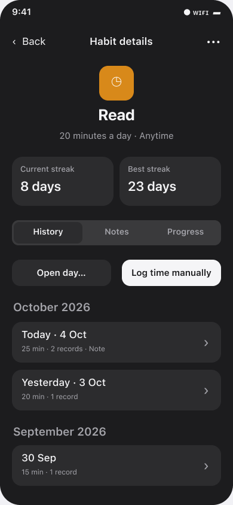

### 02. Weekly History

A long goal wraps above week-based streaks. The fixed repeatable-check action is **Add check**, even when the habit is named “Call family.” It must work for any user-entered habit name.

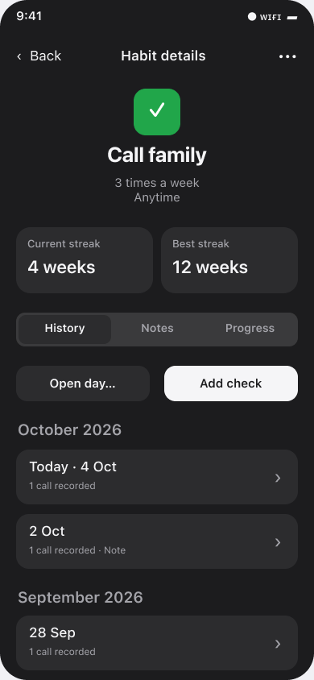

### 03. Direct date access

**Open day…** opens this picker. The copy says plainly that the chosen date opens that habit's Day details; saved records appear there and an unrecorded date opens empty. Choosing a date does not log anything. The picker is constrained to the habit's recordable range; its calendar here is a Figma proxy for native date selection.

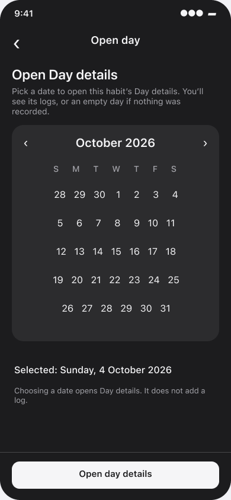

### 04. Quit History

Current/Best **run** replace build-habit streak language. The fixed **Record slip** action has neutral emphasis. Days without a recorded slip are not manufactured as History rows.

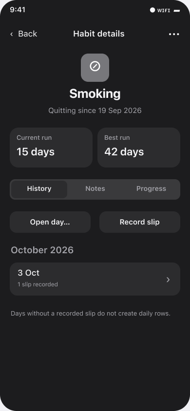

## Notes tab and note pages

The Notes tab puts full-width Search first, then a compact leading **＋ Add note** text-action row, then dated previews. The controls have separate space and no duplicated Notes heading. These controls scroll with the tab and retain their placement in empty/search states.

### 05. Notes list

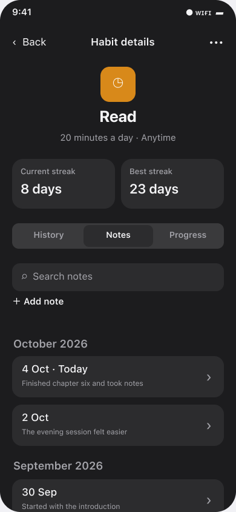

### 06. No notes yet

No fabricated rows. Add note remains in the same row below Search.

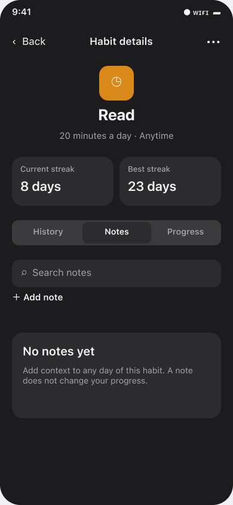

### 07. Search with no matches

This state distinguishes a failed query from no notes at all; clear search remains available. Add note does not move to a bottom bar.

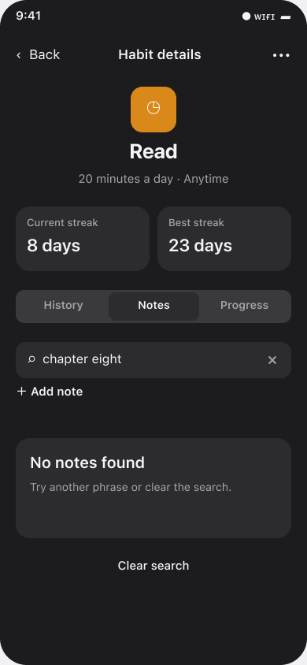

### 08. Note reader

The shared leading habit card precedes the exact date and readable note text. **Edit note** and the native More menu sit immediately after the note content. More contains scoped **Delete note**; the related-day row opens Day details for this exact date.

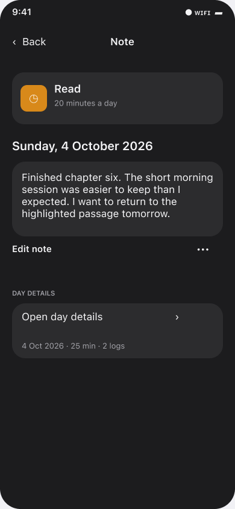

### 09. New-note editor

The shared toolbar and habit card precede a compact selectable Date row and multiline input. Native Save remains in the toolbar. A new note has no Delete action. A dirty Cancel needs discard recovery.

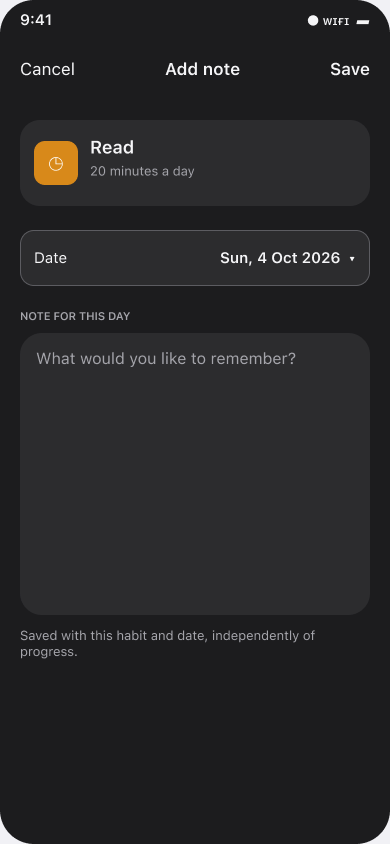

### 10. Existing-note editor

Existing text loads for the selected habit/date; the saved date is read-only. **Delete note** is a bottom destructive button, modeled after the accepted single-record editor. It opens the same confirmation as the reader's More menu. Do not delete a note by blanking its text without explaining that behavior.

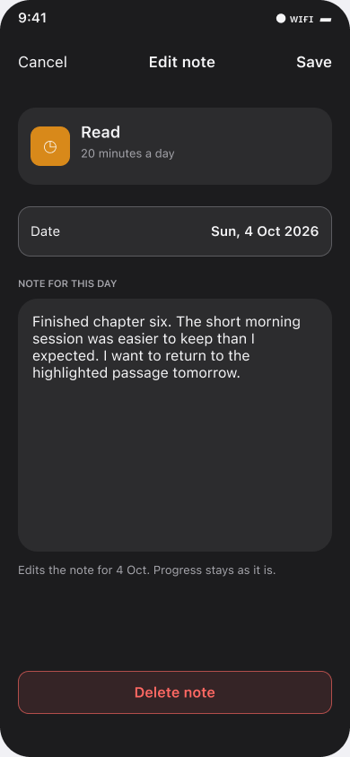

### 11. Reader More menu and confirmation

The More menu contains Delete note only for the current note. The native confirmation states that this note is removed while the day's progress remains. The existing-note editor's Delete note uses this same confirmation.

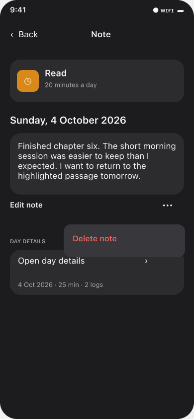

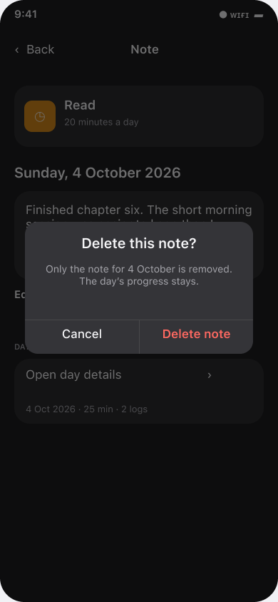

## History recording route

History's type-based action opens a form seeded to **Today**. Its identity card, top toolbar and fields follow the accepted entry editor. The **Date** row can open the date picker below before the native top **Save** adds one independent record. A past-day History row passes that exact date into Day details; a subsequent log action remains scoped to it. The form must never infer a CTA from a user-entered habit name.

### 12–13. Positive amount, Today and past day

The number is directly editable with its unit. Save adds one amount record; it does not replace the day's total. The past-day form preserves 2 October and must not imply that the event happened at save time.

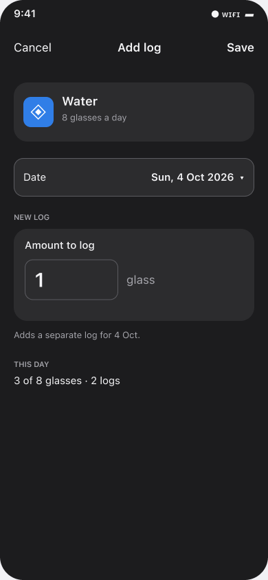

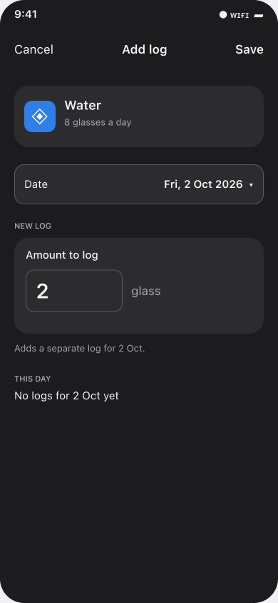

### 14. Duration

The same bounded H/M/S fields as the accepted editor support tap-to-type values (including supported fractional seconds), then Save adds one manual session. Timed sessions remain separate and are corrected in the accepted single-record editor.

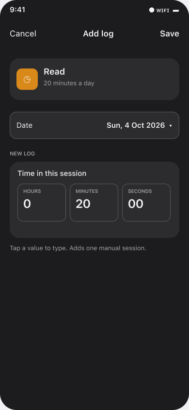

### 15. Repeatable check

The same bounded integer field as the accepted editor adds to the selected day's count. The weekly goal is context, not an invented daily quota; one bulk save remains one saved record.

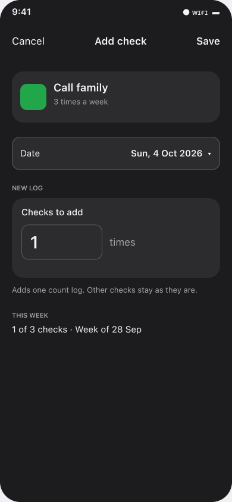

### 16–17. Once-daily check and checklist

These are **copies of the accepted Day-details layouts**. History routes to Day details for the selected date; Mark done/Undo or named checklist steps live there. No extra date row, generic “entry” editor or second check design is introduced.

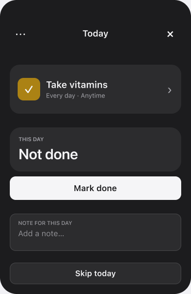

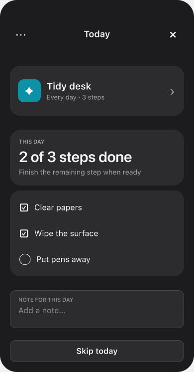

### 18–19. At-most amount and quit slip

The at-most record action remains available with neutral emphasis. Save records an amount without celebrating consumption. A slip records its actual occurrence date **and time**; its accepted editor can later correct that event or remove just that slip.

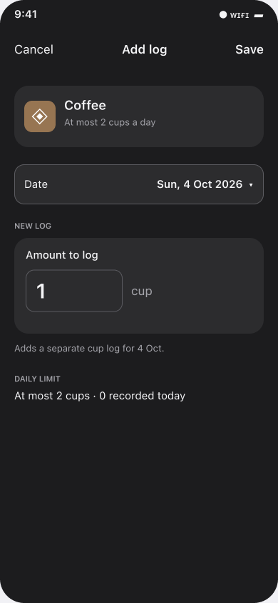

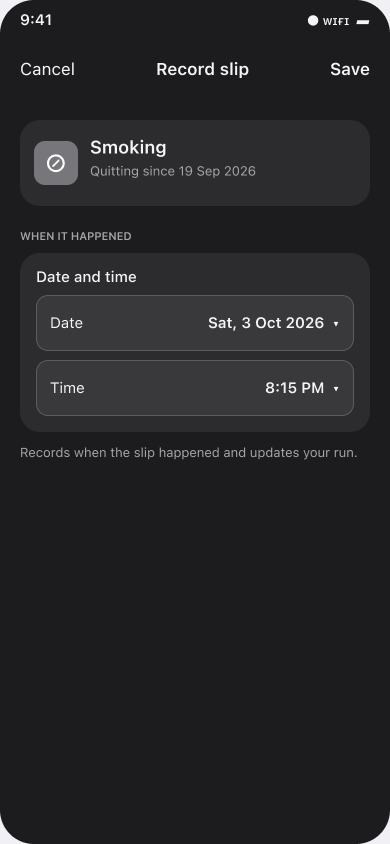

### 20. Skipped day

This is a **copy of the accepted skipped Day-details layout**. Logging stays visible but disabled; note editing remains available, and Undo skip stays in the place where Skip today was pressed. The History route must not bypass that state.

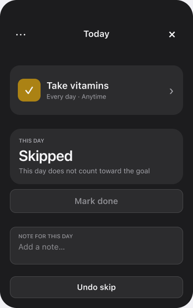

### 21. Date picker from the record form

Tapping **Date** in a record form opens this native picker route. **Use date** returns to the same unsaved form with that date selected; it does not open Day details or save a record. This route is distinct from History's **Open day…**, which opens Day details.

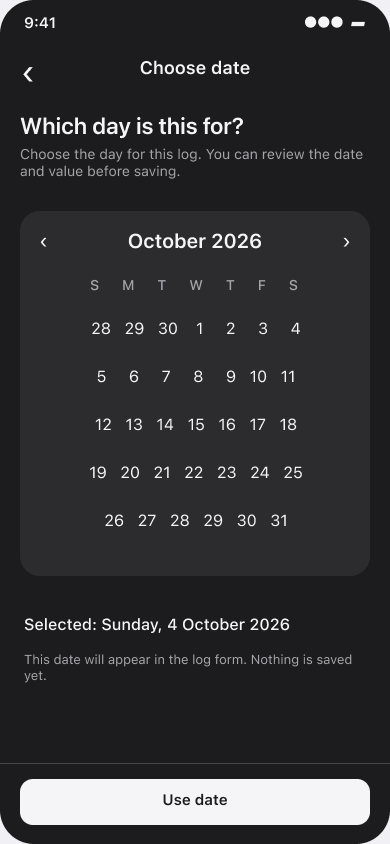

## Source and implementation boundary

This file embeds **22 PNG exports** from the editable Figma frames. The illustrations show information order, labels and state transitions. The app still needs native implementation, real-device layout checks and behavior verification (U1/U9/U20). The previous bottom History/Notes bars, habit-name-generated CTA copy, top-of-reader Edit, alternate Day-details forms, blue creation buttons and passive duration displays are superseded.
