# Widget image gallery

Written by Codex, 5 October 2026. These 26 renders accompany the [complete boards](<../Figma Delivery.md>) and [implementation handoff](<../Implementation Handoff.md>). They are our editable Figma proposal, not shipped screenshots. The [manifest](<Manifest.json>) records dimensions, checksums and source IDs. Small is 158 × 158 in this study; Medium is 338 × 158; Large is 338 × 354. Native devices determine actual family dimensions.

Names remain the compact default. Icon-only is optional. Tinted/clear renders illustrate hierarchy only; system appearance is included in both plans. The soft filled surface is a proposed paid cosmetic option. The boards also contain setup, Lock Screen proxies and entitlement guidance. Do not implement the PNGs as the UI.

## Free — Water / amount

[Editable Figma source](https://www.figma.com/design/Ncccsm1l2O62GJ5xLSInqk/Design?node-id=509-2895)

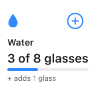

## Free — not yet

[Editable Figma source](https://www.figma.com/design/Ncccsm1l2O62GJ5xLSInqk/Design?node-id=509-2909)

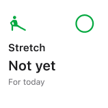

## Free — done

[Editable Figma source](https://www.figma.com/design/Ncccsm1l2O62GJ5xLSInqk/Design?node-id=509-2921)

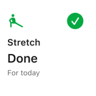

## Free — quit counter

[Editable Figma source](https://www.figma.com/design/Ncccsm1l2O62GJ5xLSInqk/Design?node-id=509-2933)

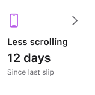

## Free — limit status

[Editable Figma source](https://www.figma.com/design/Ncccsm1l2O62GJ5xLSInqk/Design?node-id=509-2945)

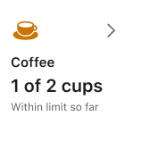

## Free — choose a habit

[Editable Figma source](https://www.figma.com/design/Ncccsm1l2O62GJ5xLSInqk/Design?node-id=509-2957)

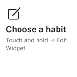

## Free — selected habit unavailable

[Editable Figma source](https://www.figma.com/design/Ncccsm1l2O62GJ5xLSInqk/Design?node-id=509-2964)

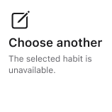

## Free — content hidden

[Editable Figma source](https://www.figma.com/design/Ncccsm1l2O62GJ5xLSInqk/Design?node-id=509-2971)

## Free — update needed

[Editable Figma source](https://www.figma.com/design/Ncccsm1l2O62GJ5xLSInqk/Design?node-id=509-2978)

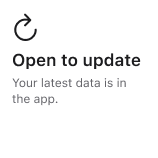

## Free — Today, Medium

[Editable Figma source](https://www.figma.com/design/Ncccsm1l2O62GJ5xLSInqk/Design?node-id=509-2985)

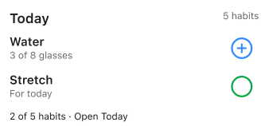

## Free — Today, Large

[Editable Figma source](https://www.figma.com/design/Ncccsm1l2O62GJ5xLSInqk/Design?node-id=509-3012)

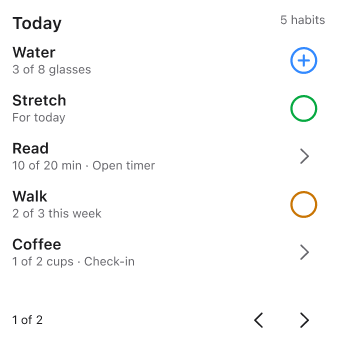

## Free — Tasks, Large

[Editable Figma source](https://www.figma.com/design/Ncccsm1l2O62GJ5xLSInqk/Design?node-id=509-3057)

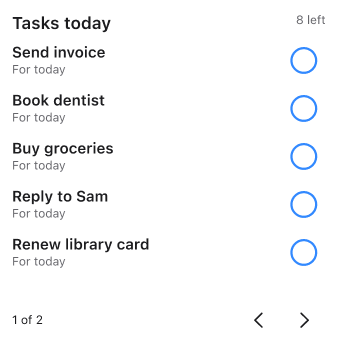

## Free — Today summary, Small

[Editable Figma source](https://www.figma.com/design/Ncccsm1l2O62GJ5xLSInqk/Design?node-id=509-3102)

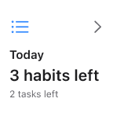

## Plus — last seven days, Medium

[Editable Figma source](https://www.figma.com/design/Ncccsm1l2O62GJ5xLSInqk/Design?node-id=509-3472)

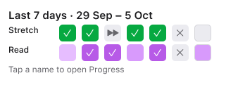

## Plus — calendar month, Large

[Editable Figma source](https://www.figma.com/design/Ncccsm1l2O62GJ5xLSInqk/Design?node-id=509-3503)

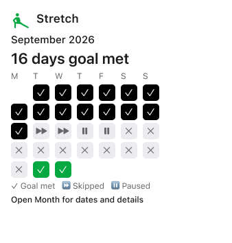

## Plus — compact favourites with names

[Editable Figma source](https://www.figma.com/design/Ncccsm1l2O62GJ5xLSInqk/Design?node-id=509-3592)

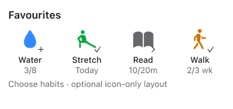

## Plus — streak focus

[Editable Figma source](https://www.figma.com/design/Ncccsm1l2O62GJ5xLSInqk/Design?node-id=509-3619)

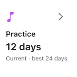

## Plus — goal focus

[Editable Figma source](https://www.figma.com/design/Ncccsm1l2O62GJ5xLSInqk/Design?node-id=509-3631)

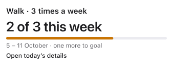

## Plus — year summary

[Editable Figma source](https://www.figma.com/design/Ncccsm1l2O62GJ5xLSInqk/Design?node-id=509-3641)

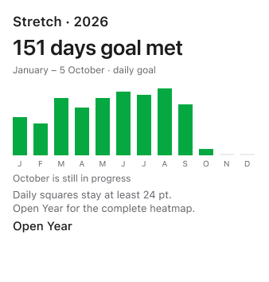

## Plus — wrapped last seven days, Small

[Editable Figma source](https://www.figma.com/design/Ncccsm1l2O62GJ5xLSInqk/Design?node-id=516-2927)

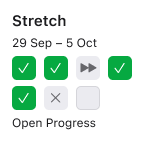

## System appearance — dark Water

[Editable Figma source](https://www.figma.com/design/Ncccsm1l2O62GJ5xLSInqk/Design?node-id=509-3457)

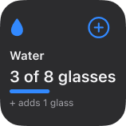

## System appearance — tinted concept

[Editable Figma source](https://www.figma.com/design/Ncccsm1l2O62GJ5xLSInqk/Design?node-id=511-2917)

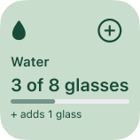

## System appearance — clear concept

[Editable Figma source](https://www.figma.com/design/Ncccsm1l2O62GJ5xLSInqk/Design?node-id=511-2933)

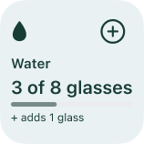

## Plus — optional icon-only favourites

[Editable Figma source](https://www.figma.com/design/Ncccsm1l2O62GJ5xLSInqk/Design?node-id=511-2885)

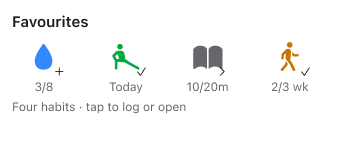

## Plus — optional soft habit-colored surface

[Editable Figma source](https://www.figma.com/design/Ncccsm1l2O62GJ5xLSInqk/Design?node-id=509-3952)

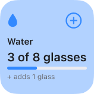

## Plus layout / system appearance — dark Month

[Editable Figma source](https://www.figma.com/design/Ncccsm1l2O62GJ5xLSInqk/Design?node-id=509-3971)

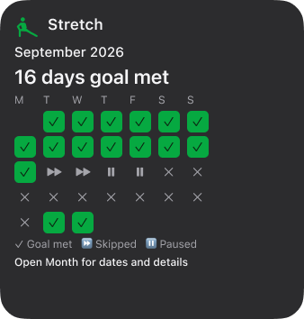
